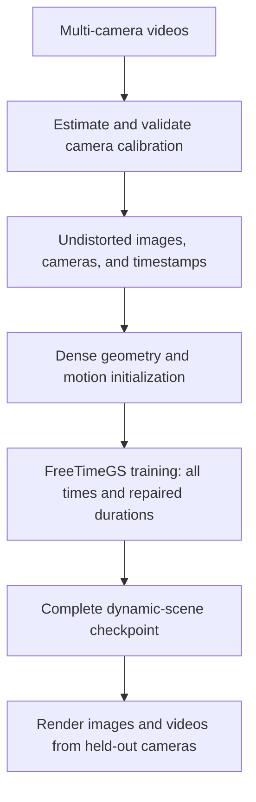

# Experiments with 3D and 4D Gaussian Splatting

The recommended reconstruction workflow is **dense FreeTimeGS with complete temporal training coverage and repaired duration handling**. Dense FreeTimeGS was the only approach the user judged to produce good Basketball results. This README describes the workflow to carry forward from those experiments, using **Ubuntu 24.04 LTS and an NVIDIA RTX 4090** as the target workstation.

Use the settings from **arm D** of the latest crossing-repair experiment. Include the recorded frames throughout the selected clip from the beginning of training, and apply the duration repair before the first update. Evaluate reconstruction from held-out cameras. **Do not withhold a time interval to test reconstruction through unseen motion.**

## Workflow

For a step-by-step code walkthrough with function arguments, data types, file handoffs, and app-design implications, see the [multi-camera FreeTimeGS workflow](docs/multicamera-freetimegs-workflow.md).



## Prepare images, calibration, and timestamps

The Basketball archive contains **34 camera videos and no supplied calibration**. The experiments estimated calibration locally from stationary scene features:

1. Mask people, the ball, and other image motion. Pool SIFT features from multiple frames of each fixed camera.
2. Use incremental COLMAP reconstruction and robust bundle adjustment to estimate camera poses, focal lengths, radial distortion, and a sparse static map from the 30 training cameras.
3. Localize cameras **0, 10, 20, and 30** against that frozen map using their calibration images. Keep their reconstruction images out of Gaussian initialization and training.
4. Validate and freeze the calibration. Estimate physical scale separately by comparing UniDepth V2 predictions with sparse-map depths; that scale remains a model-based estimate.
5. Resize reconstruction images to **960 × 540**, undistort them, and save the corresponding camera matrices and timestamps in the reconstruction manifest. Apply the same scale and coordinate conventions to cameras and geometry.

The saved [calibration](docs/experiments/basketball-calibration-alternatives/calibration.json), [scale estimate](docs/experiments/basketball-rev2/scale-fit.json), and [input manifest](.local/sync-pivot/basketball-zero/manifest.json) are the inputs for the existing Basketball workflow. The [calibration and code provenance explanation](docs/experiments/basketball-code-provenance.md) traces their complete derivation and the local projection adapter.

The reconstruction clip is **frames 0–49 at 25 fps**, with normalized time `t = frame / 50`. Use all 50 frames from each training camera, including frames **20–24** during the crossing: **30 × 50 = 1,500 training images**. Calibration used later footage for fitting and validation; that separate calibration procedure does not remove frames from this reconstruction clip. The experiments assumed zero time offsets between cameras, so preserve that recorded assumption separately from the estimated spatial calibration.

## Build the dense initializer

Use the local Basketball dense preparation pipeline on training-camera images:

1. Generate person/ball masks through the pinned ViPE segmentation component: Grounding DINO detection, SAM masks, and DeAOT tracking of the adjacent frame.
2. Match neighboring camera views with pretrained RoMa. Triangulate correspondences with unchanged EDGS geometry helpers and this repository's calibrated projection adapter, which consumes the camera estimates prepared above.
3. Retain observations supported by multiple cameras and the depth, reprojection, and triangulation checks. Estimate foreground velocities from adjacent-frame tracks and triangulated endpoints; record unsupported velocities as zero with an invalidity flag.
4. Fuse measured static observations, retain foreground observations at their measured times, and package positions, colors, velocities, temporal centers, and durations in FreeTimeGS coordinates. Preserve the shared camera/point normalization and provenance.

Both dense recipes were used in the successful repaired experiment:

| Recipe | Dense matching | Frozen initializer |
|---|---|---|
| `freetimegs-dense-coarse` | Match the full camera images. | [.local/basketball-dense-training/initializers/freetimegs-dense-coarse](.local/basketball-dense-training/initializers/freetimegs-dense-coarse) |
| `freetimegs-dense-cropped` | Add person-cropped matching and convert crop coordinates back to calibrated image coordinates. | [.local/basketball-dense-training/initializers/freetimegs-dense-cropped](.local/basketball-dense-training/initializers/freetimegs-dense-cropped) |

The [dense recipe explanation](docs/experiments/basketball-dense-training/recipes.md) details the shared matching process, person-crop refinement, and how both initializers feed the same training workflow.

Select initialization keyframes across the clip while retaining every captured frame for image-loss training. The validated repaired runs reused their existing frozen keyframe initializers; initialization sampling and training-image selection are separate. Keep the recipe and its matching initializer together. The implementation is in the [dense cloud builder](scripts/basketball_temporal_cloud.py), [geometry checks](scripts/basketball_temporal_geometry.py), and [fusion/packaging adapter](scripts/basketball_dense_fusion.py).

## Train with complete time coverage and the duration repair

Use [basketball_crossing_train.py](scripts/basketball_crossing_train.py) with these settings:

| Setting | Required behavior for this Basketball clip |
|---|---|
| `--training-policy all-times` | Sample all 1,500 training images; keep the four evaluation cameras excluded. This explicitly replaces the historical split stored in the frozen manifest. |
| `--lifetime-policy repaired` | Resolve the duration configuration and enforce the trainable duration floor. |
| Resolved duration setting | Read the finite, positive value **0.2** from the initializer metadata before training. |
| Minimum learned duration | Keep the exponentiated log-duration parameter at least **0.02** before training and after every complete optimization step, including relocation/pruning. |
| Optimizer state at the floor | Clear Adam moments only for duration entries raised to the floor; preserve step counters. |

The defect in the original implementation used the unresolved automatic-setting sentinel `-1` in the duration penalty, encouraging every positive duration to shrink. Parameters could fall below the renderer's minimum and lose useful image gradients for their width. The [duration repair](scripts/basketball_crossing_repair.py) fixes both the configuration and the trainable parameter boundary.

The repaired penalty is proportional to `max(duration - 0.2, 0)^2`: **0.2 is a penalty threshold, not a required duration or a hard maximum**. For this two-second clip, `0.02` and `0.2` correspond to temporal Gaussian widths of 40 ms and 400 ms. When adapting to another clip length, convert physical widths into its normalized time units and keep initializer, loss, and renderer settings consistent.

With the existing prepared Basketball assets and installed environment, run the following from the repository root, choosing a fresh output directory:

```bash
.local/envs/freetimegs/bin/python scripts/basketball_crossing_train.py \
  --arm freetimegs-dense-coarse \
  --seed 0 \
  --dense-initialization .local/basketball-dense-training/initializers/freetimegs-dense-coarse \
  --training-policy all-times \
  --lifetime-policy repaired \
  --target-update 70000 \
  --output .local/basketball-dense-workflow/training/freetimegs-dense-coarse-seed0
```

Omitting `--resume` starts from the dense initializer at update zero. For the cropped recipe, change the arm, initializer path, and output directory together. The adapter uses the native absolute 70,000-update schedule, with relocation ending at update 63,000.

**The validated result was a 50k→70k continuation of existing dense checkpoints.** Applying complete time coverage and the repair from update zero is the recommended future policy; its exact result and minimum training budget have not been separately measured. The [crossing explanation](docs/experiments/basketball-crossing-repair/workflow-explanation.md) records the evidence behind this recommendation.

## Save, render, and assess the result

Retain the complete checkpoint, including Gaussian motion and temporal parameters, optimizer/scheduler state, RNG and sampler state, alongside `training-config.json`, normalization, and provenance. Use [evaluate-basketball-sync-plan028.py](scripts/evaluate-basketball-sync-plan028.py) to reload and render these checkpoints with their saved duration configuration. A static point-cloud export does not preserve the complete dynamic scene.

Render the entire clip from cameras **0, 10, 20, and 30**, compare against their captured images, and assemble playback at **25 fps**. Inspect the crossing and player detail elsewhere for fragments, flicker, and incorrect motion. Use held-out-camera image and motion-region metrics alongside the videos. Frames from training cameras are training observations, including frames 20–24; they are not evidence of reconstruction through an unseen time interval.

The latest existing results are linked below. In the historical comparison images and videos, **D is the rightmost panel**, showing the full-time, repaired-duration workflow:

| Dense recipe, camera 0, seed 0 | Video | Crossing image |
|---|---|---|
| Coarse | [Comparison MP4](.local/basketball-crossing-repair/videos/freetimegs-dense-coarse-camera0-seed0/comparison.mp4) | [Court crop, frame 22](.local/basketball-crossing-repair/videos/freetimegs-dense-coarse-camera0-seed0/court.png) |
| Person-cropped | [Comparison MP4](.local/basketball-crossing-repair/videos/freetimegs-dense-cropped-camera0-seed0/comparison.mp4) | [Court crop, frame 22](.local/basketball-crossing-repair/videos/freetimegs-dense-cropped-camera0-seed0/court.png) |

The [result report](docs/experiments/basketball-crossing-repair/report.md) and [visual artifact index](.local/basketball-crossing-repair/videos/artifacts.json) cover the other cameras and seeds. Runtime assets under `.local/` are available in the experiment workspace and are not included in a Git clone.

## Implementation and workspace

The backend is the **independent FreeTimeGsVanilla reproduction** at revision `911dcf4`, installed in `.local/FreeTimeGsVanilla`, with pinned gsplat CUDA rendering. This repository supplies the camera/data adapters, dense initialization, sampling, checkpoint management, and duration repair around its reused computational core. The [code provenance](docs/experiments/basketball-code-provenance.md) records the papers, repositories, revisions, and reuse boundaries; the [FreeTimeGS environment specification](environments/freetimegs.in) and [native build script](scripts/build-freetimegs-native.sh) record the runtime setup inputs.

The current adapters are tied to the saved Basketball manifest, frame range, camera IDs, and initializer artifacts. Preparing another capture requires adapting those inputs while preserving complete temporal training coverage and the duration/time-unit rules above. Keep source, configuration, and small reports in Git; keep videos, processed images, upstream checkouts, environments, weights, checkpoints, and renders under the Git-ignored `.local/` directory. Detailed records live under `docs/`.
