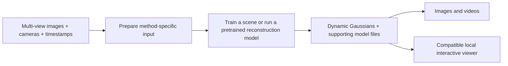

# Experiments with 3D and 4D Gaussian Splatting

Research and local experiments for creating and rendering dynamic Gaussian scenes, with **Ubuntu 24.04 LTS and an NVIDIA RTX 4090** as the target workstation.

The main question is: given synchronized views of an animated world, how can we reconstruct a 4D Gaussian representation, save it, and render it from different viewpoints over time?

## Workflow

Animated-world generation is supplied independently. This repository focuses on reconstruction, data preparation, representation storage, and rendering. Cloud-only proprietary services are outside scope. Downloading public code, weights, or datasets is compatible with running the computation locally.

## Start here

1. Follow the [pretrained experiments guide](docs/pretrained-experiments.md): view existing scenes, compare STG and Mango-GS rendering, then try NoPo4D inference before choosing what to train.
2. Read the [research guide](docs/research.md) for methods, papers, downloadable assets, and license distinctions.
3. Use the [rendering guide](docs/rendering.md) for representation compatibility and additional rendering procedures.
4. When ready to train, check the [input-data guide](docs/input-data.md) and follow the [local creation guide](docs/local-creation.md).

Start with splaTV's bundled scene and its local time-control patch. Next inspect the published `sear_steak` checkpoints, then run the bundled NoPo4D example. Record your visual assessment using the [experiment template](docs/experiments/template.md). The HUST D-NeRF `bouncingballs` walkthrough remains a later synthetic training option. These are experiment choices, not local quality rankings.

## What this repository contains

This repository contains research, experiment guides, and a reproducible viewer patch. It is also the workspace for future training implementations, installed environments, downloaded weights, generated 4DGS assets, and measured GPU results. Run commands here; upstream checkouts and large runtime files live beneath the Git-ignored `.local/` directory.

Track our implementation, scripts, patches, environment specifications, and small experiment reports. Keep datasets, downloaded checkpoints, environments, caches, rendered images/videos, and raw logs under `.local/`. See the [workspace setup](docs/pretrained-experiments.md#0-prepare-the-repository-workspace) for the layout and commands. See the [execution record](docs/experiments/pretrained-validation.md) for native GPU preview results and remaining compatibility gates; no training or comparative benchmark is claimed.

Research was checked on **2026-09-05**. The guides distinguish source-inspected behavior, author-reported results, and procedures that still need execution on the target workstation. NVIDIA device access must be checked from an authorized host terminal: a sandbox failure is not evidence of a host driver fault. The installed CUDA compiler is `/usr/local/cuda-13.0/bin/nvcc`; the target stack is standard Python 3.14 with uv, PyTorch 2.13.0+cu130 and torchvision 0.28.0+cu130. Follow the [shared environment guide](docs/environments.md) and [tracked candidate specifications](environments/README.md). No Conda or automatic downgrade is used; incompatible research implementations remain adaptation pending.

“4DGS” describes several representations, not a universal interchange format. Save the full model required by the selected renderer; a PLY file alone may omit motion networks or appearance decoders. See the [compatibility table](docs/rendering.md#representation-and-viewer-compatibility).

Open-source and research-restricted implementations are both covered, with code, dependency, and weight terms recorded separately in the [license notes](docs/research.md#licenses-and-asset-provenance).
