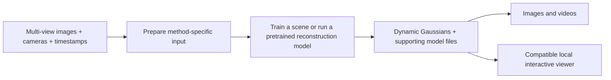

# Experiments with 3D and 4D Gaussian Splatting

Research and local experiments for creating and rendering dynamic Gaussian scenes, with **Ubuntu 24.04 LTS and an NVIDIA RTX 4090** as the target workstation.

The main question is: given synchronized views of an animated world, how can we reconstruct a 4D Gaussian representation, save it, and render it from different viewpoints over time?

## Workflow

Animated-world generation is supplied independently. This repository focuses on reconstruction, data preparation, representation storage, and rendering. Cloud-only proprietary services are outside scope. Downloading public code, weights, or datasets is compatible with running the computation locally.

## Start here

1. Read the [research guide](docs/research.md) for methods, papers, GitHub code, Hugging Face assets, and license distinctions.
2. Check the [input-data guide](docs/input-data.md) before exporting a custom scene.
3. Follow the [local creation guide](docs/local-creation.md) for environment checks and two baseline experiments.
4. Use the [rendering guide](docs/rendering.md) for images, videos, local browser playback, and representation compatibility.

For an initial training experiment, use HUST 4DGaussians with the small D-NeRF `bouncingballs` scene. Then investigate SpacetimeGaussians with a short synchronized multi-view sequence. For a viewing-only first step, the rendering guide describes running splaTV with its included scene. These are starting recommendations based on upstream documentation, not local benchmark results.

## What this repository contains

At present, this is a documentation and research repository. It contains no training implementation, installed research environment, downloaded weights, generated 4DGS assets, or measured GPU results. Commands in the guides run inside separate upstream checkouts. Keep large datasets and checkpoints outside this repository.

Research was checked on **2026-09-05**. The guides distinguish source-inspected behavior, author-reported results, and procedures that still need execution on the target workstation. The documentation environment could not communicate with the NVIDIA driver; no GPU training or rendering was performed.

“4DGS” describes several representations, not a universal interchange format. Save the full model required by the selected renderer; a PLY file alone may omit motion networks or appearance decoders. See the [compatibility table](docs/rendering.md#representation-and-viewer-compatibility).

Open-source and research-restricted implementations are both covered, with code, dependency, and weight terms recorded separately in the [license notes](docs/research.md#licenses-and-asset-provenance).
