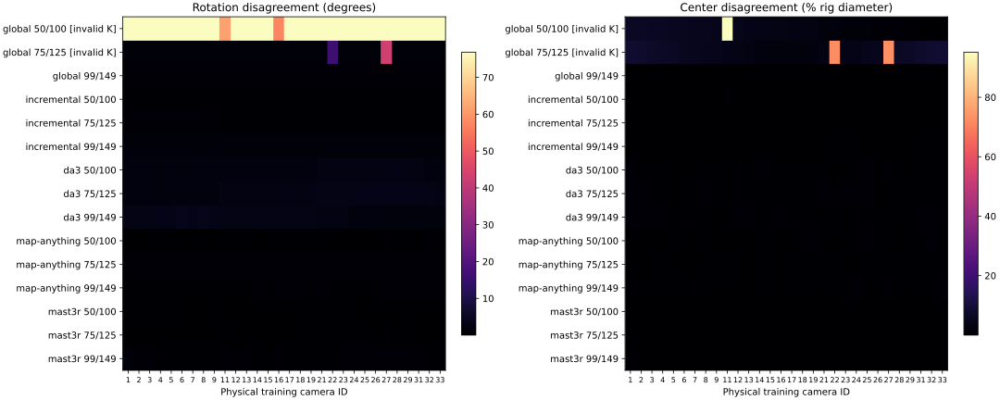
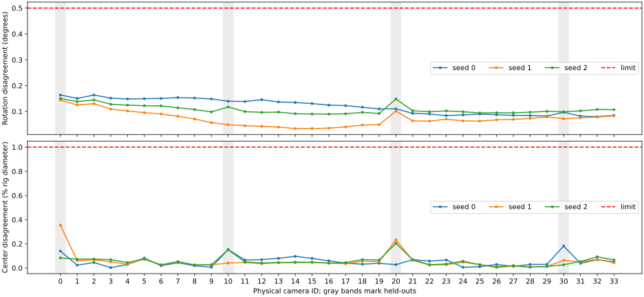
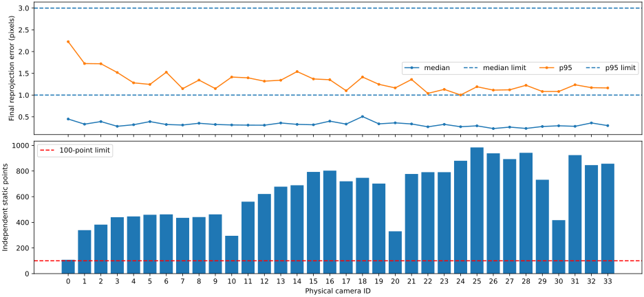

# VRU Basketball DG: calibration alternatives

Investigation: 2026-09-07. [Protocol](../../plans/plan_006.md) ·
[Research and licenses](../research/basketball-calibration-alternatives.md) ·
[Machine-readable evidence](basketball-calibration-alternatives/artifacts.json).

**All 34 cameras pass final validation.** The selected configuration is incremental
COLMAP initialization, ordinary static support and robust bundle adjustment with
one focal length and one radial-distortion term per physical camera. It recovers
all **34 cameras**, including 5 and 19, with 30 training cameras and held-outs
0,10,20,30. No GeoCalib intrinsics are supplied to this reconstruction.

Across three independent early/late pairs, full-rig maximum rotation disagreement
is **0.163815°** and center disagreement is **0.354980% of training-rig diameter**.
Within-window cross-seed maxima are **0.291030° / 0.352700%**. The historical
23-camera search reached 5.8807° / 7.1892%; the new result improves repeatability
while restoring coverage. These are **repeatability measurements, not surveyed
calibration accuracy**. Metric scale and synchronization remain unvalidated.

## What was measured

The official DG archive was audited as 34 physical videos, 1920×1080, 25 fps,
250 frames, with no included calibration. Checked linked releases did not yield
a provenance-compatible DG calibration; GZ camera files are not interchangeable.
See the research audit for the bounded search and exact release revisions.

- Fitting: snapshot pairs 50/100,75/125,99/149; full windows
  50,62,75,87,99 and 100,112,125,137,149.
- Selection: 150,162,175,187,199. Final validation: 200,212,225,237,249,
  evaluated once after freeze. Only these five timestamps per reserved window
  are evaluated; neighboring mask frames remain inside the same window.
- Frames 0–49 are reserved for a later Plan 005 continuation and were not
  used for calibration. Equal frame numbers are not assumed to synchronize people.
- All-camera masks combine person/ball segmentation and neighboring-frame
  motion. The fitting preparation produced 340 image/mask pairs, reusing 165
  hash-verified pairs and generating 175 missing pairs. GeoCalib's 20% trust
  threshold never excludes a camera or blocks mask generation here.
- All 34 focus diagnostics report no sustained change over ten fitting samples.
  This heuristic does not establish focal accuracy, identical lenses or focus distance.

Early and late reconstructions share neither fitted poses nor fitted intrinsics.
One similarity is fitted to the 30 training centers. Held-out errors use that
same transform and training-rig diameter, without any held-out alignment refit.
The historical 20-training-camera common subset is reported separately under
the same transform, never used to hide failed coverage.

## Snapshot screening

Scores are the worst of three pairs: `max(rotation / 0.5°, center_fraction / .01)`.
Only complete, finite models with valid rotations and positive focal lengths rank.

| Rank / route | Training coverage | Worst rotation | Worst center (% diameter) | Score |
| --- | ---: | ---: | ---: | ---: |
| 1. MapAnything | 30/30 in all six runs | 1.256866° | 1.061000% | 2.513733 |
| 2. MASt3R-SfM | 30/30 in all six runs | 1.285558° | 0.643327% | 2.571115 |
| 3. Incremental COLMAP, SP/LightGlue | 30/30 in all six runs | 1.733074° | 0.685891% | 3.466149 |
| 4. DA3-GIANT-1.1, ray pose | 30/30 in all six runs | 3.722509° | 1.432863% | 7.445018 |
| Global COLMAP, same frontend | Registered 30/30; invalid K | Ineligible | Ineligible | — |
| VGGSfM | Installation gate failed | Not measured | Not measured | — |
| Pi3X | Installation gate failed | Not measured | Not measured | — |
| VGGT-Ω 512 | Checkpoint access gate failed | Not measured | Not measured | — |

The global mapper runs view-graph calibration on a copied database before mapping.
Despite full registration, it produces negative focal lengths at frame 50/camera
16 (−12800.18 px), frame 75/camera 22 (−3128.69 px), and frame 125/camera 27
(−945.01 px). Diagnostic pose metrics remain available, but those models cannot win.



[Screening JSON](basketball-calibration-alternatives/screening.json) contains every
pair, common-subset result, alignment and exported-calibration hash. Thirty of
48 possible primary reconstructions ran: five runnable routes including the
control, six snapshots each. Eighteen slots were not run after installation or
checkpoint gates failed. Failed attempts and numerical export repairs are additional
diagnostics, not additional ranked candidates.

## Five-frame refinement and seeds

The top three routes use four intrinsic policies × two support recipes × three
seeds × two windows. Native learned predictions are reused between ordinary and
sharp support because the support recipe affects common refinement, not inference.
The common frontend uses masked OpenCV SIFT (8,192 features/image), spatial
deduplication within two pixels across timestamps, and tracks from at least three
cameras. It differs from the shared SP/LightGlue **snapshot** frontend.

Ordinary features rank by SIFT response; sharp support uses the existing normalized
Laplacian score, variance floor and camera/window 20th percentile. Descriptor support
must clear dynamic masks by `max(8 pixels, 3 × SIFT size)`. Both recipes retain
the physical camera IDs and pool static observations into one pose and intrinsic
set per physical camera.

For learned 150-image window outputs, raw per-observation predictions are retained.
The rig adapter initializes each camera from mean center, SO(3) mean rotation and
median K, then common BA enforces constant intrinsics and pose. MASt3R uses its
released `logwin-5` graph for these windows to bound pair-cache storage before
lowering resolution; its snapshot graph is complete. This adaptation is distinct
from a native upstream fixed-rig model.

Common BA uses SOFT_L1 at one pixel and eight CPU threads. Fixed-K, one centered
square-pixel focal, and focal-plus-one-radial configurations start independently
from the relevant native prediction. The default 200 iterations extends once to
1,000 only after logged `NO_CONVERGENCE`. Logs and both attempts remain saved;
continued nonconvergence fails acceptance.

The completed matrix has **24 unique native window runs and 108 common BA runs**.
Twelve nominal native slots reuse identical learned predictions. There are **68
logged iteration-extension reruns**, counted separately from the 132 initial
jobs; no extra intrinsic/support/seed configuration was introduced. The
[matrix accounting](basketball-calibration-alternatives/matrix-accounting.json)
has no missing finalist slots.

The accepted incremental ordinary/radial configuration passes all three seeds:
training-only worst rotation 0.163722°, center 0.096687%. Seed 0's early and late
adjustments converge after 261 and 519 iterations respectively. Reloaded native
models reproduce the saved reprojection statistics exactly (maximum delta zero).
Its training support has at least 490 points early / 460 late and at least 14
occupied grid cells per camera.

MapAnything's ordinary/radial result reaches 0.533883° / 0.280193%, narrowly failing
rotation. Its sharp/fixed-K result reaches 0.431176° / 0.607741%, but fails fitting
reprojection support; good pose repeatability alone is insufficient. MASt3R's
paired five-frame results fail the pose gate for every tested intrinsic policy;
ordinary/fixed-K reaches 1.995010° / 0.896298%, while ordinary/radial diverges to
14.223453° / 7.811612%. All scheduled seeds are complete and retained in the
[finalist table](basketball-calibration-alternatives/finalist-table.md) and
[complete finalist results](basketball-calibration-alternatives/finalists.json).

For example, MapAnything sharp/fixed-K seed 0 has camera 6 medians of 1.049 px
early and 1.114 px late; camera 16 reaches 3.662 px p95 late. These failures are
not explained by missing camera registration or insufficient feature counts.

## Full rig, selection and final validation

Held-out cameras are localized separately against each frozen training map using
fitting-only static SIFT matches, support from at least two training cameras and
robust unknown-focal PnP with one radial term. No held-out observation changes
training geometry. The export uses **seed 0's early fitting map**; late maps and
other seeds are independent diagnostics, not averaged into its calibration.



The [full-rig results](basketball-calibration-alternatives/full-rig.json) include
every camera, three early/late pairs and cross-seed comparisons. The familiar
seed-0-only center maximum is 0.181844%; **0.354980%** is the conservative maximum
over all three early/late pairs.

Selection-only matching diagnostics exposed repeated-pattern ambiguities.
Descriptor consensus from two other cameras produced catastrophic outliers;
independent image-pair fundamental filtering reduced them but still failed many
cameras. Both results and per-cell residual distributions are preserved. No
calibration or acceptance threshold was changed to pass these checks.

Camera 0's upper image row illustrates the association failure: after fundamental
filtering, its four cells still have p95 errors of 316.91,219.61,126.84 and
736.16 px. This region contains repetitive advertising and audience structure.
Temporal track continuation reduces its two well-supported upper cells to
1.58 and 2.08 px. The [regional data](basketball-calibration-alternatives/regions.json)
retain counts, missing cells and nonfinite residuals, rather than presenting only
the successful correspondence policy.

The selected measurement policy continues verified static fitting tracks into
reserved images: descriptor ratio 0.8 plus at most eight pixels displacement from
the **measured fitting 2D observation**, with no rejection based on the tested
calibration's reprojection error. Training tracks have at least three cameras
and 1° parallax; held-out anchors are fitting-only PnP inliers. Point IDs and
two-pixel spatial deduplication bound independent support, while every matched
timestamp contributes to the error distribution. This evaluates established
static-track consistency, not arbitrary new-feature matching performance.

All 34 cameras pass selection: worst per-camera median **0.507710 px**, p95
**1.781147 px**, minimum **152** independent points, **11/16** cells, **100%**
positive depth. The minimum robust nonplanarity ratio is 0.060078, above the
declared 0.01 diagnostic threshold. Nonplanarity and three-seed stability reveal
no unresolved ambiguity under these checks; they are not a uniqueness proof.

The evaluator and all map/calibration/anchor hashes are recorded in the
[winner freeze](basketball-calibration-alternatives/frozen-winner.json). All other
configurations already have a failing seed; subsequent repeats cannot reverse a
failure under the worst-seed rule. The remaining MASt3R repeats completed independently
of selection and final validation and also failed acceptance. An exclusive validation-consumption marker
prevents choosing a second candidate using final-frame results.

The single [final validation](basketball-calibration-alternatives/validation.json)
passes every camera:

| Requirement | Worst measured value | Limit |
| --- | ---: | ---: |
| Per-camera reprojection median | 0.505951 px (camera 18) | ≤1 px |
| Per-camera reprojection p95 | 2.228025 px (camera 0) | ≤3 px |
| Independent static points | 108 (camera 0) | ≥100 |
| Occupied grid cells | 11/16 | ≥6/16 |
| Positive depth | 100% | ≥95% |
| Robust nonplanarity diagnostic | 0.072753 | ≥0.01 |
| Rotations / focal lengths | All valid / positive | All 34 |

Camera 0's support falls from 152 in selection to 108 in final validation;
it passes with a modest support margin. This limitation is retained rather than
discarding that held-out camera. Reloaded exported parameters agree with their
COLMAP camera models, and all frozen calibration/map/anchor hashes remain unchanged.
The [export reload check](basketball-calibration-alternatives/export-reload.json)
reprojects all **79,835** saved final observations with **0.0 px** maximum change.
It reads saved 2D/3D observations only, not the final images, and fits nothing.



### Plan 005 handoff

Use the [estimated full-rig calibration](basketball-calibration-alternatives/calibration.json)
with the [new full-rig scene profile](../../configs/scene-manifest.vru-basketball-dg.full-rig.json).
The historical default 23-camera profile remains intact for reproducibility.
The new profile restores 30 training and four original held-out cameras; future
frames 0–49 would contain 1,500 training / 200 held-out images.

The calibration is world-to-camera at 960×540 with OpenCV integer pixel centers.
`SIMPLE_RADIAL` uses `f, cx, cy, k1` in `parameters_colmap`; those principal points
use COLMAP half-integer centers, while `K` uses OpenCV centers (0.5 pixel lower).
For normalized coordinates, radial distortion is `x_d = x (1 + k1 r²)` and
`y_d = y (1 + k1 r²)`. Resize K with the provided pixel-center-aware transform;
keep radial coefficients unchanged. Downstream consumers must honor distortion
or undistort images and propagate the resulting K/crop consistently.
Estimated focal lengths range from 792.46 to 819.38 px and `k1` from −0.16354
to −0.13189. A 17×9 full-image grid per camera passes distortion
unprojection/reprojection with maximum round-trip error below 1.3e−8 px.

Before downstream use, Plan 005 must separately validate synchronization and
metric scale, then prepare/initialize its training inputs with this full-rig
profile. Neither is established by this static calibration. No Gaussian-splatting
training, synchronization fit, metric-scale claim or downstream budget change
is part of this investigation. Dense-SfM and MP-SfM pilots are not triggered
because a primary finalist passes the declared calibration gates.

## Resources and failures

Host: RTX 4090, 24 GiB; required CPython 3.14, PyTorch 2.13.0+cu130 and torchvision
0.28.0+cu130. Isolated environments are inventoried under
[environments](basketball-calibration-alternatives/environments/global.txt).
GPU inference is serialized through a workspace lock. CPU jobs can overlap, so
these wall times are diagnostic, not controlled performance benchmarks.

| Six snapshot runs | Solver/inference wall time | Peak Torch allocated / reserved | Peak host RSS |
| --- | ---: | ---: | ---: |
| Global COLMAP | 37.58 s | Not instrumented | 0.20 GiB |
| Incremental COLMAP | 87.70 s | Not instrumented | 0.18 GiB |
| MASt3R-SfM | 893.64 s | 6.56 / 6.76 GiB | 5.91 GiB |
| DA3 | 85.54 s | 9.05 / 12.05 GiB | 11.01 GiB |
| MapAnything | 112.70 s | 6.62 / 7.12 GiB | 9.91 GiB |

The shared SP/LightGlue frontend adds 76.90 seconds over six snapshots; ranking
charges it to each mapper but total resource accounting counts the stored frontend
once. MASt3R's failed initial SciPy attempt and cache/export repair complicate its
timing comparison; both are retained. Torch peaks are process-local, not global
NVML peaks. Full-window, mask, BA, localization and evaluation measurements are
in [resources.json](basketball-calibration-alternatives/resources.json); unavailable
probe measurements remain missing rather than estimated.
For the 150-image windows, peak Torch allocated/reserved memory is 14.48/16.52 GiB
for MapAnything and 6.17/6.40 GiB for MASt3R. No inference resolution was reduced
after a memory failure; the recorded memory-saving modes fit the GPU.

The old calibration ledger remains unchanged at **1,056.087320 seconds charged**.
Plan 006 has no cumulative GPU-hour cap and records its work separately. Original
downstream training budgets and historical artifacts are preserved.

| Failure / adaptation | Recorded outcome |
| --- | --- |
| VGGSfM released PyCOLMAP 3.10.0 | No CPython 3.14 wheel; source/API adaptation pending. No inference claimed. |
| Pi3X released Torch 2.5.1 / torchvision 0.20.1 requirements | Conflict with the required stack; no silent environment downgrade. |
| VGGT-Ω 512 weight | Official pinned weight returns HTTP 403 `GatedRepoError`; upstream account access, not a Codex sandbox denial. No alternate weight or access request substituted. |
| MASt3R SciPy API | Replaced removed `scipy.cluster.hierarchy.distance` access with `scipy.spatial.distance`; patch retained. |
| MASt3R native rotation drift | Small floating-point orthogonality drift is projected to SO(3), preserving camera centers. Larger/nonrigid transforms are rejected; raw predictions remain saved. |
| Initial BA export/DB integration | Reload guard found a changed statistics buffer; private triangulation DB now receives the exact requested camera model. Failed smoke attempts retained. |
| PyCOLMAP read-only-looking database opens | SQLite header counters changed. Originals restored only after reconstructed bytes matched recorded original SHA-256 exactly; mutated copies preserved. Localizer now reads a private copy; evaluator uses SQLite `mode=ro`. |
| Initial GPU access | Sandboxed Torch CUDA initialization failed; the authorized host retry succeeded. GPU runs subsequently use host access. |
| Conditional follow-ups | Dense-SfM's released stack needs adaptation; MP-SfM requires supplied K and custom dependencies; CasCalib's height/upright prerequisites were not verified. No pilot is needed once a primary finalist passes all gates. |

## Reproduction and artifacts

Run from the repository root with the pinned isolated environments. The
[source pins](basketball-calibration-alternatives/source-pins.json),
[weight hashes](basketball-calibration-alternatives/weight-pins.json),
[raw run records](basketball-calibration-alternatives/run-results.json),
[executed command records](basketball-calibration-alternatives/commands.json), and
[log hashes](basketball-calibration-alternatives/logs.json) identify the measured
configuration. Native predictions, COLMAP maps, observations, features, images
and full logs remain under `.local/calibration/basketball-alternatives/`.
Large source videos and model weights are not copied into Git.

The environment inventories include an informational first line; they are package
inventories, not directly consumable lockfiles. Obtain sources at the recorded
revisions with their submodules, apply the linked DA3/SciPy patches, and obtain
checkpoints from the recorded Hugging Face revisions. Follow the repository's
[environment policy](../environments.md); blocked legacy stacks require explicit
source adaptation. MapAnything's DINOv2 architecture was loaded by upstream Torch
Hub from `main` on first inference, then locally cached. Its exact source files
are now hashed, but its commit was **not pinned before that first download**.
Replays must preserve that recorded cache; this is a reproducibility limitation
of that comparison, not of the selected classical calibration.

Example local commands (new output directories are required for new measurements):

```bash
W=.local/calibration/basketball-alternatives
PY=.local/envs/calibration-global/bin/python
export TORCH_HOME="$PWD/.local/cache/torch"
export HF_HOME="$PWD/.local/cache/huggingface"
export MPLCONFIGDIR="$PWD/.local/cache/matplotlib"

# Replay the finite screen or refine matrix, reusing completed recorded outputs.
"$PY" scripts/basketball_alternatives_campaign.py --workspace "$W" \
  --methods global incremental mast3r da3 map-anything
"$PY" scripts/basketball_alternatives_compare.py --workspace "$W" \
  --methods global incremental mast3r da3 map-anything --output "$W/screening.json"
"$PY" scripts/basketball_alternatives_finalists.py --workspace "$W"
"$PY" scripts/basketball_alternatives_finalist_report.py --workspace "$W" \
  --methods incremental map-anything mast3r --output "$W/finalists.json"

# Export/audit an already localized full rig into a fresh output directory.
"$PY" scripts/basketball_alternatives_full_rig.py --workspace "$W" \
  --method incremental --policy radial --output "$W/full-rig-replay"
"$PY" scripts/basketball_alternatives_quality.py --inputs "$W/inputs" \
  --output "$W/focus-new-replay.json"

# Repository verification and evidence packaging do not consume final images.
"$PY" -m unittest discover -s tests -p 'test_basketball*.py'
"$PY" scripts/basketball_alternatives_package.py --workspace "$W" \
  --output docs/experiments/basketball-calibration-alternatives
```

Before a **first** campaign in a fresh workspace, provision the recorded sources,
weights and environments, then prepare masks and the four pooled frontends. These
commands deliberately refuse existing outputs; the completed workspace already
contains them. The ViPE checkout must match the recorded audit revision.

```bash
VIPE=/home/auss/git_repos/samaust/Tridi/vipe
"$VIPE/.venv/bin/python" scripts/basketball_alternatives_prepare.py \
  --audit .local/calibration/basketball-v1/input-audit.json \
  --vipe "$VIPE" --output "$W/inputs"

for side in early late; do
  if [ "$side" = early ]; then
    frames=(50 62 75 87 99)
  else
    frames=(100 112 125 137 149)
  fi
  "$PY" scripts/basketball_alternatives_refine.py frontend --source "$W/inputs" \
    --frames "${frames[@]}" --output "$W/pooled-$side"
  "$PY" scripts/basketball_alternatives_refine.py frontend --source "$W/inputs" \
    --frames "${frames[@]}" --sharp --output "$W/pooled-sharp-$side"
done

# Fitting-only held-out localization example; use each final chosen map/seed.
"$PY" scripts/basketball_alternatives_localize.py \
  --map "$W/incremental-ba-radial-early-seed0-iter1000" \
  --features "$W/pooled-early" --inputs "$W/inputs" --seed 0 \
  --output "$W/held-out-replay-early-seed0"
```

The exact final-evaluation command is preserved in
[commands.json](basketball-calibration-alternatives/commands.json), under
`validation-incremental-radial-command.json`. Selection and validation masks use
the same preparation adapter with `--role selection` or `--role validation`;
the latter additionally requires the frozen winner. No optimizer receives those
reserved observations.

The evaluator's `--role validation` additionally requires `--frozen-winner` and
hash-matched prepared validation inputs; its one-use marker must not be deleted
to rerun final validation. A new independent study needs a new declared protocol,
not reuse of these final frames for method selection.

Tests cover physical camera IDs, frame isolation, incomplete/nonfinite rejection,
pixel resize/crop transforms, pose inversion, training-only similarity alignment,
repeated-point deduplication, static correspondence filtering, frozen-map guards
and one-use final evaluation. Native map reloads are also checked against actual
reprojection statistics during each common BA run.
Verification passed **45 Basketball tests, three calibration-budget tests and
four training-budget tests**, plus artifact hashes, full matrix coverage, local
documentation links, SVG parsing and documented Bash syntax. The original
calibration ledger's hash and charged total are unchanged.
