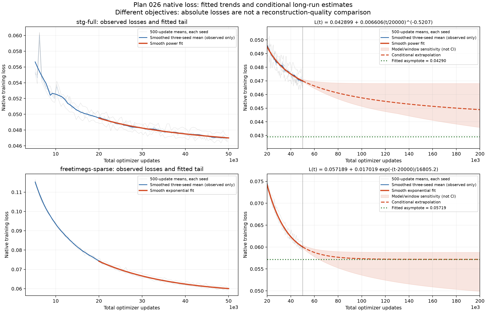

# Native-loss smoothing and extrapolation

The preferred fits predict modest additional native-loss reduction by 100,000
updates: **2.6% for STG Full and 4.5% for sparse FreeTimeGS**, relative to each
fitted 50,000-update value. Estimated infinite-time floors are **0.04290** and
**0.05719**, respectively. These are conditional curve estimates, not measured
future results or reliable lowest attainable losses.

[Export PDF](native-loss-asymptotes.pdf) · [Fit parameters and sensitivity](fits.json) ·
[Observed block means](block-means.csv)

## Equations

Let `t` be the total optimizer update, including the historical first 5,000.
The fitted tail starts at 20,000 updates. The chosen STG curve is a power law:

$$L_{STG}(t)=0.042899+0.006606\left(\frac{t}{20000}\right)^{-0.520672}.$$

The chosen sparse FreeTimeGS curve is exponential:

$$L_{Free}(t)=0.057189+0.017019\exp\left(-\frac{t-20000}{16805.2}\right).$$

In both equations the first constant is the estimated asymptote as `t` tends
to infinity. The limit is approached gradually; no finite training duration
is predicted to reach it exactly.

| Quantity | STG Full | FreeTimeGS sparse |
| --- | ---: | ---: |
| Observed mean, last 2,000 updates | 0.04702 | 0.06021 |
| Fitted loss at 50,000 | 0.04700 | 0.06004 |
| Predicted loss at 70,000 | 0.04634 | 0.05806 |
| Predicted loss at 100,000 | 0.04576 | 0.05733 |
| Predicted loss at 200,000 | 0.04489 | 0.05719 |
| Preferred asymptote | 0.04290 | 0.05719 |
| Reduction from fitted 50,000 to asymptote | 8.7% | 4.8% |

The numerical floor is lower for STG, but the two objectives contain different
terms and weights. This is **not** evidence that STG's reconstruction can become
25% better, nor that a 4.5% loss decrease gives a 4.5% PSNR or player-detail gain.
Within the preferred curves, FreeTimeGS has the larger relative improvement by
100,000; STG has a slower tail with a larger eventual relative reduction.

## How the estimates were obtained and checked

The input is all 270,000 recorded continuation losses: 45,000 updates for each
of three seeds per arm. Historical 1–5,000 losses are not part of these fits.
Each seed is averaged into nonoverlapping 500-update blocks; the fitting target
is the equal-weight mean over the three seeds. All update sequences and finite
loss values are checked. Source paths and SHA-256 hashes are retained in
`fits.json`.

The blue observed-only smoother is a Savitzky–Golay filter over 11 block means
with a quadratic polynomial (5,500-update window). It is for display only and
is not used to fit or extrapolate. Orange curves use constrained nonlinear
least squares on the unsmoothed block means, with nonnegative floor and
amplitude and a positive decay parameter. The 20,000-update starting point
focuses on later training rather than early schedule/densification changes.

Two candidate equations were compared: exponential and power-law decay. Each
was fit to 20,000–40,000 and used to predict the next 10,000 updates. The lower
prediction RMSE chose the form; that form was then refit to 20,000–50,000.
This is a retrospective model-selection check, not an independent validation
of the infinite-time estimate.

| Prediction RMSE on 40,001–50,000 block means | Exponential | Power law |
| --- | ---: | ---: |
| STG Full | 0.000269 | **0.000224** |
| FreeTimeGS sparse | **0.000220** | 0.000283 |

## How uncertain is the lowest asymptote?

**A dependable lowest asymptote cannot be identified from this training window.**
Changing the fit start to 10,000 or 30,000 and changing the equation gives:

| Sensitivity across two equations and three fit windows | STG Full | FreeTimeGS sparse |
| --- | ---: | ---: |
| Fitted asymptote range | approximately 0–0.04681 | 0.04432–0.05879 |
| Predicted loss at 100,000 range | 0.04514–0.04682 | 0.05359–0.05883 |

These are model/window sensitivity ranges, **not confidence intervals**. The
shaded region shows the range of finite-time predictions, not the full range
of infinite-time floors. The late STG power-law fit hits the imposed zero-floor
boundary with a very slow exponent. This demonstrates poor identification of
the floor; it is not credible evidence that training will remove all error.
Even fitting the preferred STG model separately to the three seeds gives floors
0.03159–0.04518. FreeTimeGS's preferred exponential per-seed floors are tighter,
0.05705–0.05723, but its alternative power-law fits are substantially lower.
The lowest fitted FreeTimeGS scenario, 0.04432, would imply roughly 26% eventual
reduction from the current fitted loss; it is an optimistic model scenario,
not the preferred forecast or a guaranteed attainable floor.

The 100,000-update sensitivity translates to about **0.4–4.0%** further native
loss reduction for STG and **2.0–10.7%** for FreeTimeGS, using each preferred
fitted 50,000 value as a common reference. These ranges cover only the tested
models, not every possible future behavior. The preferred forecasts indicate
small additional reductions; neither curve establishes that more training
will repair the remaining players.

Extrapolation assumes the observed optimization behavior continues. STG already
uses its final position learning rate after 30,000. FreeTimeGS retains a native
70,000-step schedule, so predictions beyond that horizon additionally depend
on how training and its learning rates are extended. No training was launched,
no schedule was changed, and no new held-out quality evaluation was performed.
The measured [Plan 026 report](../report.md) remains the quality evidence.

## Reproduction and validation

Run `MPLCONFIGDIR=/tmp/matplotlib .local/envs/roma/bin/python scripts/basketball_loss_extrapolation.py`
from the repository root. Runtime: NumPy 2.5.2, SciPy 1.18.1, Matplotlib 3.11.1.
The system Python lacks NumPy; the existing environment was used without
installing packages. The script validates all six update sequences, checks
finite source losses, retains input hashes, and records all candidate fits.
Synthetic noiseless exponential and power-law parameter recovery and monotone,
finite predictions are checked in `validation.json`. The exported figure was
visually inspected.
