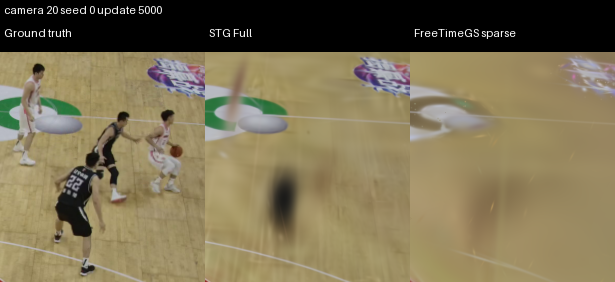
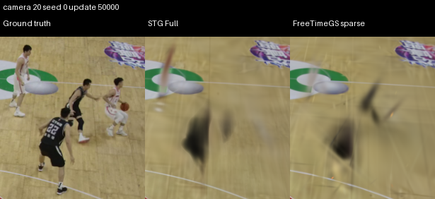

# Plan 026 — Basketball duration and initialization study

Longer training materially improves sparse FreeTimeGS, but does not recover detailed players in this experiment. Its held-out-camera full-image PSNR rises from **19.22 to 23.61 dB** between 5,000 and 50,000 updates: a paired gain of **4.40 dB (95% interval 4.05–4.65)**. Motion-pixel PSNR also improves by **2.87 dB (2.62–3.11)**. Nevertheless, the inspected players remain blurred, fragmented, or missing, and STG Full retains a measured endpoint advantage under these sparse workflows.

**The complete nine-trajectory study is incomplete.** Both prescribed dense pilots failed the foreground-floater gate. No dense initializer was accepted or frozen, and no dense model was trained. All six independent sparse trajectories, all five curve evaluations for each, and their endpoint visual artifacts are complete. This is a fixed experiment, not a continuous-improvement loop. [Plan 026](../../../plans/plan_026.md) remains the specification.

## Four scientific effects

| Effect requested by the plan | Result |
| --- | --- |
| Training duration: sparse FreeTimeGS at 50,000 versus 5,000 | Measured improvement in all reported endpoint metrics; player reconstruction remains poor |
| Initialization: dense versus sparse FreeTimeGS | Unavailable: dense prerequisite failed |
| Initialization × duration interaction | Unavailable: no trained dense trajectories |
| STG Full versus dense FreeTimeGS across the curves | Unavailable: no trained dense trajectories |

The STG-versus-sparse-FreeTimeGS comparison below is supplemental. It cannot replace the planned dense workflow comparison or determine whether a qualifying dense initializer would repair the remaining weakness. The evidence establishes that the 5,000-update baseline understates sparse FreeTimeGS's attainable quality at 50,000; it does not isolate initialization as the cause, establish convergence, or rule out further improvement with longer training.

## Protocol and measured quality

All arms retain accepted calibration and scale, original camera IDs, the zero-offset operational assumption, 960×540 images, and source frames 0–49. Initialization excludes cameras 0/10/20/30 and frames 20–24. Training uses the same 1,350 images. Evaluation uses the same 350 targets and final Plan 024 protocol v3, with frozen image-difference motion masks and pinned PSNR, SSIM, and AlexNet LPIPS definitions. Historical 5,000-update results were reused only after hash and coverage verification. No held-out score was used to select the dense recipe.

In the tables, **H** is held-out-camera evaluation (200 targets, ten five-frame blocks); **T** is temporal interpolation (150 targets, one block). Values are three-seed/block means. Higher PSNR/SSIM and lower LPIPS/MAE are better. Motion crops and pixels are evaluation proxies, not verified player segmentation; they can include court, lighting, or display changes.

| Split | Arm | Updates | Full PSNR | Full SSIM | Full LPIPS | Crop PSNR | Crop SSIM | Crop LPIPS |
| --- | --- | ---: | ---: | ---: | ---: | ---: | ---: | ---: |
| H | STG Full | 5,000 | 23.521 | 0.7816 | 0.2699 | 23.456 | 0.7838 | 0.2724 |
| H | STG Full | 50,000 | 24.424 | 0.8018 | 0.2268 | 24.495 | 0.8047 | 0.2261 |
| H | FreeTimeGS sparse | 5,000 | 19.216 | 0.6483 | 0.4724 | 19.642 | 0.6614 | 0.4634 |
| H | FreeTimeGS sparse | 50,000 | 23.613 | 0.7885 | 0.2431 | 23.830 | 0.7936 | 0.2413 |
| T | STG Full | 5,000 | 24.504 | 0.8181 | 0.2511 | 23.750 | 0.8056 | 0.2669 |
| T | STG Full | 50,000 | 25.553 | 0.8427 | 0.2054 | 24.791 | 0.8299 | 0.2211 |
| T | FreeTimeGS sparse | 5,000 | 19.787 | 0.6559 | 0.4697 | 19.664 | 0.6573 | 0.4653 |
| T | FreeTimeGS sparse | 50,000 | 24.416 | 0.8168 | 0.2283 | 23.768 | 0.8035 | 0.2458 |

| Split | Arm | Updates | Motion-pixel PSNR | Motion-pixel MAE | Adjacent-frame difference MAE |
| --- | --- | ---: | ---: | ---: | ---: |
| H | STG Full | 5,000 | 13.742 | 0.155806 | 0.007494 |
| H | STG Full | 50,000 | 15.205 | 0.125863 | 0.007704 |
| H | FreeTimeGS sparse | 5,000 | 11.779 | 0.208691 | 0.009379 |
| H | FreeTimeGS sparse | 50,000 | 14.647 | 0.138891 | 0.008149 |
| T | STG Full | 5,000 | 12.977 | 0.175185 | 0.007080 |
| T | STG Full | 50,000 | 14.118 | 0.146526 | 0.007408 |
| T | FreeTimeGS sparse | 5,000 | 11.555 | 0.215700 | 0.009010 |
| T | FreeTimeGS sparse | 50,000 | 13.750 | 0.158573 | 0.007527 |

### Paired duration effect for sparse FreeTimeGS

Entries are **50,000 minus 5,000**, with 95% percentile intervals from the pinned 2,000-draw bootstrap over matched seeds and five-frame blocks. Negative error deltas indicate improvement. The temporal-interpolation interval cannot estimate between-block temporal variation because only one block is available.

| Metric | H: delta [95% interval] | T: delta [95% interval] |
| --- | ---: | ---: |
| Full PSNR (dB) | +4.396 [+4.053, +4.648] | +4.629 [+4.078, +4.912] |
| Full SSIM | +0.1402 [+0.1367, +0.1432] | +0.1609 [+0.1585, +0.1656] |
| Full LPIPS | -0.2293 [-0.2403, -0.2177] | -0.2414 [-0.2549, -0.2275] |
| Motion-crop PSNR (dB) | +4.187 [+3.978, +4.372] | +4.103 [+3.582, +4.405] |
| Motion-crop SSIM | +0.1322 [+0.1263, +0.1381] | +0.1462 [+0.1438, +0.1497] |
| Motion-crop LPIPS | -0.2221 [-0.2336, -0.2104] | -0.2195 [-0.2320, -0.2076] |
| Motion-pixel PSNR (dB) | +2.869 [+2.618, +3.107] | +2.195 [+1.870, +2.490] |
| Motion-pixel MAE | -0.069800 [-0.075965, -0.063818] | -0.057127 [-0.064856, -0.050916] |
| Adjacent-frame difference MAE | -0.001230 [-0.001503, -0.000828] | -0.001484 [-0.001549, -0.001413] |

### Supplemental sparse workflow comparison and trajectories

At 50,000 updates, sparse FreeTimeGS is **0.811 dB behind STG** on held-out-camera full-image PSNR (FreeTimeGS minus STG: −0.811, 95% interval −1.144 to −0.535). Its full-image LPIPS is 0.0163 higher (0.0123–0.0200). On temporal interpolation, its full-image PSNR deficit is 1.137 dB (0.682–1.686). STG has better endpoint point estimates on every reported metric in both splits, although the interpolation motion-pixel PSNR difference remains uncertain: FreeTimeGS minus STG is −0.368 dB, with interval −0.833 to +0.137.

The held-out-camera full-image PSNR gap narrows from 4.30 dB at 5,000 to 0.81 dB at 50,000. Sparse FreeTimeGS image metrics continue improving through 50,000. Its held-out-camera adjacent-frame difference error improves through 30,000, then slightly increases; interpolation difference error continues falling. STG image metrics largely flatten after 20,000–30,000, while its adjacent-frame difference error increases over the trajectory. Better image scores therefore do not imply uniformly better temporal behavior.

[Complete numerical curves](analysis-final/curves.csv) and [all paired statistics](analysis-final/statistics.json) retain every metric and curve point, including uncertainty. Plot lines join observed checkpoints; they do not represent additional evaluations.

| Split | Against optimizer updates | Against measured training time |
| --- | --- | --- |
| Held-out cameras | [curves](analysis-final/heldout-camera-iteration.png) | [curves](analysis-final/heldout-camera-training_seconds.png) |
| Temporal interpolation | [curves](analysis-final/temporal-interpolation-iteration.png) | [curves](analysis-final/temporal-interpolation-training_seconds.png) |

## Player, court, and display evidence

All 12 fixed endpoint player crops were inspected, together with seed-0 court/display crops and video frames 0, 25, and 49 in all four held-out cameras. Black uniforms frequently become diffuse dark silhouettes; white uniforms become pale smears or nearly disappear. Limbs, uniform numbers, and ball detail remain missing or unstable. Some silhouettes become more distinct than at 5,000 updates, but neither sparse workflow recovers detailed players in the inspected outputs. These failures also occur outside the interpolation interval.

Court markings and logos are much clearer than players. Display crops still contain blur and incorrect digits. The study does not identify the cause of those display errors. The metric gains are real within the frozen evaluation, including motion-pixel improvement, but are insufficient evidence of satisfactory dynamic reconstruction.

Camera 20, seed 0, fixed player crop at 5,000 updates:

The same crop at 50,000 updates:

Panels show ground truth, STG Full, and sparse FreeTimeGS, left to right. [Visual assessment](visual-assessment.md) links the full inspection scope, additional court/display examples, and sampled video contact sheets. Each endpoint bundle contains 48 comparison PNGs and 12 side-by-side videos, each using all 50 source frames at 25 fps. No video frames were synthesized. The dense arm is absent, so these are two-arm visual comparisons.

## Dense prerequisite and scope of the failure

Both the coarse and prescribed person-cropped RoMa pilots ran at frames 0/1, 25/26, and 45/46 with all 30 training cameras. The cropped pilot improves projected semantic-person coverage and produces recognizable components, but detached fragments remain in cameras 21 and 31 at frame 0, and foreground smearing remains at frame 45. This fails the plan's no-evident-foreground-floaters gate. The surviving numerical triangulation and tracking checks do not establish acceptable visual geometry.

The cropped pilot retains 618,372 static, 480,215 person, and 769 ball-labeled observations before fusion. Of its foreground observations, 442,237 pass measured-velocity checks and 38,747 retain an invalid-motion flag with zero initialization velocity. These are observations, not unique physical points or verified identities. False-positive ball masks were observed. Static fusion, full keyframe assembly, and production initialization were not reached; floor support remains unresolved. No court plane, sparse-point density duplication, further recipe variant, or synchronization change was introduced. [Pilot review](pilot-review.md) and [compact evidence](pilot-evidence.json) retain the failed prerequisite.

## Resources and native schedules

STG preserves its native 30,000-step position-learning-rate decay, extends both the loop and optimizer guard to 50,000, and uses the final position rate thereafter. FreeTimeGS preserves its native 70,000-step schedule. The six old 5,000-update checkpoints remain unchanged. Each new continuation performs exactly 45,000 updates. STG samples two images per update and FreeTimeGS one, so equal update counts are not equal training work.

Mean continuation-loop time is **32.75 minutes for STG** and **97.40 minutes for sparse FreeTimeGS**. Mean accumulated time at the 50,000-update curve point is **36.51 versus 99.72 minutes**. The time axis combines historical charged 5,000-update training with new segment wall time up to the recorded update, including startup and preceding recovery saves. It excludes work after that update, such as final serialization/teardown; whole-job charging is reported separately below.

| Arm | Seed | Final points | Continuation min | Accumulated min | Peak allocated / reserved MiB | Endpoint MiB | Render FPS |
| --- | ---: | ---: | ---: | ---: | ---: | ---: | ---: |
| STG Full | 0 | 34,217 | 33.03 | 36.78 | 322.2 / 856.0 | 16.11 | 906.5 |
| STG Full | 1 | 35,612 | 32.80 | 36.53 | 313.9 / 884.0 | 16.69 | 944.0 |
| STG Full | 2 | 40,591 | 32.43 | 36.22 | 327.7 / 1042.0 | 18.74 | 911.3 |
| FreeTimeGS sparse | 0 | 45,828 | 97.25 | 99.57 | 290.0 / 320.0 | 34.13 | 1363.5 |
| FreeTimeGS sparse | 1 | 45,828 | 97.80 | 100.12 | 290.0 / 320.0 | 34.13 | 1370.9 |
| FreeTimeGS sparse | 2 | 45,828 | 97.13 | 99.47 | 290.0 / 320.0 | 34.13 | 1391.0 |

Memory is the training process's PyTorch peak allocation/reservation, excluding other CUDA and driver allocations. FPS is the pinned warmed native-renderer benchmark at camera 0/frame 25 (five warmups, 30 timed calls), excluding camera/ray construction, loading, PNG encoding, and metrics. It is not end-to-end application throughput. [Resource audit](resources-final/trajectories.json) retains exact sizes/hashes and timing; [training traces](resources-final/training-trajectories.png) show loss and point-count evolution. Native training losses differ across methods and should be compared within a method.

| New study GPU-job category | Charged wall minutes |
| --- | ---: |
| initialization | 11.211 |
| validation | 1.859 |
| training | 390.774 |
| evaluation | 32.883 |
| Total | 436.726 |

The new ledger totals **7.279 GPU-job wall hours**, plus 5.222 seconds of pre-ledger runtime checks. These are whole-job wall costs, not GPU-kernel busy time. Initialization cost is separated from training and evaluation. Standalone CPU tests, inspection, video encoding, and report preparation are outside GPU-job accounting. Historical sparse-initialization CPU cost was not separately measured. [Accounting](analysis-final/accounting.json) links the immutable historical ledger hash; [cost plot](analysis-final/charged-compute.png) separates categories. No time or GPU-hour ceiling applied, and recorded GPU concurrency never exceeded one.

## Validation, artifacts, and remaining limitations

[Final validation](final-validation.json) independently verifies all 30 available arm/seed/checkpoint pairs, 10,500 metric rows, exact 350-target sets, finite metrics, and checkpoint/render/metric hashes. Historical protocol files remain unchanged. All 49 recorded GPU segments are closed; the serial execution queue completed successfully. The dense scientific prerequisite failed despite successful execution of the pilot jobs.

[Implementation validation](implementation-validation.md) records split/camera, projection/crop, motion/time-unit, and native continuation checks. Restored optimizer, random-generator, sampler, and method state are exact. Post-training GPU states are not bitwise reproducible: both uninterrupted repeats and split runs exhibit native variation. This limitation is retained rather than hidden behind passing restore tests. Native tests and [production evidence](stg-production-post30000.json) prove STG optimizer updates continue after 30,000. [Reload evidence](curve-render-validation.json) records all 24 new snapshots and 312 exact fresh-process PNG/raw-float probe comparisons.

The [artifact browser](artifacts.md) provides direct video links. The [artifact index](analysis-final/artifact-index.json) links every checkpoint, render, metric file, hash, and measured curve time. [Visual validation](visual-validation.json) links both complete endpoint bundles and their checked hashes/cadence. Large files remain under `.local/basketball-dense-temporal/`; historical files remain under `.local/sync-pivot/`. Provisional baseline plots and earlier audit milestones are retained as historical progress evidence and are superseded by `analysis-final/` and `resources-final/` for final conclusions.

The study covers one scene, fixed cameras, and three seeds. Temporal interpolation has only one block, and zero offsets remain an operational assumption rather than independent proof of physical synchronization. Even a successful dense comparison would jointly change point count, geometry, and initial velocity, rather than isolate each contribution. Here, initialization, interaction, and STG-versus-dense effects remain unmeasured. Six of nine planned endpoints are complete; the three dense trajectories and their comparisons are blocked by the failed prerequisite. No claim of full Plan 026 attainment is made.
