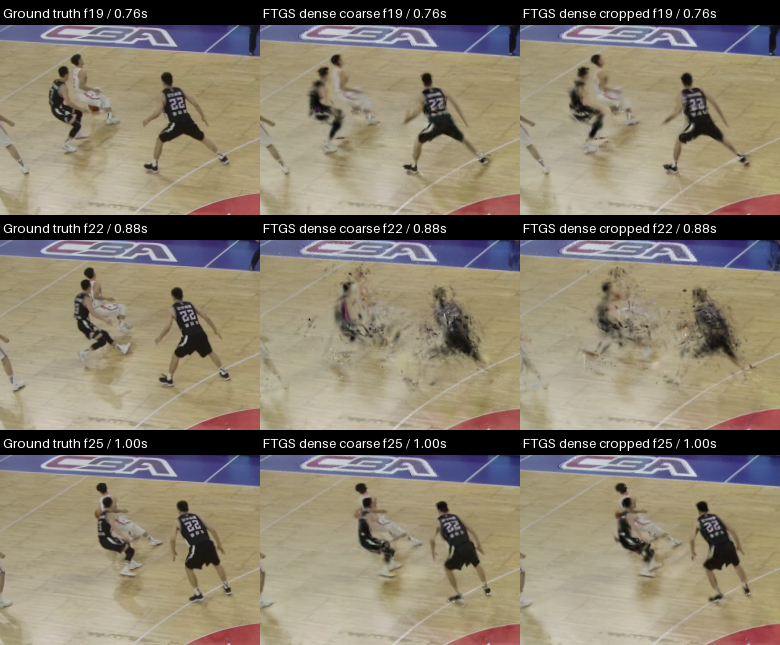
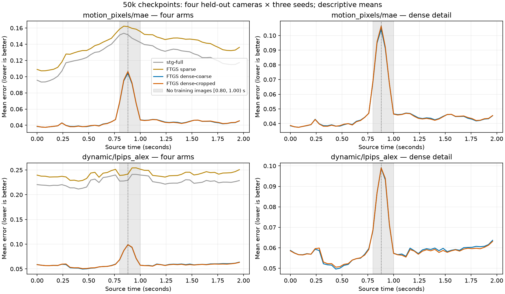

# Basketball crossing artifacts — investigation 001

The reported burst is reproducible in both 50k dense variants, across all three
seeds and all four held-out cameras. It concentrates in frames **20–24
(0.80–0.96 seconds)**, with motion-pixel error peaking at **frame 22 (0.88 seconds)
in all 24 dense recipe/camera/seed combinations**. Those five frames are excluded
from training and initialization in every camera. The precise mechanism causing
the fragments remains unproven; this investigation establishes the timing,
repeatability, and connection to the temporal holdout. The issue is not fixed.

The user's assessment of the generated two-second videos was:

- STG Full and FreeTimeGS Sparse produce blurry humans.
- FreeTimeGS dense coarse and dense cropped produce very sharp humans; it is
  hard to tell which of the two is better.
- Near the middle, the white-shirt player with the ball changes direction and
  crosses in front of a black-shirt player. Flying artifacts appear around both
  for a few frames; players are mostly sharp for the rest of the video.

This assessment is preserved as human feedback. The investigation uses the
completed 50k videos' underlying lossless PNGs and compares all arms and seeds.
It does not infer verified person identities from semantic or instance labels.



In the inspected source crops, the dense players have much clearer bodies,
limbs, and clothing than the sparse/STG silhouettes at frames 19 and 25. Their
outlines break into scattered fragments at frames 21–23, with substantial
recovery by frame 25. Some edge artifacts remain at the surrounding frames.
The failure also affects the nearby defender in a black jersey marked 22;
it is not confined to the crossing pair. Camera 30 has the ball-handler partly
outside the right image boundary, so its crop provides evidence about the
visible nearby defender rather than an unobstructed view of the whole crossing.

Before/during/after crops at frames 19/22/25 were visually inspected for every
camera and seed. The finer nine-frame sequence (17, 19, 20, 21, 22, 23, 24, 25,
27) was additionally inspected for camera 0, seed 0. All twelve nine-frame,
five-column sequences are retained under
`.local/basketball-dense-training/crossing-investigation-001/`, with paths,
crop coordinates, labels, and hashes in [evidence.json](evidence.json).

The frozen [visual protocol](../../basketball-dense-temporal/visual-protocol.json)
selects **frame 22** for its original court/display/player stills. It therefore
samples the worst moment of this failure. Earlier descriptions based on those
stills or on the untrained initializers should not be generalized to the whole
50k video. The human report and this temporal inspection refine the description
to sharp dense players outside a brief, severe interpolation failure. The
historical rejection of the untrained Plan 026 pilots remains a separate result.



The following values use the **existing frozen motion-pixel MAE**, on RGB values
scaled to 0–1. Lower is better. Means give equal weight to four held-out cameras
and three seeds. Nearby frames are 17–19 and 25–27; the gap is 20–24. These are
descriptive windows selected after observing the issue, not new significance
tests or replacements for the experiment's bootstrap results.

| 50k arm | Nearby MAE | Gap MAE | Gap / nearby |
| --- | ---: | ---: | ---: |
| STG Full | 0.14062 | 0.14980 | 1.07× |
| FreeTimeGS sparse | 0.15086 | 0.16019 | 1.06× |
| Dense coarse | 0.04548 | 0.08512 | 1.87× |
| Dense cropped | 0.04533 | 0.08605 | 1.90× |

At frame 22 itself, dense MAE reaches 0.1042 (coarse) and 0.1064 (cropped).
Motion-crop LPIPS shows the same narrow spike: nearby/gap averages are
0.05707/0.08364 for coarse and 0.05684/0.08397 for cropped. These regions cover
motion and surrounding image content; they are not isolated player-identity or
ball-quality measurements. The images are necessary to interpret the numbers.

Both dense variants still have lower absolute errors in the gap than the
persistently blurry baselines. A smaller baseline spike therefore does not imply
better reconstruction of this event. The two dense curves are very close, and
neither recipe eliminates the failure; this investigation does not select a
winner. Gap MAE improved by about 29% (coarse) and 30% (cropped) from 5k to 50k,
while nearby MAE improved by about 49% and 50%. Longer training improved the
absolute gap error but left a larger relative discontinuity.

The strongest explanatory evidence is the missing supervision interval. The
verified manifest contains 1,350 training keys: 30 cameras × 45 frames, with
frames 20–24 absent everywhere. Its time normalization is frame/50 over two
seconds, while source playback time is frame/25. Frame 19 (0.76 s) and frame 25
(1.00 s) bracket the gap and are eligible training times in the 30 training
cameras. Geometry initialization also skips this interval; retained foreground
keyframes jump from 15 to 25. The failure is present in original PNGs before
video encoding and is shared by all seeds and both recipes.

The local native renderer gives each Gaussian a straight trajectory,
`position(t) = mean + velocity * (t - center_time)`, and a Gaussian temporal
opacity envelope. See [the extracted native-method binding](../../../../scripts/freetimegs_source.py)
and the [native implementation](../../../../.local/FreeTimeGsVanilla/src/simple_trainer_freetime_4d_pure_relocation.py)
(`compute_positions_at_time`, `compute_temporal_opacity`, and
`rasterize_splats`). An ensemble can represent a turn using multiple Gaussians,
but overlapping motion/opacity envelopes without image supervision through the
turn may put visible Gaussians off the players. This is a **mechanism hypothesis**,
not a demonstrated causal attribution. A direction change, occlusion, original
correspondence mistakes, learned lifetimes, and relocation can interact. There
is no evidence here establishing an identity swap, a velocity-unit bug, or a
cropped-matching-specific defect.

The next diagnostic should attribute the visible fragments to individual
Gaussians on frozen 50k checkpoints at frames 19–25, retaining both recipes and
all seeds. It should compare their projected positions, temporal centers,
lifetimes, velocities, opacity, and visibility at frames 19/22/25. Diagnostic
copies can then isolate whether the main contribution is misplaced moving
Gaussians or inappropriate opacity/lifetime overlap. Original initialization
labels must not be treated as current identities after relocation. That would
distinguish mechanisms before selecting a training change. This pass launches
no new training or GPU evaluations. Adding the excluded frames to the training
set would change the benchmark and cannot validate a fix under the existing
protocol. The crossing and the only held-out temporal block coincide, so these
results alone cannot separate the effect of occlusion from the effect of the gap.

Reproduce the analysis with new output paths:

```bash
.local/envs/freetimegs/bin/python scripts/basketball_dense_crossing_audit.py \
  --output docs/experiments/basketball-dense-training/crossing-investigation-NEW \
  --assets .local/basketball-dense-training/crossing-investigation-NEW
python3 -m unittest discover -s tests -p 'test_basketball_dense_crossing_audit.py' -v
```

Validation passed four tests for immutable source hashes, camera/frame coverage,
seed/time pairing, and declared-window calculations. The real-data audit
validated all 60 metric files (21,000 frame rows), the 1,350 training keys, and
546 source-file hashes. An independent pixel comparison checked all 540 image
tiles in the twelve sequence sheets against their lossless sources; all matched.
[validation.json](validation.json) records these checks. CSV means for all five
checkpoints are in [frame-means.csv](frame-means.csv). The new sequence sheets
use about 33.5 MB and compact analysis artifacts about 1.4 MB; existing
checkpoints and experiment results were preserved.
