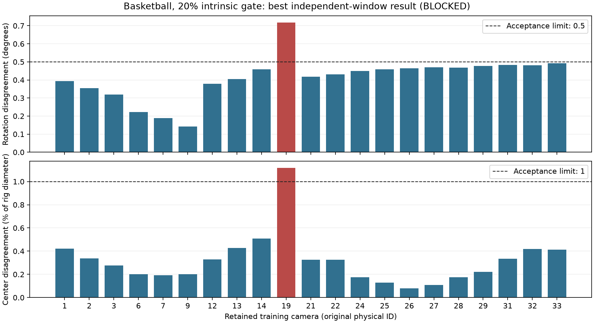

# Basketball recovery with the 20% intrinsic gate

Historical 24-camera record. **Current status:** [camera 19 removal and the
rebuilt 23-camera search](basketball-no-camera19.md) remain blocked by pose
stability. The previous 24-camera outcomes below are preserved. The 20% prior gate and full ten-frame focus screening
pass for all retained cameras. No accepted calibration or training result is
claimed. This supersedes the [33-camera revision-one blocker](basketball-rev1.md).

## Camera selection and retained priors

The user restored the prior variation limit to 20% and explicitly authorized
excluding its failures. Applying `(max - min) / median` to the completed ten-frame
GeoCalib estimates excludes:

| Camera | Intrinsic-prior relative range |
| --- | ---: |
| 4 | 25.2414% |
| 8 | 26.5828% |
| 11 | 23.7469% |
| 15 | 21.6457% |
| 16 | 24.8411% |
| 17 | 41.1882% |
| 18 | 21.1224% |
| 20 | 23.0249% |
| 23 | 22.6102% |

Camera 5 remains excluded from the prior user instruction. The versioned active
protocol is **basketball-intrinsic20/v1**: **24 cameras, 21 training, and three
held-outs (0, 10, 30)**. Original physical IDs are preserved. Held-out camera 20
is removed without replacement. Future preparation contains **1,200 images:
1,050 training and 150 held-out**, from source frames 0–49.

The continuation reused all 240 retained intrinsic observations, verified their
source/model/artifact hashes, and generated only the 120 missing static masks.
All 24 cameras pass the ten-frame 20% check; representative depth maps are reused.
All 24 complete automatic focus screens report no sustained sharpness or apparent
scale change at the predefined thresholds. This supports the user's observation
of constant zoom and apparently constant focus, without treating the check as
proof of physical lens settings. Different cameras retain separate intrinsics.

Camera exclusion is applied to database keypoints, descriptors, matches and
verified geometry before reconstruction. Historical SQLite databases are read
through read-only backups because native database opening can change metadata.
Historical files and previous budget charges are preserved.

## Complete bounded recovery

All **16 predefined paired configurations / 32 independent reconstructions**
completed, registered all 21 training cameras, and reported CONVERGENCE in final
bundle adjustment. Each run asserted that fixed intrinsic parameters remained
fixed after mapping and final refinement. Held-out observations did not enter
training geometry.

| Stage / intrinsic policy / observations | Maximum rotation | Maximum center / diameter |
| --- | ---: | ---: |
| A: fixed principal, original SIFT | 177.9423 degrees | 83.8409% |
| A: fixed principal, original SIFT + RoMa | 48.2635 degrees | 37.2991% |
| A: fixed all intrinsics, original SIFT | 6.2415 degrees | 6.5934% |
| A: fixed all intrinsics, original SIFT + RoMa | 6.9768 degrees | 6.6052% |
| B: fixed principal, expanded sharp SIFT | 22.5605 degrees | 48.2784% |
| B: fixed principal, expanded sharp DSP-SIFT | 53.0530 degrees | 33.7811% |
| B: fixed principal, DSP + RoMa 0.95 | 47.2725 degrees | 32.9763% |
| B: fixed principal, DSP + RoMa 0.90 | 47.1404 degrees | 31.8191% |
| B: fixed all intrinsics, expanded sharp SIFT | 6.6083 degrees | 8.1469% |
| B: fixed all intrinsics, expanded sharp DSP-SIFT | 6.1706 degrees | 7.7635% |
| B: fixed all intrinsics, DSP + RoMa 0.95 | 7.3459 degrees | 7.9172% |
| B: fixed all intrinsics, DSP + RoMa 0.90 | 9.8354 degrees | 7.5006% |
| C: fixed principal, sharp SIFT, initial pair 2–7 | 136.5749 degrees | 67.6207% |
| **C: fixed principal, sharp SIFT, initial pair 6–12** | **0.7182 degrees** | **1.1185%** |
| C: fixed all intrinsics, sharp DSP, initial pair 2–7 | 3.6288 degrees | 8.1296% |
| C: fixed all intrinsics, sharp DSP, initial pair 1–7 | 5.4974 degrees | 8.3562% |
| Required maximum | 0.5 degrees | 1% |

The best candidate uses five independent timestamps per window, fixed principal
points, free focal refinement, sharpness-aware standard SIFT and the same strong
initial pair **6–12** in both windows. Camera **19** is the only training camera
failing either pose gate; the other 20 training cameras meet both thresholds in
this comparison. Camera 19 passes the intrinsic-prior gate and remains retained;
no further camera removal or pose-threshold relaxation was performed.



The new dense pass used 40 verified-overlap pairs at frames 50 and 149: **80
inferences**, below the 128 cap. One prediction set supplied both confidence
variants, retaining **931 matches at 0.95** and **12,492 at 0.90**, with static,
bilateral sharpness and bilateral spatial checks. All four expanded SIFT/DSP
feature databases formed connected overlap graphs. More correspondences alone
did not resolve the pose ambiguity. Stage C used only pairs meeting the frozen
inlier, triangulation-angle, coverage and homography criteria in both windows.

## Evidence, budget and remaining gates

[Machine-readable evidence](basketball-intrinsic20-result.json) includes camera
selection, all comparisons/commands, solver outcomes, focus results, original
artifact reuse, configuration/model/log hashes and the complete GPU ledger.
Local outputs are under `.local/calibration/basketball-v1/intrinsic20/`.

This continuation charged **181.0684 seconds** for retained mask completion and
**21.3355 seconds** for the new dense pass. Cumulative calibration usage is
**1,056.0873 / 28,800 GPU-seconds**, leaving **27,743.9127 seconds**. The 32 CPU
reconstruction commands took 293.1009 seconds in total. No downstream-only
eight-hour extension was activated. All original training allocations remain
unchanged, and no Basketball training was started.

The finite search is exhausted without passing the 0.5 degree / 1% gate. Pooled
and held-out calibration validation, scale, synchronization, preparation,
initialization, training and evaluation remain gated. No selection, final-
validation or experiment frames were consumed by this recovery. The 1,200-image
count is an expected protocol count, not a claim of generated images.

Validation: 33 Basketball tests, three calibration-budget tests, four training-
budget tests; all 32 real native fixed-parameter assertions and converged runs;
source membership, prior/mask reuse, bounded inference and search counts,
evidence hashes, compilation, documentation links and `git diff --check`.
The pinned ViPE checkout and original training ledger remain unchanged.

Reproduction commands (fresh output/workspace paths are required; exact executed
commands and the frozen search are preserved in the evidence):

```bash
.local/envs/stg-colmap/bin/python scripts/basketball_features.py \
  --priors .local/calibration/basketball-v1/intrinsic20/retained-priors \
  --output .local/calibration/basketball-v1/intrinsic20/features-sharp-sift-early \
  --window early

.local/envs/stg-colmap/bin/python scripts/basketball_recovery_stage.py \
  --workspace .local/calibration/basketball-v1/intrinsic20 --stage B

.local/envs/stg-colmap/bin/python scripts/basketball_recovery_stage.py \
  --workspace .local/calibration/basketball-v1/intrinsic20 --stage C
```

Further reconstruction search or removing camera 19 would require a new explicit
strategy revision. The stopping condition is geometric stability, not exhausted
GPU time.
