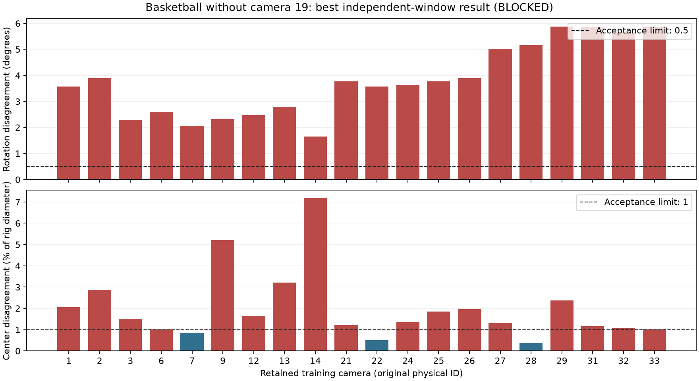

# Basketball continuation after removing camera 19

Status: **blocked by independent-window rig instability after the bounded
23-camera reconstruction search**. Camera 19 is excluded as explicitly requested.
This supersedes the [24-camera result](basketball-intrinsic20.md).

## Active protocol and preserved inputs

Protocol: **basketball-intrinsic20-no-camera19/v1**. Retain **23 physical cameras:
20 training and held-outs 0, 10, 30**. Exclusions are **4, 5, 8, 11, 15, 16, 17,
18, 19, 20, 23**. Original IDs are preserved. Future preparation contains
**1,150 images: 1,000 training and 150 held-out**, from source frames 0–49.

The 20% intrinsic-prior limit, 0.5 degree / 1% pose limits, frame-role separation
and budget policies are unchanged. All 230 retained intrinsic observations and
their image/mask/depth artifacts were copied with hash verification, without new
inference. All retained priors still pass the 20% gate. Full ten-frame automatic
focus screening detects no sustained sharpness or apparent-scale changes in all
23 cameras; this remains a diagnostic check rather than proof of lens settings.

Each reconstruction starts from window-specific original priors and a new
database containing only retained training cameras. Excluded keypoints, matches
and verified geometry are omitted. No previous sparse map is reused as a pose
initialization, and camera 19 was not merely dropped from an old error vector.
Existing per-camera features and dense correspondences are reused through
immutable caches; historical databases and evidence remain unchanged.

## Reconstruction outcomes

The previously best sharp-SIFT recipe with fixed principal points and initial
pair 6–12 was rebuilt first. It did not preserve the former 0.7182 degree /
1.1185% result: removing camera 19 changed the independently recovered solutions.
That pair now disagrees by **137.3361 degrees / 18.5312%**.

The remaining predefined configurations were then executed. The first rebuild
occupies its C-stage slot and is counted once: **16 paired configurations / 32
independent reconstruction commands**, without exceeding the bound.

| Configuration | Maximum rotation | Maximum center / diameter |
| --- | ---: | ---: |
| A: fixed principal, original SIFT | Incomplete early map | Camera 31 unregistered |
| A: fixed principal, original SIFT + RoMa | 161.5007 degrees | 31.3507% |
| A: fixed all intrinsics, original SIFT | 164.7453 degrees | 19.1548% |
| A: fixed all intrinsics, original SIFT + RoMa | 163.3455 degrees | 19.8894% |
| B: fixed principal, expanded sharp SIFT | 155.9952 degrees | 48.5213% |
| B: fixed principal, expanded sharp DSP-SIFT | 42.2021 degrees | 52.1605% |
| B: fixed principal, DSP + RoMa 0.95 | 48.6813 degrees | 35.0218% |
| B: fixed principal, DSP + RoMa 0.90 | 48.1081 degrees | 38.1944% |
| B: fixed all intrinsics, expanded sharp SIFT | 21.7493 degrees | 37.1110% |
| **B: fixed all intrinsics, expanded sharp DSP-SIFT** | **5.8807 degrees** | **7.1892%** |
| B: fixed all intrinsics, DSP + RoMa 0.95 | 10.5853 degrees | 7.0425% |
| B: fixed all intrinsics, DSP + RoMa 0.90 | 10.8072 degrees | 7.1650% |
| C: fixed principal, sharp DSP, initial pair 2–7 | 165.9014 degrees | 39.1418% |
| C: fixed principal, sharp SIFT, initial pair 6–12 (first rebuild) | 137.3361 degrees | 18.5312% |
| C: fixed all intrinsics, sharp DSP, initial pair 2–7 | 7.3496 degrees | 7.4471% |
| C: fixed all intrinsics, sharp DSP, initial pair 1–7 | 6.7942 degrees | 7.5317% |
| Required maximum | 0.5 degrees | 1% |

Thirty-one commands produced complete 20-training-camera candidates; one early
SIFT map registered 19 cameras and was rejected. All 32 final adjustments
reported CONVERGENCE, including that incomplete map. Its log also records
numerical Cholesky failures, demonstrating why solver termination alone is not
an acceptance criterion. No result was accepted on fitting reprojection error
alone.

The best result under the frozen combined pose score is fixed-intrinsic,
expanded sharp DSP-SIFT. It fails rotation for **20 of 20 training cameras** and
center disagreement for **17 of 20**. The largest rotation error is at camera
33; the largest center error is at camera 14. The instability is no longer an
isolated camera-19 error.

## Evidence, budget and remaining work

[Machine-readable evidence](basketball-no-camera19-result.json) contains all
configurations, commands, per-camera comparisons, complete/incomplete outcomes,
prior/focus results, cache bindings, model/log hashes and budget state. Local
outputs are under `.local/calibration/basketball-v1/no-camera19/`.

This continuation used **no new GPU inference**. Cumulative calibration usage
remains **1,056.0873 / 28,800 GPU-seconds**, leaving **27,743.9127 seconds**.
CPU reconstruction commands took 265.5813 seconds in total. No downstream-only
eight-hour allowance was activated, and original training allocations remain
unchanged.

The finite reconstruction search is exhausted without a passing training rig.
Held-out localization, pooled-map selection/final validation, scale,
synchronization, preparation, initialization, training and evaluation remain
gated. No reserved selection, final-validation or experiment frames were used.
The image counts are protocol expectations, not generated data.

Validation: **35 Basketball tests, three calibration-budget tests and four
training-budget tests**; prior-copy integrity; all-run database exclusion;
fixed-parameter assertions; attempt uniqueness and the already-tested C-slot
guard; model/log/source hashes; compilation, documentation links and
`git diff --check`. The pinned ViPE checkout and original training ledger remain
unchanged. Changes are saved as validated local commits, without pushing.

The new reconstruction blocker is evidenced geometric instability after camera
19 removal. More camera removal, changed camera models or a new recovery search
requires a further explicit strategy revision; the issue is not exhausted GPU
time.
