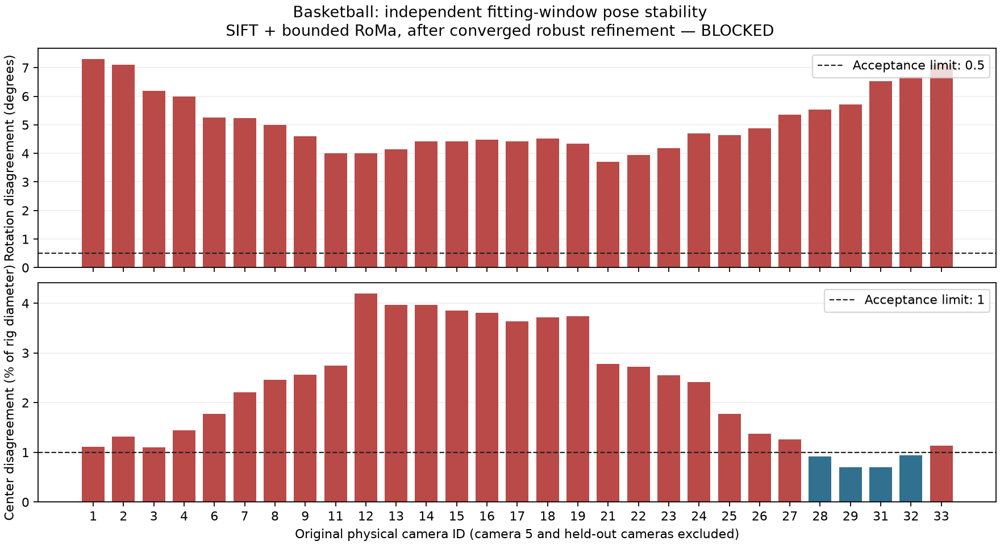

# Basketball calibration excluding camera 5

Historical recovery record. **Current status:** [the camera 19 removal continuation](basketball-no-camera19.md)
retains 23 cameras and remains blocked by independent-window pose instability. The five-frame prior pass and original recovery below are preserved.

The user explicitly removed physical camera 5 after its intrinsic-prior spread
exceeded the authorized 25% limit. This creates the versioned
`basketball-no-camera5/v1` variant: **33 cameras, 29 training cameras and four
held-out cameras (0, 10, 20, 30)**. Source camera IDs are preserved. Camera 5's
video and historical evidence remain on disk but cannot enter subsequent
estimation, reconstruction, initialization, training or evaluation.

The prepared scene must contain **1,650 images: 1,450 training and 200 held-out**
for source frames 0–49 at 960×540. Camera 0 still starts the shared 20-pose sweep
at frame 25. Its nearest training endpoint must be selected from the retained
training rig after calibration. Frame windows, other acceptance gates, crop
policy, original per-method training allocations and cumulative eight-hour
calibration budget are unchanged. Results must name this 33-camera variant and
estimated calibration; they are not official 34-camera benchmark results.

## Retained priors

The 33 retained cameras already passed the 25% intrinsic-stability check.
The continuation reuses their 165 fitting-window intrinsic estimates from the
previous all-camera result, after checking video, source, model-weight and input
audit provenance. It regenerates fitting RGB/temporal differences directly from
the source videos, then runs UniDepth and TrackAnything for retained cameras.
The excluded camera is rejected by the frame-access guard in both pilot and
all-camera modes. Original failed attempts remain charged to the same ledger.

Protocol: `.local/calibration/basketball-v1/protocol-no-camera5.json`.
Prior output: `.local/calibration/basketball-v1/no-camera5-priors`.
GPU log: `.local/calibration/basketball-v1/no-camera5-priors.log`.

```bash
PYTHONDONTWRITEBYTECODE=1 python3 scripts/calibration_budget.py \
  --ledger .local/calibration/basketball-v1/gpu-ledger.json \
  --seconds 3600 --log .local/calibration/basketball-v1/no-camera5-priors.log \
  -- /home/auss/git_repos/samaust/Tridi/vipe/.venv/bin/python \
  scripts/basketball_vipe_pilot.py \
  --workspace .local/calibration/basketball-v1 \
  --vipe /home/auss/git_repos/samaust/Tridi/vipe \
  --output .local/calibration/basketball-v1/no-camera5-priors \
  --all-priors .local/calibration/basketball-v1/pilot-25/result.json \
  --intrinsics-from .local/calibration/basketball-v1/all-priors/result.json
```

## Static reconstruction design

`scripts/basketball_static_rig.py` uses pinned PyCOLMAP 4.2.0 CPU masked SIFT.
It extracts features from all five fitting timestamps for the 29 training
cameras, rejects features whose descriptor support intersects dynamic regions,
and combines them into one virtual image per physical camera. A two-pixel cell
keeps one feature observation per location to avoid counting repeated timestamps
as independent geometric support. Source frame/keypoint membership is retained.
Each physical camera has one PINHOLE calibration and one fixed pose throughout
reconstruction. GeoCalib uses integer-centered image coordinates; adding 0.5 to
the principal point converts to COLMAP's half-integer convention.

Exhaustive matching determines overlap without camera-ID adjacency assumptions.
Incremental reconstruction is bounded to ten minutes, followed by robust
SOFT_L1 bundle adjustment. The reconstruction is a calibration map only, never
Gaussian initialization. Held-out fitting images are reserved for localization
against a frozen accepted training map. A connected candidate does not by itself
pass planar-degeneracy, independent temporal-window, reprojection or timing gates.


## Retained-prior outcome

The 33-camera prior stage passed: 165 fitting observations, 33 representative
depth maps and 165 static masks. Every representative depth map has 100% finite
positive depth. Intrinsic estimates match the previous retained estimates;
there was no focal re-estimation or further threshold adjustment. The
[prior evidence](basketball-no-camera5-priors.json) records camera membership,
quality ranges, source/configuration bindings, runtime, peak memory and budget.
All generated image/mask/depth files are additionally bound by `artifacts.json`.
The stage took 373.5065 seconds inside the worker. This is a prior-quality pass,
not accepted shared calibration or proof of complete moving-region rejection.

Seventeen focused tests passed for camera exclusion, retained counts, frame
leakage, pose/pixel conventions and calibration accounting. Source-camera IDs
and original input audit remain unchanged. Static reconstruction continues.

## SIFT candidate and independent-window gate

The full PINHOLE SIFT run registered all 29 training cameras in one connected
candidate with 9,139 points and mean fitting reprojection error 0.4923 pixels.
A separate four-camera submodel was degenerate: bundle adjustment drove some
focals beyond ten image widths, so it is not a usable alternative rig.
Independent reconstructions from frames 50/75 and 125/149 both registered all
29 cameras. After a single global similarity alignment, their maximum
rotation disagreement was **7.6405°**, and camera-center disagreement was
**4.9614% of rig diameter**. This fails the fixed 0.5°/1% gate despite low
fitting error. These maps are not accepted calibration.

The single predefined distortion alternative is COLMAP `RADIAL`: one focal,
two radial coefficients and fixed zero tangential distortion. Independent early
and late reconstructions also failed (**177.6887°**, **80.7268%**). It was not
selected; neither selection-window improvement nor final acceptance is claimed.
No selection or final-validation frames were consumed. Reconstruction and
bundle adjustment ran on CPU; the GPU ledger remains reserved for GPU stages.

Diagnostics:
`.local/calibration/basketball-v1/no-camera5-pose-stability.json` and
`.local/calibration/basketball-v1/no-camera5-radial-pose-stability.json`.
The plan's single bounded RoMa fallback is the next permitted recovery step.

## Bounded dense fallback and final blocker

The fallback used the already pinned offline RoMa implementation on a fixed set
of 49 training-camera pairs at source frames 50 and 149 (98 inferences). Pairs
came from the verified SIFT overlap graph: a maximum-inlier spanning tree plus
strong local overlap edges, capped at 64 pairs. Both endpoints had to lie at
least eight pixels inside the static masks, with confidence at least 0.95.
One match per 16-pixel source cell and at most 1,500 matches per pair bounded
sampling. This retained 1,803 correspondences in total (median 15, maximum 105
per pair). These settings were recorded before the pass; there was no matcher,
weight or threshold search.

The dense correspondences augmented the early/late SIFT databases and underwent
native geometric verification. Appended locations have no SIFT descriptors;
the augmented databases intentionally remove descriptor rows so those locations
cannot be consumed as valid SIFT descriptors. Reconstruction continues from
coordinates and verified matches. The original databases remain intact.

Both augmented windows registered all 29 training cameras, but their initial
pose comparison still failed (6.3669° / 4.3732%). Because the first bundle
adjustments reached their iteration caps, each final candidate received one
bounded refinement with at most 1,000 iterations and 120 seconds, with SOFT_L1
loss and explicit convergence tolerances. **Both refinements reported
CONVERGENCE.** The final independent-window comparison nevertheless failed:

| Check | Required maximum | Observed maximum | Cameras failing |
| --- | ---: | ---: | ---: |
| Rotation disagreement | 0.5° | **7.3065°**, camera 1 | 29 of 29 |
| Center disagreement / rig diameter | 1% | **4.1972%**, camera 12 | 25 of 29 |



The [final evidence JSON](basketball-no-camera5-result.json) contains every
per-camera disagreement, the single similarity alignment, model/log hashes,
protocol membership and complete cumulative calibration accounting. The local
current-status artifact is `.local/calibration/basketball-v1/status.json`.
Native COLMAP IDs are physical source IDs plus one; image names and recorded
camera lists retain the physical IDs, including the gap at camera 5.

This is the current defined blocker: **the retained training rig is unstable
across independent fitting windows after the bounded recovery options**.
The 33 retained intrinsic priors passed, but low fitting reprojection error and
connected registration do not establish reliable shared calibration. No accepted
rig was published. Held-out localization, scale estimation, selection/final
validation, synchronization, processed scene, initialization, training and model
evaluation remain unexecuted. All frames used in estimation are in 50–149.
The experiment window 0–49 and both reserved later windows remain unused.

Cumulative GPU calibration charge: **718.3131 / 28,800 seconds** (0.19953
GPU-hours), leaving **28,081.6869 seconds**. This includes all original failed
attempts, the runtime-probe allowances, the retained-prior run and the single
RoMa fallback. GPU jobs ran sequentially. CPU SIFT, bundle adjustment and pose
comparisons are measured separately and consume no training allocation. No
Basketball training was started; the original training ledger is unchanged.

The recovery steps are bounded and exhausted for this implementation. Further
work requires revising the calibration strategy or acceptance requirements;
this result does not authorize more matcher/model search or another camera
removal automatically.

## Validation and reproduction

Final checks passed: 18 Basketball tests, three calibration-budget tests and four
existing training-budget tests (25 total), Python compilation, current evidence
hashes, local documentation links and `git diff --check`. The ViPE checkout is
clean and the training ledger hash remains
`d0b4daa1aee79361580af3a1bf8fbc597148db7775b26f169a0a1b2e6ac90957`.
The expected image counts are protocol checks; no processed images or model
reloads are claimed. Geometry-scale, distortion-selection, final reprojection,
timing, initialization and model-evaluation tests remain gated on a reliable rig.

The executed recovery commands use the existing pinned environments. Prior
outputs are immutable; these are reproduction records, not authorization for
an additional dense pass or model search:

```bash
.local/envs/stg-colmap/bin/python scripts/basketball_static_rig.py \
  --priors .local/calibration/basketball-v1/no-camera5-priors \
  --output .local/calibration/basketball-v1/no-camera5-sift

# Independent windows use --fit-frames 50 75 and --fit-frames 125 149,
# each with a separate output. The single alternative adds --camera-model RADIAL.

PYTHONDONTWRITEBYTECODE=1 python3 scripts/calibration_budget.py \
  --ledger .local/calibration/basketball-v1/gpu-ledger.json \
  --seconds 1800 --log .local/calibration/basketball-v1/no-camera5-dense.log \
  -- .local/envs/roma/bin/python scripts/basketball_dense_matches.py \
  --priors .local/calibration/basketball-v1/no-camera5-priors \
  --sift-result .local/calibration/basketball-v1/no-camera5-sift/result.json \
  --roma .local/RoMa-edgs --weights .local/weights/roma-edgs \
  --output .local/calibration/basketball-v1/no-camera5-dense

.local/envs/stg-colmap/bin/python scripts/basketball_dense_rig.py \
  --sift .local/calibration/basketball-v1/no-camera5-early \
  --dense .local/calibration/basketball-v1/no-camera5-dense --frame 50 \
  --output .local/calibration/basketball-v1/no-camera5-dense-early

# The late counterpart uses no-camera5-late, --frame 149, and its own output.
.local/envs/stg-colmap/bin/python scripts/basketball_refine_rig.py \
  --input .local/calibration/basketball-v1/no-camera5-dense-early \
  --output .local/calibration/basketball-v1/no-camera5-refined-early

# Repeat the bounded refinement once for the late candidate, then compare:
.local/envs/stg-colmap/bin/python scripts/basketball_pose_stability.py \
  --reference .local/calibration/basketball-v1/no-camera5-refined-early \
  --other .local/calibration/basketball-v1/no-camera5-refined-late \
  --output .local/calibration/basketball-v1/no-camera5-final-pose-stability.json
```
