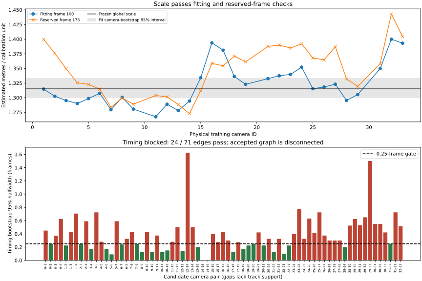

# Basketball Plan 005 revision 2 continuation

Latest continuation: [the autonomous timing recovery](basketball-timing-recovery.md)
completed both declared fitting stages. Temporal SIFT passes 67/146 edges and
RoMa passes 0/146; combining already-passing complementary edges reaches 33
cameras but leaves camera 14 disconnected and four graph bridges unvalidated.
Synchronization still blocks downstream execution. Calibration and scale remain
accepted; the evidence below records the earlier initial continuation.


Status: provenance, camera conventions and estimated metric scale passed;
synchronization is blocked by the fitting uncertainty/graph gate. No Basketball initialization, training or evaluation has run.
The accepted [Plan 006 calibration](basketball-calibration-alternatives.md) remains
immutable, with all 34 cameras and held-outs 0, 10, 20, 30.

## Provenance and conventions

The [provenance audit](basketball-rev2/provenance.json) rehashed every source video,
the pinned calibration/profile and frozen map/anchor artifacts. All 34 videos
decoded to 250 frames at 1920×1080 and 25 fps, with unchanged timestamps.
The pinned ViPE branch/revision and clean tree passed. The static validation
consumption marker remains intact; no final static images were evaluated.

The [saved-observation reload](basketball-rev2/export-reload.json) reproduced all
79,835 saved final projections with zero error change. The scale adapter's
undistortion maps agree with native COLMAP radial projections within 0.00004 px
across a full-image sample for every camera. Output K explicitly uses (480,270)
principal points to match the unmodified pinned ViPE depth wrapper, with the
accepted per-camera focal. This half-pixel change is part of the image remap;
the immutable source K retains OpenCV (479.5,269.5) principal points.

## Frozen scale protocol

[The protocol](../../configs/basketball-rev2/scale.json) is frozen before depth
inference. Fit on training cameras at frame 100; check the frozen scale at frame
175 only if fitting passes. Generate fresh ViPE UniDepth depth on undistorted
images; older depth used other intrinsics on distorted images and is not reused.
The native ViPE checkout is unchanged. Source, extension and weight hashes must
match the earlier audited environment before inference, with offline weight reuse.
The NVIDIA catalog check found no strong match needed for this existing pipeline;
no skills were installed.

Use equal-camera median log depth/map-z ratios, a camera-cluster bootstrap and
predeclared support/consistency gates. Require at least 100 points and six image
grid cells per training camera, local log MAD ≤0.25, each camera scale within 25%
of the global value, and bootstrap relative halfwidth ≤10%. Reserved-frame scale
disagreement must be ≤10%. These new scale-specific criteria are separate from
GeoCalib prior trust and are not adjusted after inference. The bootstrap cannot
measure common monocular metric bias; no measured ground-truth metric accuracy
is claimed. Frame-100 preparation retains 424–1,049 static points per camera.

## Reproduction and accounting

Use fresh output directories for new measurements. Initial commands:

```bash
.local/envs/calibration-global/bin/python scripts/basketball_continuation_audit.py --output .local/calibration/basketball-rev2/provenance
.local/envs/calibration-global/bin/python scripts/basketball_scale.py prepare --protocol configs/basketball-rev2/scale.json --audit .local/calibration/basketball-rev2/provenance/result.json --role fit --output .local/calibration/basketball-rev2/scale-fit-inputs
```

CPU provenance/preparation does not charge GPU time. Preserve the original
calibration ledger and its 1,056.087320-second starting charge. GPU inference and
failed attempts use that ledger; the conditional downstream extension remains
unused. Plan 006's uncapped investigation is separate. Every method retains its
two-hour Basketball training allocation; no training seconds have been charged
by this continuation.

Verification: two provenance/split rejection tests and four scale/distortion
tests pass, including synthetic known scale with outliers, cross-camera bias,
reserved-frame drift, support/leakage and nonfinite rejection. Synchronization,
shared preprocessing and method regression checks remain later gates under
[revision 2](../../plans/plan_005_rev2.md).

## Scale outcome and timing implementation

[Fitting](basketball-rev2/scale-fit.json) passes with one global scale
**1.31506947 estimated metres per calibration unit**. Camera-bootstrap 95% interval:
**1.29961338–1.33331995** (1.28% relative halfwidth). Maximum per-camera deviation
is 6.45%, and maximum local log MAD is 0.10341.
[Reserved frame 175](basketball-rev2/scale-selection.json) passes against that
unchanged fitting scale: diagnostic scale 1.35619473, disagreement **3.13%**;
maximum per-camera deviation from the frozen scale is 9.72%. These are estimated
scale consistency results; common monocular depth bias remains unmeasured.

The two serialized GPU attempts charged **24.550233 seconds**, bringing the
original ledger to **1,080.637553 seconds**. Both completed; no extension was used.
[Resource and depth artifact hashes](basketball-rev2/resources.json) record the
required Python 3.14 / Torch 2.13.0+cu130 / torchvision 0.28.0+cu130 runtime,
peak memory, supervised charges and exact commands. ViPE sources, extensions and
cached weights matched the original audit before each attempt.

The [timing protocol](../../configs/basketball-rev2/timing.json) freezes dynamic
SIFT/Lucas–Kanade tracking, descriptor matching and robust epipolar timing checks.
Fitting uses only 50–149, physical camera pairs selected by geometric overlap and
center distance, ±25 integer lags and 0.05-frame refinement. Offsets must have a
distinguishable optimum, bootstrap halfwidth ≤0.25 frame and a connected graph
with cycle support covering every camera; cycle residuals must be ≤0.25 frame.
Six synthetic timing tests pass, including full-image distortion inversion and
undiluted signed cycle closure, plus: fractional sign/recovery, flat/boundary/support
rejection, uncertain tracks, and graph disconnection/bridges/cycle inconsistency.
Reserved-window timing execution remains gated on the fitting outcome and will
require separately frozen selection/final validation support. It is not yet
implemented or claimed complete.

## Timing outcome: downstream blocked

The [corrected fitting result](basketball-rev2/timing-fit-precise.json) contains all
integer/fractional search curves, support and track-bootstrap intervals. There
are **3,854 moving tracks** across all 34 cameras (78–155 per camera) and **71
geometrically selected camera pairs**. Only **24 edges pass**: **45 fail timing
uncertainty**, and **two lack 12 independent matching tracks spanning the search**.
The accepted graph leaves **19 cameras unreachable from camera 1**:
14, 16, 17, 18, 19, 20, 21, 22, 23, 24, 25, 26, 27, 28, 29, 30, 31, 32, 33.
No rig-wide offsets are exported. Individual passing edges are fitting diagnostics,
not accepted synchronization.

| Pair | Dynamic track support | Diagnostic optimum (frames) | Bootstrap 95% interval (frames) | Outcome |
| --- | ---: | ---: | --- | --- |
| 0–1 | 42 | 0.00 | −0.35 to 0.55 | Uncertainty exceeds 0.25-frame halfwidth |
| 13–14 | 13 | 0.05 | −0.45 to 0.55 | Uncertainty exceeds limit |
| 14–15 | 11 | Unavailable | Unavailable | Insufficient support |
| 30–31 | 30 | 0.40 | −0.50 to 0.60 | Uncertainty exceeds limit |
| 31–32 | 37 | −0.20 | −0.25 to 0.25 | Edge passes; disconnected from reference component |



The [first fitting result](basketball-rev2/timing-fit.json) is preserved.
Additional numeric checks found default OpenCV inverse distortion left up to
0.0102196 px error, and least-squares edge residuals could hide a 0.6-frame cycle
closure error by spreading it into three 0.2-frame residuals. The corrected
adapter uses explicit iterative convergence (<1e−6 px full-image round trip) and
signed fundamental-cycle closure. One CPU retry failed because OpenCV 5 exposes
`criteria` on `undistortPoints`, not `undistortPointsIter`; its log and partial
output are retained. This was an API error, not a sandbox/permission failure.
The subsequent complete rerun used the unchanged timing protocol and thresholds;
it produced the same 24/71 pass count and disconnected graph. Original adapter
source, failed-attempt logs, track hashes, CPU timings and final search records
are inventoried in the [timing summary](basketball-rev2/timing-summary.json).

Timing **selection (150–199), final validation (200–249), drift/subset checks,
shared 1,700-image preparation, fresh Gaussian initialization, training and model
evaluation have not run**. Reserved timing consumers remain unimplemented behind
the failed fitting gate. The static validation marker and calibration are
unchanged. Equal frame numbers or near-zero fitting optima cannot replace the
required timing evidence. A stronger automatic correspondence/uncertainty method
would need a newly declared fitting protocol; this run does not relax its gates
or use reserved timing data to repair the fit.

STG Lite, STG Full, FreeTimeGS reproduction and ATGS stop at this shared gate;
MoE-GS and FreeTimeGS++ also retain their independent implementation blockers.
No method budget is charged and no allowance is redistributed. The remaining
original calibration/downstream allowance is **27,719.362447 seconds**; budget
exhaustion is not the blocker. The conditional eight-hour extension is unused.

## Completed verification and commands

**57 Basketball tests, seven calibration/training-budget tests and three SelfCap
initialization regressions pass**, along with frozen artifact/video/profile hashes,
local documentation links, SVG parsing and `git diff --check`. SelfCap code and
checkpoints were not modified. Downstream training/reload/metric tests remain
unexecuted because those stages are gated. This is evidenced blocker coverage,
not completion of the downstream experiments.

```bash
# Each scale inference was supervised on the host GPU with a separate log/output.
python3 scripts/calibration_budget.py --ledger .local/calibration/basketball-v1/gpu-ledger.json --seconds 1800 --log .local/calibration/basketball-rev2/scale-fit-infer.log -- /home/auss/git_repos/samaust/Tridi/vipe/.venv/bin/python scripts/basketball_scale.py infer --inputs .local/calibration/basketball-rev2/scale-fit-inputs --vipe /home/auss/git_repos/samaust/Tridi/vipe --output .local/calibration/basketball-rev2/scale-fit-depth
.local/envs/calibration-global/bin/python scripts/basketball_scale.py evaluate --inputs .local/calibration/basketball-rev2/scale-fit-inputs --depths .local/calibration/basketball-rev2/scale-fit-depth --output .local/calibration/basketball-rev2/scale-fit.json
.local/envs/calibration-global/bin/python scripts/basketball_scale.py prepare --protocol configs/basketball-rev2/scale.json --audit .local/calibration/basketball-rev2/provenance/result.json --role selection --output .local/calibration/basketball-rev2/scale-selection-inputs
# Reserved scale inference uses scale-selection-inputs / scale-selection-depth;
# its exact supervised command is in resources.json.
.local/envs/calibration-global/bin/python scripts/basketball_scale.py evaluate --inputs .local/calibration/basketball-rev2/scale-selection-inputs --depths .local/calibration/basketball-rev2/scale-selection-depth --frozen-fit .local/calibration/basketball-rev2/scale-fit.json --output .local/calibration/basketball-rev2/scale-selection.json
.local/envs/calibration-global/bin/python scripts/basketball_timing.py track --protocol configs/basketball-rev2/timing.json --audit .local/calibration/basketball-rev2/provenance/result.json --output .local/calibration/basketball-rev2/timing-fit-tracks-precise
.local/envs/calibration-global/bin/python scripts/basketball_timing.py fit --tracks .local/calibration/basketball-rev2/timing-fit-tracks-precise --output .local/calibration/basketball-rev2/timing-fit-precise.json
# Packaging reads saved evidence only; fitting returns exit code 1 for this gate failure.
.local/envs/calibration-global/bin/python scripts/basketball_continuation_package.py --workspace .local/calibration/basketball-rev2 --output docs/experiments/basketball-rev2
```
