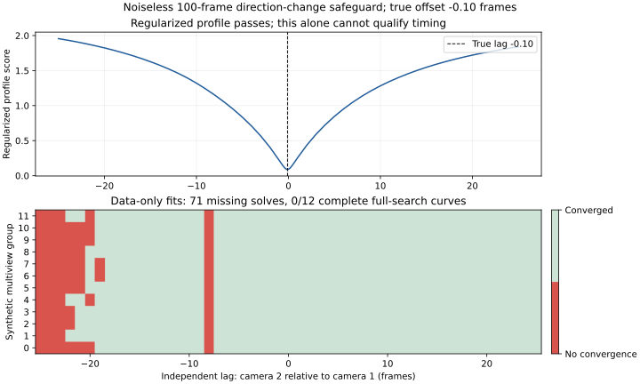

# Plan 008: balanced multiview support and shared-spline safeguards

Status: **support admitted; timing blocked by independent data-only solver failures**.
All 72 fixed edges pass the revised support gate. The actual spline optimizer and
independent evaluator were implemented and exercised synthetically. A required
100-frame noiseless direction-change control then failed independent validation:
**71 of 612 acceleration-free nuisance fits reached the 200-evaluation cap**.
Every one of its 12 groups had an incomplete full-search curve, leaving **0/12
supporting data-only groups**. The regularized estimate alone cannot qualify it.

No real-data timing configuration was fitted, no candidate was selected, and
selection was not reevaluated. Final frames 200–249, final-consumption markers,
initialization and Basketball training remain untouched. The
[terminal result](basketball-shared-timing-v2/result.json) records a numerical
failure, with `candidate_offsets` and `accepted_timing` both null.

## Admission outcome

Fresh native fitting extraction produced **46,024 retained trajectories**, versus
5,785 in Plan 007. Duplicate handling leaves 27,724 merged trajectories. Association
produces **1,334 eligible groups**, versus 351 previously; eligible-group counts
increase on every fixed edge. The binary-only integer program completed all
1,334 seed-0 tie decisions in **117.574221 seconds** of its 120-second allowance.
It assigns **667 whole groups to each half**, with at least **19 groups per edge
per half**. Maximum edge imbalance is 1 and total imbalance is 37. Saved membership
is independently reconstructed, including original-track and duplicate-family
leakage checks.

| Observation/association stage | Count |
| --- | ---: |
| Seeded trajectories | 210,353 |
| Rejected for length | 113,226 |
| Rejected for motion | 51,103 |
| Retained native trajectories | 46,024 |
| Duplicate source trajectories merged into compatible families | 7,567 |
| Incompatible transitive families rejected | 2,047 |
| Source trajectories in those rejected families | 10,733 |
| Remaining merged trajectories | 27,724 |
| Conflicting multiview components rejected whole | 226 |
| Components with fewer than three training cameras rejected | 16,918 |
| Eligible whole groups | 1,334 |

The two branches per seed terminate through 120,301 LK failures, 84,774 appearance
discontinuities and 215,631 fitting-boundary completions. These are branch counts,
not additional rejected-trajectory counts. Descriptor checkpoints had no missing
computations. Per-camera and per-seed details are retained in the support artifact.

## Terminal synthetic evidence

All **1,890 optimizer controls / 5,670 starts** were evaluated across all six
configurations. Three short-window recovery misses were independently audited
and remained unqualified because data-only identifiability was not established.
The full 12-group independent matrix then completed three of its planned 117
controls before the mandatory stop; the remaining 114 controls were not run.

| Independent control | True offset | Regularized lag | Complete data-only groups | Safeguard outcome |
| --- | ---: | ---: | ---: | --- |
| Constant velocity, 100 frames, no noise | −0.75 | −0.75 | 12/12 | Passed |
| Acceleration, 100 frames, no noise | −0.25 | −0.25 | 12/12 | Passed |
| Direction change, 100 frames, no noise | −0.10 | −0.10 | 0/12 | Numerical blocker |

The failing control uses ten-frame knot spacing and acceleration weight 1.
Its three production starts recover the offset within **0.001229 frames**. The
regularized independent profile also recovers −0.10 frames, has a 0.158486 profile
score gap, and reports a collapsed bootstrap interval [−0.10, −0.10]. All 1,164
regularized nuisance fits converge. In the separate data-only integer search,
71/612 fits do not converge within 200 evaluations; no nuisance offset reaches
its boundary. Incomplete curves stay missing rather than becoming zero offsets
or narrowed-search evidence.

This establishes a limitation of the implemented independent solver under the
frozen settings. It does not establish intrinsic unidentifiability of the scene
or rank the unexecuted real configurations. The full ±25-frame search, solver cap,
0.05-frame noiseless recovery limit and 0.25-frame timing requirement remain fixed.
No new model or threshold was selected after the failure.

The [frozen v2 configuration](../../configs/basketball-rev2/timing-shared-v2.json)
preserves all 34 cameras, accepted calibration and scale, the fixed 72-edge graph,
held-outs 0/10/20/30, and the 0.25-frame timing requirement. The fitting role is
50–149. Selection 150–199 was previously inspected, and final validation 200–249
remains untouched. Training and initialization are outside this investigation.
This is an adapted research investigation, not an author-pipeline reproduction.

## Revised observations and association

The separately versioned [extractor](../../scripts/basketball_shared_tracks_v2.py)
uses native 1920×1080 images and seeds 50, 60, …, 140 and 149. Each seed has
independent forward and backward LK branches; an appearance discontinuity ends
that branch, and its two contiguous branches are joined at the seed. All seeds
use the same masked SIFT settings: 16,000 features, at most 1,000 tracks per seed,
eight-pixel spacing, 31-pixel LK window, one-pixel forward/backward error limit,
and 0.7 adjacent-patch correlation. The minimum length remains 60 frames, with
five-pixel total motion and 0.15-pixel median per-frame speed in the calibration
convention. Masks are filtered to fitting frames before nearest-mask lookup and
are hash-verified. Pixel centers convert by `(xy + 0.5) / 2 − 0.5`, followed by
the existing radial undistortion.

RootSIFT descriptors are retained at the seed and every supported ten-frame
checkpoint relative to that seed. Checkpoints use the tracked position and
original keypoint scale, orientation and octave. Their frame IDs and original
source-track identities are saved. Checkpoint computation is batched by source
frame; an exact-equivalence regression checks it against individual computation.
The first implementation's per-checkpoint pyramid rebuilding was interrupted
before a camera completed; its code and partial output are preserved locally.
The same policy resumed in fresh outputs, without changing the configuration,
thresholds, matching rules or partition seed. A second computational refactor
replaced repeated duplicate-pair and descriptor scans with equivalent operations.
It reused the complete hash-verified extraction in a fresh association directory;
no images were re-extracted. Both interrupted workers and source snapshots remain
in the inventory. Equivalence tests compare candidate filtering against all-pairs
merging and descriptor reductions against brute-force checkpoint distances.

The [association implementation](../../scripts/basketball_shared_association_v2.py)
unions same-camera tracks with at least eight shared frames and maximum
separation at most one calibration pixel. It rejects an entire transitive family
if any shared-frame members differ by more than one pixel or its union has a
frame gap. Compatible families average shared positions, retaining all original
track identities and descriptor provenance. No family is split to repair support.

Track-to-track appearance distance is the minimum checkpoint distance among
pairs whose source frames differ by at most 25. Mutual nearest-neighbor matching
requires the 0.8 ratio in both directions. The runner-up must be a different
trajectory with a finite eligible distance; checkpoints from the winning
trajectory do not count as competing tracks. Only fixed-graph edges are matched.
Connected components containing multiple trajectories from one camera are
rejected wholesale. Eligible groups require at least three training cameras;
held-out cameras do not satisfy this requirement.

## Coverage partition and admission

The partitioner receives only the saved binary edge-by-group membership matrix.
It has no offsets, residuals, motion scores, geometry scores, or selection data.
An edge with fewer than 24 eligible groups immediately blocks admission. When
that necessary condition holds, SciPy's installed integer-programming solver
assigns every complete group to exactly one half, with half sizes differing by
at most one and at least 12 groups per edge per half.

The solver first minimizes maximum edge-count imbalance, then total imbalance,
then minimizes each binary decision in a seed-0 permutation of group IDs,
preferring optimization (0) when either choice remains optimal. Each phase must
prove optimality within one shared 120-second solver allowance. Infeasibility,
solver timeout, incomplete deterministic tie-break and numerical failure have
distinct statuses. Partial assignments cannot pass admission.

[All-edge support changes and per-camera extraction losses](basketball-shared-timing-v2/support.json),
[groups, rejected components and matching provenance](basketball-shared-timing-v2/groups.json),
[binary membership](basketball-shared-timing-v2/membership.json), and
[partition provenance](basketball-shared-timing-v2/partition.json) are published.
Native observations, checkpoint descriptors, duplicate families and original
track identities remain in the hash-bound local artifact inventory.
These presence counts precede geometric/spatial and timing validation; they
are upper bounds on support that could survive the later gates.

## Evidence boundary

The completed [Plan 007 estimator audit](basketball-shared-timing-v1.md) is reused,
not rerun. Its source, output, historical estimator, calibration, scale and
consumption-marker hashes were reverified. The previous 16-edge admission
failure and 36/72-edge selection failure remain historical evidence.
No prior script, result, configuration or consumption marker was overwritten.

The immutable [admission CLI](../../scripts/basketball_shared_timing_v2.py)
implements `prepare` and `associate`. The separately frozen
[full workflow](../../scripts/basketball_shared_workflow_v2.py) adds `safeguard`,
`fit`, `assess` and `package`, with hashed predecessors and fresh outputs.
Its selection entry remains guarded pending fitting qualification. No final-frame
reader exists. The [configuration assessment record](basketball-shared-timing-v2/configuration-assessments.json)
keeps unexecuted real configurations separate from synthetic model controls.

## Implemented spline model and independent evaluator

The [actual model](../../scripts/basketball_shared_spline_v2.py) represents each
multiview group by a clamped cubic B-spline in rig-diameter units. Corrected time
is `(source_frame − camera_offset) / 25` seconds. Poses, intrinsics, radial
distortion and scale remain fixed. The joint solver optimizes training offsets
and spline coefficients, anchors camera 1, bounds offsets by ±25 frames, and
rejects solutions within 0.01 frames of a boundary. Training-only triangulation
initializes coefficients without interpolating outside the role/window.

The objective applies one-pixel soft-L1 to each 2D reprojection norm **before**
data-sample normalization. Mean squared acceleration is a separate quadratic
penalty, with source-frame-spaced quadrature in seconds. Analytic sparse
Jacobians feed SciPy trust-region reflective least squares and LSMR, with all
three tolerances at `1e-6` and at most 200 function evaluations. Six configurations
remain fixed: knot spacing 5 or 10 frames crossed with acceleration weights
0.1, 1 and 10. The production-start gate checks current, zero and seed-0
±0.5-frame perturbed starts for convergence and agreement within 0.25 frames.
All solver evaluations, objectives, coefficients and initialization support are
retained in local raw artifacts, including nonqualifying synthetic fits.

Held-out offsets are estimated only after freezing training trajectories. This
separate scalar profile searches integer lags throughout ±25 and refines every
minimum basin; held-out observations cannot update spline coefficients. An
initial one-variable TRF/LSMR implementation hit an installed-SciPy indexing
error. The post-fit scalar estimator uses bounded scalar refinement, while the
joint offset/spline solves retain the prescribed sparse TRF/LSMR solver.

Independent edge measurement accepts observations, calibration, endpoint IDs
and model/resource settings; it never accepts production offsets or coefficients.
For a training edge, one endpoint is anchored at zero, the other lag is profiled,
and the remaining training offsets and trajectory are local nuisance variables.
For a held-out edge, training-only nuisance trajectories and offsets are fitted
first and frozen before held-out lag is evaluated. Every group starts from a
local zero gauge, without production priors or cycle penalties.

The evaluator searches all integer lags in ±25, refines detected minimum basins
to 0.05 frames and competing minima to 0.01 frames. It caches whole-group curves
and resamples entire multiview groups 256 times with seed 0. Acceleration-free
nuisance profiles are fitted separately. Boundary, ambiguity, missing full-search
support and wide-interval failures remain explicit. Independent fundamental-cycle
closures use the measured edge lags, not cycles manufactured from global offsets.
Separable group profiles run in at most eight single-thread CPU workers; a
regression compares parallel and serial curves exactly.

## Synthetic safeguards

The [continuous 3D generator](../../scripts/basketball_shared_synthetic_v2.py)
covers offsets −0.75, −0.25, −0.10, 0, 0.10, 0.25 and 0.75 frames; lengths
25, 50 and 100; and noise 0, 0.25 and 0.5 pixels. Positive geometries include
identifiable constant velocity, acceleration and a cubic direction reversal.
Stationary and constant-velocity epipolar-direction controls are deliberately
ambiguous. Synthetic current starts are fixed independently of the known offsets.
Noise seeds are reused across injections, so control counts are not independent
experimental replications.

The full optimizer matrix plans 1,890 controls, each with three actual starts.
A separate 117-case independent-profile matrix uses 12 multiview groups per case,
covers every injection/length/noise combination, and tests ambiguous controls
across all three acceleration weights. Noiseless controls independently established as identifiable must converge,
agree and recover within 0.05 frames. Long noiseless positive controls must also
establish independent identifiability. Short unsupported or ambiguous controls
remain rejected; a motion label alone is not a recovery requirement. Noisy
controls passing independent timing gates must recover within 0.25 frames. Missing or
rejected controls are preserved, and a failed required safeguard stops real
fitting. The [synthetic summary](basketball-shared-timing-v2/synthetic-summary.json)
records attempted versus planned controls, errors, convergence, uncertainty and
failed cases; [per-control summaries](basketball-shared-timing-v2/optimizer-controls.json)
link the compact statistics to raw coefficient/trace artifacts.

Unit regressions additionally check robust-loss normalization, sparse analytic
derivatives, accepted pose/distortion conventions, outliers, fixed source support
across injections, held-out isolation, independent full-range lag sign, group
bootstrap units, deliberately inconsistent independent cycles, and rejection when
only a regularized curve appears confident. Unit-test success does not substitute
for passing the broader synthetic safeguards or any real-data timing gate.

## Resources and verification

The four-hour elapsed budget starts at **2026-09-07 18:06:19 UTC**, including
initial inspection, implementation, tests, interrupted commands and reporting.
The external process watchdog protects the final 20-minute packaging reserve;
ordinary work expires at 21:46:19 UTC and packaging at 22:06:19 UTC. Existing CPU
dependencies are used with at most eight compute threads, one decoder thread,
and one BLAS/HiGHS thread. There were no downloads or GPU jobs. The historical
GPU ledger remains hash-identical; Basketball training is uncharged.

The [resource record](basketball-shared-timing-v2/resources.json) retains the
interrupted unbatched extraction, slower association and serial synthetic worker,
a repaired test-fixture
error and an unavailable
bare `python` command, subsequently replaced with the installed calibration
interpreter. The serial synthetic worker was restarted in fresh outputs with the
same controls and thresholds after independent profiles were parallelized. An
initial optimizer-only guard mistakenly treated a short motion label as proof
of identifiability. The correction follows the original plan: independent
data-only evidence determines whether short-control recovery is required. Its
799 existing fits were reused after checking their hashes, recipes, model code
and identical optimizer/start definitions; no recovery threshold was relaxed.
The original rejection and its three-group diagnostic are preserved as
implementation history, not the terminal scientific finding. The
[evidence inventory](basketball-shared-timing-v2/evidence.json)
binds exact successful stage commands, raw artifacts, logs and historical inputs.
The [independent verification record](basketball-shared-timing-v2/verification.json)
records final elapsed time, regression counts, hashes, documentation links,
all-edge reconstruction and absence of trajectory/family leakage.
