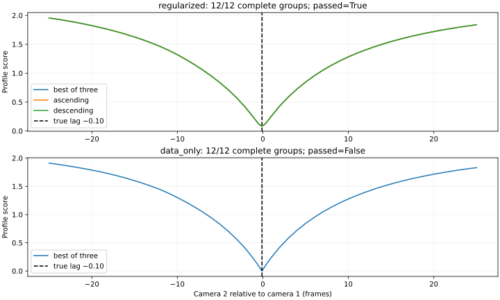

# Plan 009: independent timing solver repair

Status: **numerical blocker: incomplete positive-depth evidence in both sweep directions**.
The revised evaluator removes the previous evaluation-cap failures on the exact
12-group control, but some data-only starts converge to negative-depth solutions.
The best-of-three aggregate recovers the true offset; it cannot qualify timing
because the required ascending and descending profiles are incomplete.

No real fitting, computational-feasibility benchmark, selection access or final
validation was performed. All six real configurations remain unassessed,
`candidate_offsets` and `accepted_timing` remain null, and Basketball training
remains blocked. This is the documented-blocker completion path of
[Plan 009](../../plans/plan_009.md), not a selection-qualified candidate.
The [terminal result](basketball-shared-timing-v3/result.json) preserves the stop.

## Exact failing-control retest

The unchanged generator reconstructs 12 noiseless direction-changing groups,
100 source frames, true offset −0.10 frames, ten-frame knots and acceleration
weight 1. Both objectives search all 51 integer lags from −25 through 25,
then refine detected basins to 0.05 frames and competing basins to 0.01 frames.
Each final profile contains 97 lags and the same 12 groups. Every group/lag
retains exactly three initialization attempts.

| Evidence | Regularized | Data-only |
| --- | ---: | ---: |
| Attempts | 3,492 | 3,492 |
| Converged attempts | 3,492 | 3,492 |
| Rejected for negative depth | 0 | 12 |
| Evaluation-cap failures | 0 | 0 |
| Best-of-three complete groups | 12/12 | 12/12 |
| Best-of-three optimum | −0.10 | −0.10 |
| Best-of-three bootstrap 95% interval | [−0.10, −0.10] | [−0.10, −0.10] |
| Complete ascending groups | 12/12 | 11/12 |
| Complete descending groups | 12/12 | 10/12 |
| Qualified | Yes | **No** |

The ascending failure is group 2 at lag −19. Descending failures are groups 9
and 11 at lag −7. Nine cold starts also have negative depth. These fits satisfy
SciPy's termination criteria after 8–68 evaluations, but fail the unchanged
positive-depth gate. No nuisance offset reaches its boundary. Missing sweep
estimates remain null; their disagreement is not reported as zero.
The data-only best-of-three gap is 0.231001 profile-score units and its bootstrap
interval collapses at the truth, yet neither substitutes for complete evidence
in both directions. All 12 groups remain in the saved refined search.

The [exact retest](basketball-shared-timing-v3/exact-retest.json) publishes group
curves, separate directional curves, gates and bootstrap intervals. The
[initialization ledger](basketball-shared-timing-v3/initialization-attempts.json)
contains all 6,984 attempts, seed provenance, convergence, depth, objectives,
evaluations and solver costs. Full initial/final coefficient states and objective
traces are retained in hash-bound local artifacts linked from those records.

The mandatory stop occurs before the complete 117-case independent matrix and
three targeted short-control audits. They were **not rerun or credited as
passed**. The 1,890 unchanged production controls are verified for reuse, but
remain independently unqualified under v3. The
[qualification record](basketball-shared-timing-v3/qualification.json) separates
unexecuted work from failed evidence. Real-workload projections are null because
the prerequisite safeguards failed; no computational-feasibility claim is made.

## Predetermined solver diagnosis

Forty-eight problems compare original unit-scaled sparse TRF/LSMR,
Jacobian-scaled sparse TRF/LSMR, and Jacobian-scaled dense TRF/exact. They use
identical initial states, bounds, full coefficient dimensions and objectives:
groups 0, 5 and 11 at lags −25, −22, −19, −8, −1, 0, 1 and 25, for both
regularized and data-only objectives.

All 24 regularized problems converge with positive depth under all three
solvers, and every pair agrees within
`abs(F1−F2) <= 1e−6 + 1e−4 * max(abs(F1), abs(F2))`, where
`F = sum(residual**2)` follows the historical reported objective convention.

| Data-only diagnostic solver | Nonconverged | Negative depth | Valid |
| --- | ---: | ---: | ---: |
| Sparse, unit scaling | 8 | 0 | 16/24 |
| Sparse, Jacobian scaling | 0 | 2 | 22/24 |
| Dense exact, Jacobian scaling | 0 | 7 | 17/24 |

Data-only objectives disagree in 15/24 unit-versus-scaled comparisons,
15/24 unit-versus-dense comparisons, and 4/24 scaled-versus-dense comparisons.
These differences remain unresolved. The dense reference is a local optimizer;
it neither certifies a global minimum nor provides a qualification fallback.
Agreement is numerical consistency evidence, not timing identifiability.

Regularized Jacobians have numerical rank 55/55. Data-only final ranks range
43–49 of 55, with 6–12 initially zero columns. The basis-support analysis finds
no coefficients provably inactive throughout the permitted nuisance-offset range
in these fixtures. Current zero columns therefore cannot justify deleting
coefficients. The [solver comparisons](basketball-shared-timing-v3/solver-comparisons.json)
retain initial/final residual norms, objectives, gradient norms, singular values,
rank tolerances, zero-column identities, termination reasons, evaluations and
elapsed times; raw residual vectors remain linked locally.

## Frozen evaluator and isolation

The separately versioned [solver](../../scripts/basketball_shared_solver_v3.py)
uses the immutable v2 reprojection model, cubic basis, quadratic acceleration
term and observation support. It uses analytic sparse Jacobians, TRF/LSMR,
`x_scale='jac'`, explicit `regularize=True`, all outer tolerances `1e−6`,
and at most 200 function evaluations. All coefficients are retained.
Linear-step stabilization adds no acceleration or ridge residual to the
reported data-only objective. Installed SciPy 1.18.1 LSMR defaults are recorded
in the [freeze](basketball-shared-timing-v3/evaluator-freeze.json): damping 0,
`atol=btol=1e−6`, `conlim=1e8`, `maxiter=None` (effective `min(m,n)`),
`show=False`, `x0=None`. No tolerance or iteration tuning followed the outcomes.
[SciPy's documentation](https://docs.scipy.org/doc/scipy/reference/generated/scipy.optimize.least_squares.html)
describes Jacobian column scaling and the rank-deficiency stabilization option.

The [profiler](../../scripts/basketball_shared_profiles_v3.py) first solves every
integer lag cold, then ascending and descending sweeps. Endpoints use the nearest
valid cold seed, with lower-lag tie-breaking. Each interior uses the preceding
valid solution in its direction. Refinements use cold initialization and the
nearest valid lower ascending and upper descending solutions. Missing seeds and
failed starts remain explicit, with no fourth attempt. Each lag retains the
lowest valid objective, and separate directional evidence must also qualify.

Cache/seed identities bind the full observations, calibration, role, window,
group, edge gauge, spacing, penalty and solver policy; lag is appended for each
profile point. No cache crosses penalties or roles. Held-out profiles first fit
training-only nuisance state with the revised solver, freeze it, then evaluate
held-out observations including their depth. Independent entry points accept no
production coefficients or offsets. Whole-group bootstrap and independent-cycle
gates retain their prior definitions.

The [workflow](../../scripts/basketball_shared_workflow_v3.py) exposes prepare,
diagnose, safeguard, benchmark, fit, assess, select and package. Prepare imports
v2 admission through an explicit
[cross-version manifest](basketball-shared-timing-v3/cross-version-manifest.json),
without rebinding old configuration hashes. Every executed stage checks hashed
predecessors and writes a fresh directory. The later conditional stages remain
guarded and unimplemented beyond their interfaces because the exact retest
failed; the selection adapter was not developed or opened before qualification.
Production fitting continues to be owned by immutable v2 code.

## Preserved admission and history

All 34 cameras, accepted calibration and scale, the fixed 72-edge graph,
held-outs 0/10/20/30, fitting frames 50–149, the 667/667 whole-group partition
and minimum 19 groups per edge per half are unchanged. Selection 150–199 remains
previously inspected but unconsumed by this attempt. Final frames 200–249 remain
untouched. The 0.25-frame timing requirement and six configurations are unchanged.

The [production reuse manifest](basketball-shared-timing-v3/controls-reuse.json)
verifies every control's hash and recipe, generator, fitting implementation,
and original three-start definitions. No production fitting code, old output,
old configuration, consumption marker or completed Plan 007 audit was changed.
[Plan 008's evaluation-cap failure](basketball-shared-timing-v2.md) and
[Plan 007's earlier support failure](basketball-shared-timing-v1.md) remain intact.

## Budget and verification

The fresh clock is conservatively anchored at **2026-09-07 21:33:00 UTC**,
rounded down before the first inspection tool call. The diagnosis, implementation
and exact retest completed within 608.1 elapsed seconds, below the 90-minute
limit. Computation would expire at 2026-09-08 01:13:00 UTC, with the four-hour
reporting deadline at 01:33:00 UTC. The scientific blocker stopped computation
earlier. The [resource record](basketball-shared-timing-v3/resources.json)
includes stage wall/CPU times and memory. At most eight CPU workers were used,
with single-thread numerical libraries; there were no GPU jobs, downloads,
training runs or final-frame reads.

Regressions pass: **138 Basketball, 7 budget and 3 SelfCap tests**. New tests
cover scaling/derivatives, changing coefficient observability, initialization
provenance, three-attempt limits, sweep disagreement, regularization-only
confidence, competing basins, held-out isolation, production-state exclusion,
cache isolation, fractional sign, group bootstrap, inconsistent cycles, deadlines,
fresh outputs and immutable control reuse. No scientific outcome prompted a
solver-policy change.

The [independent verification](basketball-shared-timing-v3/verification.json)
reconstructs all 72 edge memberships and partition assignments, rejects source
trajectory/family leakage, verifies historical and new artifact hashes, checks
diagnostic initial-state equality and all attempted profile provenance, validates
documentation links and both Git diff checks, and confirms that the only timing
consumption marker is the unchanged historical selection marker. The
[evidence inventory](basketball-shared-timing-v3/evidence.json) binds raw local
artifacts to the published result.
