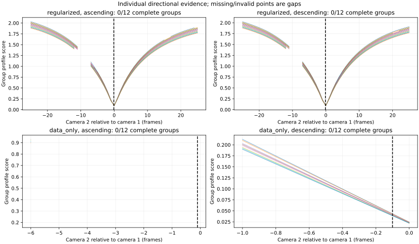

# Plan 010: positive-depth independent timing profiles

Status: **numerical blocker: incomplete constrained profiles under the frozen limits**.
Both objectives retain all twelve groups but have zero complete qualified group
profiles across the integer search, including each sweep direction. This is the
documented-blocker completion path of Plan 010. No candidate is accepted.
The [terminal result](basketball-shared-timing-v4/result.json) preserves the stop.

This separately versioned evaluator implements the constrained numerical and
initialization policy in [Plan 010](../../plans/plan_010.md). Historical
[Plan 009 failures](basketball-shared-timing-v3.md),
[Plan 008](basketball-shared-timing-v2.md) and the completed
[Plan 007 audit](basketball-shared-timing-v1.md) remain intact.

## Exact retest and mandatory stop

The [exact retest](basketball-shared-timing-v4/exact-retest.json) attempts all 51
integer lags from −25 through 25 for each of twelve groups and both objectives,
with cold, ascending and descending starts: 3,672 attempts total. Both regularized
and data-only searches have 0/12 complete qualified groups; both directional
searches also have 0/12. The twelve-group membership is retained rather than
replaced by a smaller successful subset.

| Exact-control evidence | Regularized | Data-only |
| --- | ---: | ---: |
| Attempts | 1,836 | 1,836 |
| Qualified attempts | 1,693 | 62 |
| Rejected attempts | 143 | 1,774 |
| Stops at the 200-iteration ceiling | 130 | 1,774 |
| Stops at the distinct-objective-evaluation ceiling | 0 | 0 |
| `xtol` termination failing the optimality gate | 13 | 0 |
| Negative-depth returned states | 0 | 0 |
| Initializations with coefficient replacement | 0 | 1,224 |
| Initializations requiring blending | 0 | 0 |
| Depth-boundary-dependent states | 0 | 0 |
| Factorization warnings | 0 | 0 |

The constrained evaluator preserves positive depths in every returned state,
but the unchanged 200-iteration policy leaves most data-only attempts
unqualified. SciPy labels these iteration stops “maximum number of function
evaluations”; the separate accounting confirms that none reached the distinct
200-objective-evaluation ceiling. There is no fallback or post-outcome tuning.

There is no qualified aggregate optimum, sweep-agreement estimate or bootstrap
interval. These fields remain null. No refinement is attempted because the full
integer profiles lack sufficient numerical evidence to identify admissible
basins. This is a failed exact control, not a successful ambiguous negative
control. The 117-case independent matrix, three targeted short-control audits,
benchmark, all six real configurations, assessment and selection are not run.
Workload projections and the final-validation protocol remain null.

The figure plots individual directional group scores, with invalid points shown
as gaps; it does not construct an aggregate from changing group membership.
The [initialization ledger](basketball-shared-timing-v4/initialization-attempts.json)
contains every attempt, seed provenance, replacements, blends, depth checks,
termination, optimality, evaluation counts and barrier parameters. The
[portable group inventory](basketball-shared-timing-v4/profile-groups.json) links
24 compressed JSON files containing every full state and constrained-solver
trace, storing each attempt once. The historical and local raw artifacts remain
hash-bound by the evidence inventory.

## Coefficient diagnosis

The unchanged generator reconstructs the exact twelve-group, 100-frame noiseless
direction-change control with true offset −0.10 frames, ten-frame knots and
acceleration weight 1. All twelve rejected v3 data-only attempts and their saved
initial/final states were reconstructed. The
[coefficient diagnostics](basketball-shared-timing-v4/coefficient-diagnostics.json)
include sampled data and acceleration support, Jacobian column norms, singular
values, numerical ranks, coefficient magnitudes, objectives and depth extrema.
Twelve linked gzip JSON artifacts retain complete residuals, per-observation
depths, trajectory coordinates and amplitude probes.

| Saved transfer | Source → destination lag | Source coefficient magnitude | Block 16 basis norm, source → destination | Minimum destination seed depth / diameter |
| --- | --- | ---: | --- | ---: |
| Group 9, descending | −6 → −7 | 1.799e43 | 3.033e−45 → 2.770e−4 | −4.850e39 |
| Group 11, descending | −6 → −7 | 2.147e43 | 3.033e−45 → 2.770e−4 | −5.851e39 |

These columns are numerically weak at the source, rather than exactly zero.
Their activation after transfer explains the enormous destination seed depths.
In contrast, group 2's ascending transfer from −20 to −19 starts with minimum
normalized depth 3.3722 and finishes at −0.6024, reducing the objective from
3.30289 to 3.24430. Its maximum coefficient magnitude grows from 15.34 to 38.03:
this failure includes movement in observable trajectory directions and a
camera-plane crossing, beyond the weak-column initialization issue.

The 2,852 deterministic diagnostic probes use both signs and Euclidean
amplitudes 10^0, 10^2, …, 10^44 along normalized saved displacements from cold
initialization. Both seed and final displacements are inspected at separately
fixed source and destination endpoint lags. Zero displacement has no direction
and is omitted. Probe comparisons use the unchanged tolerance
`abs(F1−F2) <= 1e−6 + 1e−4 * max(abs(F1), abs(F2))`.

The report distinguishes exactly unsupported sampled columns, numerically weak
columns that activate after transfer, observable trajectory movement, and
positive-depth trajectories reaching large coordinates while retaining or
improving the cold objective. Comparisons against saved objectives are also
published: improvement over cold alone does not demonstrate escape at an optimum.
Finite probes cannot certify a global minimum or establish that a finite minimum
does not exist. Observable escape remains unresolved; this supports a numerical
blocker, without a mathematical claim of scientific/model impossibility.

## Frozen evaluator

The [v4 solver](../../scripts/basketball_shared_solver_v4.py) calls installed
SciPy 1.18.1 `trust-constr` with sparse augmented-system factorization, all three
termination tolerances 1e−6 and at most 200 iterations. An independent shared
residual/Jacobian cache enforces at most 200 distinct objective evaluations,
including derivative-triggered evaluations. There is no solver-policy search
following the complete-profile outcomes.

Offsets are dimensionless `offset_frames / 25`; coefficients retain existing
rig-diameter units. Analytic sparse objective gradients, sparse Gauss–Newton
objective Hessians and analytic sparse depth Jacobians and constraint Hessians
are supplied. Every fitted observation has normalized depth at least 1e−8 with
`keep_feasible=True`; offset bounds also preserve feasibility. The
[evaluator freeze](basketball-shared-timing-v4/evaluator-freeze.json) explicitly
records installed defaults, physical scaling and initialization policy.

Reported objectives remain the sum of the original v2 squared residuals.
Barriers and constraint merit terms never enter profiles or bootstrap costs.
No coefficient is deleted, bounded or given an added data-only ridge penalty.
Returned states must be finite and successfully terminated, with independently
checked optimality at most 1e−6, no constraint violation, unchanged nuisance
boundary checks, and minimum normalized depth strictly above 1e−7. The last
condition rejects dependence on the numerical depth boundary.

Warm transfer retains the v3 seed order and resets the fixed endpoint lag.
A coefficient block is replaced by its destination cold value only when its
sampled data basis norm is below `max(shape) * eps * largest_column_norm` and
its acceleration column is likewise below threshold, or acceleration is off.
All blocks remain optimization variables. Finiteness, offset bounds and
strict depth above twice the optimization margin are checked at the destination.
The first feasible blend in 1, 1/2, …, 2^−20, 0 is used. Failure of this fixed
sequence produces a failed start, without another initialization optimizer.

The [v4 profiler](../../scripts/basketball_shared_profiles_v4.py) retains cold,
ascending and descending attempts with at most three solves per group/lag.
A cold fallback remains visible in seed provenance. Membership is frozen before
solving and checked separately for both directions in every refinement round.
Integer searches cover −25 through 25; every detected basin is scheduled for
0.05-frame refinement, with competing basins at 0.01 frames. Missing numerical
evidence cannot pass as an ambiguous negative or noisy control.

Cache identities bind observations, calibration, role/window, group, edge gauge,
spacing, penalty, solver/scaling/depth/transfer policy and requested lag.
Held-out observations cannot affect training nuisance fitting, seed replacement
or initialization; nuisance state is frozen before held-out evaluation.
Independent entry points accept no production coefficients or offsets.

## Admission, continuation and roles

The [cross-version manifest](basketball-shared-timing-v4/cross-version-manifest.json)
imports historical admission without rewriting predecessor hashes. All 34 cameras,
accepted calibration and scale, 72 edges, held-outs 0/10/20/30, indivisible duplicate
families, 667/667 partition and minimum 19 groups per edge per half remain fixed.
The [production reuse manifest](basketball-shared-timing-v4/controls-reuse.json)
verifies all 1,890 hashes and recipes, generator, fitting source and the three
unchanged production start definitions. Production fitting remains owned by
immutable v2 code.

The [workflow](../../scripts/basketball_shared_workflow_v4.py) exposes prepare,
diagnose, safeguard, benchmark, fit, assess, select and package. Executed stages
consume hashed predecessors and create fresh directories under one deadline.
Conditional benchmark/fit/assessment adapters remain gated until safeguards
pass and must be implemented and tested before their first use. Selection
implementation is additionally gated on fitting qualification. No unexecuted
adapter, control matrix or production configuration is credited as passed.

Fitting frames remain 50–149. Selection 150–199 was historically inspected but
is not consumed by this investigation. Final 200–249 remains untouched.
`accepted_timing` remains null. The
[qualification record](basketball-shared-timing-v4/qualification.json) records
unexecuted controls, workload projections, configurations and role consumption.

## Budget and reproducibility

The clock starts conservatively at **2026-09-07 23:29:00 UTC**, rounded down before
the first inspection. Diagnosis, freeze and exact retest must finish by
2026-09-08 00:59 UTC. Computation stops by 03:09 UTC, reserving the last twenty
minutes before the 03:29 UTC reporting deadline. At most eight CPU workers and
single-thread numerical libraries are used; there are no GPU jobs, downloads,
training jobs or final-frame reads.

Diagnosis, freeze and the exact retest completed in **1621.3 elapsed seconds**,
below the 5,400-second early limit. The mandatory numerical stop ended scientific
computation before subsequent safeguards or production work.

The [resource record](basketball-shared-timing-v4/resources.json) includes elapsed
time, stage CPU/memory, constraint and initialization costs, and the failed
prefreeze diagnostic serialization attempt. That attempt encountered a NumPy
integer JSON error, fixed before the evaluator freeze; new prepare and diagnosis
directories preserve the failed output and predecessor hashes.

Regressions pass: **150 Basketball, 7 budget and 3 SelfCap tests**, including
12 v4 regression methods covering derivatives/scaling, strict evaluation counts,
weak-column activation, camera-plane crossing, deterministic initialization,
infeasible seeds, depth-boundary dependence, fixed membership, sweep disagreement,
refinement attempts, held-out isolation, cache/version isolation, fractional sign,
whole-group bootstrap, competing basins, cycles, deadlines and immutable reuse.

The [verification](basketball-shared-timing-v4/verification.json) binds regression
logs, historical hashes, independently reconstructed partition/edge membership,
seed provenance, returned depths, documentation links, consumption markers and
both Git diff checks. The [evidence inventory](basketball-shared-timing-v4/evidence.json)
binds the full compressed diagnostic and solver records to local raw artifacts.
