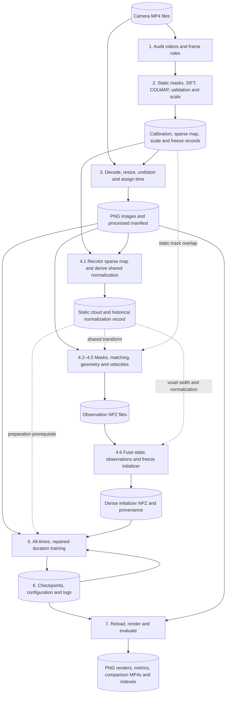
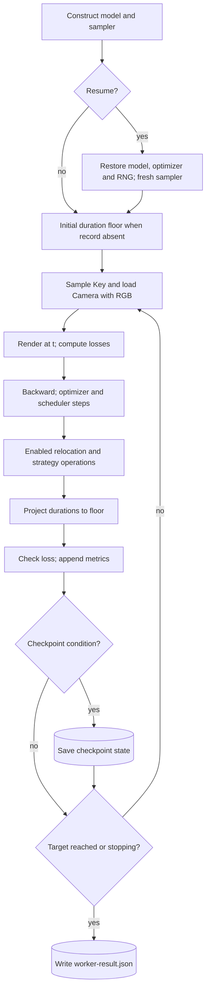

# Multi-camera videos to a FreeTimeGS dynamic scene

[Repository overview](../README.md) · [Recipe comparison](experiments/basketball-dense-training/recipes.md) · [Code provenance](experiments/basketball-code-provenance.md)

This document explains the current recommended reconstruction workflow, its function calls, and the data passed between them. It uses the Basketball capture and both dense FreeTimeGS initializers. Read the numbered steps in order for the workflow; use the contract tables and appendices when inspecting code or designing a future app.

The implementation is a collection of Python scripts, external computational components, and saved experiment artifacts. There is no single general-purpose “videos in, 4DGS out” entry point. Each stage below identifies its actual entry points and prerequisites. In particular, some preparation scripts depend on results from earlier experiments.

### Contents

- [1. Inputs and prerequisites](#1-understand-and-validate-inputs)
- [2. Camera calibration and scale](#2-estimate-camera-calibration-and-scale)
- [3. Processed images, time and cameras](#3-prepare-reconstruction-data)
- [4. Dense geometry and motion initialization](#4-build-dense-initialization)
- [5. Model construction and training](#5-construct-and-train-the-model)
- [6. Checkpoints and continuation](#6-save-and-restore-state)
- [7. Rendering, metrics and outputs](#7-render-evaluate-and-deliver-outputs)
- [8. Worked example](#8-worked-example-camera-1frame-0-to-a-camera-0-render)
- [9. App-design implications](#9-implications-for-a-future-4dgs-app)
- [A. Data contracts](#appendix-a-shared-data-contracts) · [B. Evidence](#appendix-b-source-and-artifact-evidence) · [C. CLI reference](#appendix-c-entry-point-and-cli-reference) · [D. Verification](#appendix-d-documentation-verification)

## Reading conventions and evidence

The code baseline is repository commit `d7a4a952e114d2908c9e0f935d192fd0189452f5`, inspected on 2026-09-12. **Source-derived** behavior means the implementation and its callers were inspected; it does not mean the operation was rerun for this document. **Artifact-observed** values come from saved JSON records or NPY headers inside NPZ archives. **Recommendation** identifies a future policy rather than a newly measured result.

The recommended training route uses `--training-policy all-times --lifetime-policy repaired`. The successful experiment measured a **50,000 → 70,000 update continuation**. Applying those policies from update zero is the recommendation for future training; its exact result and minimum budget were not established by that comparison. See the [crossing explanation](experiments/basketball-crossing-repair/workflow-explanation.md).

Type notation:

| Notation | Meaning |
|---|---|
| `A32[N,3]` / `A64[N,3]` | CPU NumPy array, float32 / float64, with the indicated shape. |
| `T32[N,3]` | PyTorch float32 tensor; device is stated at the boundary. |
| `I64[N]` / `B[N]` | NumPy int64 / boolean array. Plain “integer array” allows platform-dependent integer width. |
| `N`, `M`, `V`, `H`, `W` | Gaussian count, candidate/observation count, supporting camera count, image height and width. Counts can change between stages. |
| `Path` | `pathlib.Path`. A CLI path starts as text and argparse converts it. |
| `Key` | Python `tuple[str, int]`: physical camera ID and source frame ID. JSON stores it as a two-element array. |
| `Record` | Python dictionary loaded from or suitable for JSON; its relevant fields are defined beside the interface or in Appendix A. |
| `Camera` | The runtime `SimpleNamespace` described in Appendix A.3; it is not a formal dataclass. |
| `None` return | The useful output may instead be a file or a mutation of an input/model. |
| Inferred type | A contract established from construction, conversion, validation, or use, where the function lacks annotations. Most local signatures are unannotated. |

A Gaussian is a learned, oriented 3D ellipsoid with color and opacity. FreeTimeGS adds a temporal center, temporal width, and velocity. A **correspondence** connects pixels thought to show the same scene point in different cameras. **Triangulation** estimates that point's 3D position using calibrated camera rays. **Normalization** changes the shared scene coordinate system for numerical conditioning. **Rasterization** projects and blends Gaussians into an image. A **checkpoint** retains model and training state. SH means spherical harmonics, the model's representation of view-dependent color.

## Workflow overview

Rectangles represent processing; cylinders represent files. Solid arrows carry files or in-memory data. Dashed arrows indicate reuse of historical prerequisites. The sequence is a dependency graph, not a claim that one script invokes every stage.



## 1. Understand and validate inputs

### 1.1 Identify the capture and the frame roles

The saved capture has **34 fixed-camera MP4 files**, `0.mp4` through `33.mp4`, each **1920 × 1080, 25 fps, 250 frames**. The source location in this workspace is `.local/data/vru-basketball/Basketball_dg/`. Calibration is estimated from the videos; it was not supplied with the archive.

[`basketball_audit.py`](../scripts/basketball_audit.py) is the input audit entry point. Its `main()` parses `--videos`, `--vipe` and `--output`, all `Path` values, then calls ffprobe once per video. The stdout is JSON decoded into a dictionary. `validate_probe(probe)` checks stream count, dimensions, decoded frame count, nominal/average rate and timestamp intervals, returning `list[float]` timestamps in seconds. `frame_roles()` returns the role dictionary.

| Purpose | Frames | Cameras |
|---|---|---|
| Reconstruction | 0–49 | All 34 images available; 30 cameras used for training. |
| Calibration fitting | 50–149 | Training map from 30 cameras; separate localization of the four evaluation cameras. |
| Calibration selection | 150–199 | Check the fixed candidate on all 34 cameras. |
| Final calibration validation | 200–249 | Check the frozen winner on all 34 cameras. |

The audit writes `frame-roles.json` and `input-audit.json`: camera IDs, video paths/hashes, stream information, timestamps, ViPE revision, blockers and status. `main()` returns a `bool` indicating blockers, used as the process exit status. Incorrect inventory, decode errors, variable cadence or changed source provenance block preparation.

### 1.2 Separate spatial calibration from synchronization

Regular container timestamps do not prove simultaneous physical exposure across cameras. The reconstruction route records **zero offsets as an operational assumption**. It does not estimate exposure phase or drift here.

After calibration and scale estimation, [`basketball_sync_audit.py.main()`](../scripts/basketball_sync_audit.py) combines the accepted calibration, scale result, sparse map and source inventory into `basketball-sync-freeze/v1`. It consumes fixed repository paths and `--output: Path`; it writes the freeze JSON and returns `None`.

Its `select_cameras(visible, count=8, reference=1, heldout=(0,10,20,30))` takes `dict[int, set[int]]` of visible map-point IDs and returns `(list[int], list[Record])` for an older synchronization subset. This selection is retained as provenance; the dense reconstruction still uses all 30 training cameras.

### 1.3 Resolve environment and file dependencies

Run entry-point scripts with the repository root as working directory. Some paths are resolved from `__file__`, others from the working directory, and some saved records contain absolute paths.

| Component | Role and runtime boundary |
|---|---|
| ffprobe / OpenCV | CPU video inspection, decoding and image transformations. |
| ViPE segmentation and UniDepth | Separate pinned environment and existing weights; CUDA inference. ViPE is used for these components, not as the Gaussian trainer. |
| OpenCV SIFT / PyCOLMAP / NumPy / SciPy | Static features, mapping, bundle adjustment, projection checks, normalization and fusion; CPU operations in this route. |
| RoMa / EDGS | CUDA matching and pairwise triangulation; NumPy/OpenCV handle subsequent checks and tracking. |
| FreeTimeGsVanilla / gsplat / PyTorch | Gaussian model, CUDA rendering, differentiation and optimization. Native initializer KNN runs through scikit-learn on CPU. |
| Metric container / ffmpeg | Pinned evaluation environment with CUDA LPIPS; CPU image encoding and video assembly. |

The reconstruction environment is specified in [`environments/freetimegs.in`](../environments/freetimegs.in); native dependencies are built by [`build-freetimegs-native.sh`](../scripts/build-freetimegs-native.sh). Runtime assets under `.local/` are workspace-only and absent from a normal Git clone. Source pins and evidence are in Appendix B.

## 2. Estimate camera calibration and scale

### 2.1 Decode calibration snapshots and exclude moving content

[`basketball_alternatives_prepare.py.main()`](../scripts/basketball_alternatives_prepare.py) takes an input audit and ViPE checkout, prepares snapshots, and writes images, static masks and a result manifest. Its CLI is listed in Appendix C.

For `role='fit'`, the snapshots are `[50,62,75,87,99]` and `[100,112,125,137,149]`. Selection uses `[150,162,175,187,199]`; validation uses `[200,212,225,237,249]`. These sets come from [the calibration protocol](../scripts/basketball_alternatives_protocol.py).

For each camera and selected frame, the script:

1. Decodes the image and an adjacent frame within the same role window.
2. Resizes BGR `uint8[1080,1920,3]` to `uint8[540,960,3]`.
3. Converts the selected image to CUDA RGB `T32[540,960,3]` in `[0,1]`.
4. Calls `TrackAnythingPipeline(['person','basketball']).track(VideoFrame(...))`.
5. Combines the detected foreground with a dilated adjacent-frame difference mask.
6. Writes the selected PNG and a static-mask PNG: **255 means usable static evidence; 0 means excluded**.

The ViPE call returns `(instance_mask, phrases)`: an integer tensor `[540,960]` and a mapping of labels to semantic names. Detection/masking is the library boundary; its internal neural-network layers are outside this walkthrough. Each calibration snapshot uses a new tracker. Source images and masks may instead be copied from explicitly supplied, hash-verified reuse directories.

`main()` returns a failure `bool` and writes `result.json` with `status`, `role`, `source_frames` and `observations`. An observation identifies `camera_id: int`, `source_frame_id: int`, `stem: str`, image/mask hashes and mask diagnostics. The next consumer is the pooled feature frontend.

### 2.2 Pool static SIFT features and estimate the training-camera map

The accepted route is **incremental mapping, radial refinement, ordinary feature scoring**: `['incremental','radial',false]` in the [frozen-winner record](experiments/basketball-calibration-alternatives/frozen-winner.json).

Use the SIFT `frontend` in [`basketball_alternatives_refine.py`](../scripts/basketball_alternatives_refine.py). The different `frontend` in `basketball_alternatives_colmap.py` is the older SuperPoint/LightGlue screening route and is not this accepted frontend.

| Function | Inputs and actual use | Return / side effect and next consumer |
|---|---|---|
| `frontend(inputs, frames, output, sharp)` | `Path` prepared directory; five frame IDs; `Path` output; `sharp=False`. Reads static images/masks. | `None`. Writes `features.db`, image symlinks, per-camera observation JSON and `result.json` with `status='matched'`. Consumed by mapping and refinement. |
| `deduplicate(candidates, radius=2.)` | Ordered `list[dict]` containing `xy: pair[float]`, score/frame/index and optional SIFT properties; radius in pixels. | Subset `list[dict]` preserving greedy order. Removes features within 2 pixels across snapshots. Used in training and evaluation feature extraction. |
| `mapping(source, method, output, seed=0)` | [Mapper](../scripts/basketball_alternatives_colmap.py): `Path` frontend, `method='incremental'`, fresh output, integer seed. | `None`. Writes copied database, native sparse model, calibration JSON and completeness/reprojection report. |
| `export_model(model)` | `pycolmap.Reconstruction` with posed images. | `list[dict]`: camera ID, `R[3,3]`, `t[3]`, `K[3,3]`, center `[3]` as JSON lists. Checks physical-camera/image mapping. |

SIFT receives grayscale `uint8[540,960]` and a static mask. Its keypoints and `float32[M,128]` descriptors are filtered away from mask boundaries. Selected keypoint rows become `float32[M,4]`; their x/y coordinates receive `+0.5` for COLMAP. Descriptors are converted to `uint8[M,128]` in the database. Physical camera `c` uses COLMAP IDs `c+1`.

The frontend uses `pycolmap.match_exhaustive` on CPU. The mapper calls `pycolmap.incremental_mapping(database_path, image_path, output_path, options)`, receiving a map of model IDs to `Reconstruction` objects. It accepts exactly one complete 30-camera reconstruction and checks native export/reload equality.

The frontend starts each camera with a 1,152-pixel focal guess and centered principal point. Its local [`register_image(db, colmap, *, camera_id, image_id, name, K, model_name='PINHOLE')`](../scripts/basketball_static_rig.py) takes the database, PyCOLMAP module, integer IDs, image-name string and floating `K[3,3]`, then writes camera/rig/image/frame rows and returns `None`. The frontend explicitly clears the helper's focal-prior flag afterward: this initial guess is not a trusted calibration prior.

### 2.3 Refine intrinsics, poses and sparse geometry

`refine(source, native, output, policy, seed, iterations=200, extend_from=None)` in the SIFT/refinement module takes the pooled frontend directory, a calibration JSON path, output path, `policy='radial'` and integer seed. It returns `None` and writes a refined native `sparse/` model, `calibration-0.json` and `result.json`.

The adapter constructs PyCOLMAP cameras and poses, triangulates observations with `pycolmap.triangulate_points`, then calls `pycolmap.bundle_adjustment(model, options)`, which mutates the reconstruction. The accepted camera model is `SIMPLE_RADIAL`: `[f,cx,cy,k]`. Focal length and one radial coefficient are refined; principal point stays `(480,270)` in COLMAP coordinates. Square pixels are assumed.

`support(model)` returns per-camera support records: independent points, contributing cameras, occupied image cells, positive-depth fraction and median/p95 reprojection error. Export/reload checks compare both geometry and support statistics. An extension from 200 to 1,000 BA iterations requires the recorded non-convergence evidence and matching prior configuration; it is not an unrestricted retry knob.

### 2.4 Localize the four evaluation cameras and validate the rig

[`basketball_alternatives_localize.py.main()`](../scripts/basketball_alternatives_localize.py) consumes the refined map, pooled features and prepared calibration snapshots. It localizes cameras `0,10,20,30` against the frozen training map.

`held_out_features(inputs, camera, frames)` returns `(xy, descriptors)`: CPU floating `[M,2]` COLMAP pixel coordinates and `A32[M,128]` descriptors. The function is also reused for reserved-frame features, including training cameras.

Descriptor matches vote for map points. `pycolmap.estimate_and_refine_absolute_pose(points2D, points3D, camera, estimation, refinement)` receives floating `[M,2]` and `[M,3]` arrays and mutable camera parameters; it returns a pose/inlier dictionary or `None`. Localization saves camera calibration plus observation NPZ files (`points2D`, `points3D`, `inliers`). It verifies that the training map and source database have not changed.

[`basketball_alternatives_full_rig.py`](../scripts/basketball_alternatives_full_rig.py) compares early/late solutions across three seeds. `full_compare(training, held_out)` takes pairs of `(centers, rotations)` arrays and returns disagreement/alignment records. Similarity alignment is fitted to training cameras and applied unchanged to evaluation cameras. The output calibration joins **seed 0's early training map and localized evaluation cameras**.

The supporting [comparison functions](../scripts/basketball_alternatives_compare.py) are:

| Function | Inputs | Output |
|---|---|---|
| `load_export(path, expected=TRAINING, *, require_positive_focal=True)` | Calibration `Path`; expected camera IDs; validation flag. | `(centers[C,3], rotations[C,3,3])`, CPU floating arrays in expected order. |
| `compare(reference, other)` | Two center/rotation tuples. | Dictionary: similarity alignment, per-camera rotation/center errors, maximum errors and pass status. |
| `frozen_errors(reference, other, transform, diameter)` | Same tuples; `(scale, rotation[3,3], translation[3])`; rig diameter float. | Two floating `[C]` arrays: rotation degrees and center-distance fractions. |

[`basketball_alternatives_evaluate.py`](../scripts/basketball_alternatives_evaluate.py) evaluates reserved snapshots without fitting the tested cameras or geometry. Its relevant helpers are:

| Function | Inputs | Return / effect |
|---|---|---|
| `galleries(model, database)` | Native reconstruction; SQLite database `Path`. | List of `(camera:int, descriptors:A32[M,128], point_ids:list[int], xy:float[M,2])`, filtered by static track support/parallax. |
| `temporal_anchor(model, gallery, camera, held_out, fit_inputs)` | Model/gallery; integer camera ID; localized observations and fitting-image directories. | `(descriptors, point_ids, measured_xy)` for that camera. |
| `temporal_correspondences(desc, xy, anchor)` | Current features and anchor tuple. | `list[tuple[int,int]]` of feature-index/map-point-ID pairs, using appearance and ≤8-pixel measured displacement. |
| `correspondences(desc, xy, gallery, exclude_camera=None)` | Current features, gallery, optional excluded integer ID. | Same pair list, with independent image-pair geometric filtering. Alternative branch when temporal anchors are absent. |
| `validate_frozen(frozen_path, calibration, prepared, hashes)` | Winner/calibration paths, prepared record, path→hash dictionary. | `None`; raises on evidence mismatch. |
| `consume_validation(frozen_path, output)` | Paths. | `None`; exclusively creates `validation-consumed.json` before final evaluation. |

The accepted winner records the **temporal-anchor** correspondence route. Evaluation writes `camera*-observations.npy` rows `[frame, point_id, u, v, error]` and per-camera reports. Calibration selection requires spatial coverage, positive depth, low reprojection errors and nonplanar support; the exact gates are encoded in the evaluator.

[`basketball_alternatives_freeze.py.main()`](../scripts/basketball_alternatives_freeze.py) consumes the campaign workspace, full-rig result and passing selection result. It writes `frozen-winner.json` only after checking eligibility, coverage and hashes. Final validation then consumes that winner. This is historical experiment selection infrastructure, not a generic calibration service.

[`basketball_alternatives_package.py.main()`](../scripts/basketball_alternatives_package.py) takes `--workspace` and `--output` paths and copies the accepted full-rig calibration, winner and selection/validation records into the documentation evidence directory, alongside reports and indexes. It returns `None`. Those copied records are the fixed paths consumed by the later scale and reconstruction-freeze scripts.

### 2.5 Estimate physical scale and build the reconstruction freeze

[`basketball_scale.py`](../scripts/basketball_scale.py) compares UniDepth V2 predictions with sparse-map camera depths. It does not replace the accepted poses.

Its `--audit` input is a separate `basketball-continuation-audit/v1` provenance result, not the initial video-audit JSON. [`basketball_continuation_audit.py.main()`](../scripts/basketball_continuation_audit.py) takes `--output:Path`, checks the fixed scene profile, accepted calibration, validation records, source video metadata and hashes, and writes `result.json` with `status='passed'` and a `sha256` path→hash dictionary. It returns `None`. Its `verify_hashes(expected)` and `verify_membership(profile, calibration)` return `None` or raise on mismatched evidence/coverage. The scale protocol is the existing [`configs/basketball-rev2/scale.json`](../configs/basketball-rev2/scale.json), including the map path and acceptance thresholds.

| Function | Inputs | Return / file outputs |
|---|---|---|
| `protocol(path)` | Protocol JSON `Path`. | Validated dictionary; requires the frozen calibration, all 30 training cameras, fit frame 100 and selection frame 175. |
| `undistortion(entry)` | Radial calibration entry. | `(target_K:A64[3,3], maps:tuple[A32[540,960],A32[540,960]])`. This depth wrapper uses destination principal point `(480,270)`. |
| `prepare(a)` | `argparse.Namespace` with `protocol, audit, role, output`. | `None`. Writes undistorted PNGs, `*-samples.npz`, `protocol.json` and `inputs.json`. |
| `infer(a)` | Namespace with `inputs, vipe, output` paths. | `None`. Writes `*-depth.npz` containing depth/confidence arrays and a result index. |
| `scale_statistics(samples, p, frozen_scale=None)` | One sample record per training camera: positive depth ratios, grid-cell count, positive-depth fraction; protocol; optional scalar scale. | Dictionary with `status, blockers, scale, diagnostic_window_scale, bootstrap_95_interval, relative_halfwidth, cameras, uncertainty_limitation`. |
| `evaluate(a)` | Namespace with prepared inputs, depth directory, optional frozen fit and output path. | Failure `bool`; writes the scale result. |

At the model boundary, `UniDepth2Model.estimate(DepthEstimationInput(rgb=..., intrinsics=...))` receives CUDA RGB `T32[540,960,3]` in `[0,1]` and `[fx,fy,cx,cy]`; it returns an object with `metric_depth` and `confidence` tensors. The local wrapper saves their CPU arrays without an explicit dtype cast. The saved `camera1-frame100-depth.npz` has **float32 `[540,960]` depth and confidence**, verified from its headers. The scale consumer expects a 2D depth image usable by OpenCV remapping; validate this contract when changing the depth component.

The fit is the exponential of the median of per-camera median log-depth ratios; it does not fit an affine depth shift. Selection evaluates the already frozen scale. The [saved fit](experiments/basketball-rev2/scale-fit.json) gives **1.315069470778244** model-estimated physical units per map unit. This remains a model-based estimate, with limitations in the result record.

Finally, Step 1.2's sync audit writes the reconstruction freeze, including scale, calibration/map paths and video hashes. This freeze is the input to Step 3.

## 3. Prepare reconstruction data

### 3.1 Decode, resize and undistort the reconstruction clip

[`prepare-basketball-sync.py.main()`](../scripts/prepare-basketball-sync.py) takes `--freeze: Path` and a fresh `--output: Path`. For every camera it verifies the video/calibration hashes, then reads frames 0–49 sequentially.

The image sequence is:

```text
MP4
  → cv2.VideoCapture.read(): (bool, uint8[1080,1920,3] BGR)
  → cv2.resize(..., (960,540), INTER_AREA): uint8[540,960,3] BGR
  → cv2.remap(..., INTER_LINEAR, BORDER_CONSTANT): undistorted BGR
  → cv2.imwrite(...): PNG file
  → later PIL.convert('RGB') / image loader: RGB array
```

It detects exact consecutive duplicate pixel hashes and records them; it does not automatically drop or synchronize frames. Failed decoding, unexpected native dimensions, changed input hashes or failed PNG writes raise errors. Incomplete output directories can remain.

### 3.2 Convert camera and time conventions

[`render_calibration(entry, scale)`](../scripts/basketball_scene.py) takes the radial calibration record and a positive float scale. It returns:

- Processed camera dictionary: `K`, `width=960`, `height=540`, `world_to_camera_R`, scaled `world_to_camera_T` and scaled `center`.
- OpenCV `K: A64[3,3]` used for undistortion.
- `list[float]` distortion vector `[k,0,0,0]`.

The exported calibration's K uses OpenCV integer pixel centers. Undistortion preserves that K; the renderer K adds **0.5 to both principal-point coordinates**. The world-to-camera relation is `X_camera = R X_world + T`. Apply physical scale to both scene positions and camera translations; rotations remain rotations.

Time conversion is implemented by [`sync_timing.py`](../scripts/sync_timing.py):

| Function | Inputs | Output |
|---|---|---|
| `zero_timing(freeze_hash)` in the preparation script | SHA-256 string. | `camera-timing/v1` dictionary: all offsets zero, reference `'1'`, unknown uncertainties, origin 0 seconds and duration 2 seconds. |
| `validate_timing(result)` | Timing dictionary, Appendix A.1. | Same validated dictionary or `ValueError`. |
| `corrected_timestamp(result, camera_id, source_seconds)` | Timing dictionary, camera `str`, seconds `float`. | `float` source seconds minus offset; checks supported interval. |
| `normalized_timestamp(result, camera_id, source_seconds)` | Same input types. | `float` in `[0,1)`: corrected seconds minus origin, divided by clip duration. |
| `common_training_keys(frames, conditions, held_out, reserved=(0.8,1.0))` | `list[(str,int,float)]`, timing dictionaries, excluded camera IDs, seconds interval. | `(list[Key], list[exclusion record])`. Records camera/time/support exclusions. |

For this clip, `source_seconds=f/25` and `t=f/50`. The final sample has `t=0.98`, not 1. The interval length is 2 seconds even though the last sampled timestamp is 1.96 seconds.

### 3.3 Write the manifest and construct runtime camera objects

The output contains **1,700 PNGs** at `rgb/<camera>/<six-digit-frame>.png` and `manifest.json`. The historical manifest has **1,350 training keys**, because `common_training_keys` excludes frames 20–24 as well as the four evaluation cameras. All 1,700 image records still exist. Step 5 changes the runtime training selection to 1,500 keys.

| Call sequence | Inputs | Output / behavior |
|---|---|---|
| `FreeTimeBasketballScene(path)` → inherited `BasketballScene.__init__` | Manifest `Path`. | Scene with `cameras: dict[str,Record]`, `frames: dict[Key,Record]`, hash and training keys; strictly validates the original 34-camera/50-frame manifest. |
| `scene.training_keys(frame_id=None)` | Optional integer frame. | `list[Key]`; no image decoding. |
| `scene.training_camera(key, *, device, load_image=True)` | Training key; device string; bool. | `Camera`; rejects a key outside current runtime training selection. |
| `scene.camera(key, *, device, load_image=False)` | Any prepared camera/frame key. | Calls inherited `SelfCapScene.camera`, then `gsplat_camera`. Can load evaluation cameras. |
| `make_camera(calibration, timestamp, *, device, full=False, name='', uid=0)` | Processed camera dictionary, normalized float time, device and optional metadata. | Intermediate `SimpleNamespace` with transposed world-view matrix `T32[4,4]` and optional image. See [`stg_scene.py`](../scripts/stg_scene.py). |
| `gsplat_camera(view, calibration)` | Intermediate view and processed calibration dictionary. | Final `Camera` with batch dimension 1. See [`freetimegs_scene.py`](../scripts/freetimegs_scene.py). |

When requested, `SelfCapScene.camera` verifies path containment, image hash, RGB mode and dimensions. It converts RGB `uint8[H,W,3]` to device `T32[3,H,W]/255`. `gsplat_camera` changes this to contiguous `pixels: T32[1,H,W,3]` and constructs `camtoworlds[1,4,4]`, `viewmats[1,4,4]` and `Ks[1,3,3]`. With `load_image=False`, `pixels=None`. The exact runtime fields are in Appendix A.3.

## 4. Build dense initialization

### 4.1 Recolor the sparse map and establish shared normalization

[`initialize-basketball-sync.py.main()`](../scripts/initialize-basketball-sync.py) reads the manifest, reconstruction freeze and native sparse map. It recolors map points from **training-camera frame 25**, using at least two valid projected colors per retained point. Evaluation-camera evidence in the map is rejected.

It writes `static-cloud.npz` with positions `A32[Ns,3]` and RGB `A32[Ns,3]` in `[0,1]`, an ASCII `initialization.ply`, and `result.json` with hashes and provenance. These positions already include the physical scale.

[`prepare_free(scene, initialization, checkout)`](../scripts/basketball_native_train.py) then derives the FreeTimeGS coordinate system:

1. Read the static cloud and CPU camera-to-world matrices from training frame 25.
2. Call `load_normalization(checkout)` to extract four upstream NumPy helpers.
3. Compute `T1=similarity_from_cameras(camtoworlds)`.
4. Compute `T2=align_principle_axes(transform_points(T1, positions))` and `transform=T2 @ T1`.
5. Transform geometry and cameras consistently; derive `scene_scale` from normalized camera centers.
6. Filter static points beyond `5*scene_scale`, create nine temporal copies with zero velocity, and return normalized scene, CPU tensor data and normalization record.

The actual call returns `(FreeTimeBasketballScene subclass, dict[str,T32], Record)`. The record contains the `4×4` transform, scalar scene scale, source hashes, center times, duration and historical point count. The saved normalization has `scene_scale=1.1` and `points=45828`; **that count describes the sparse temporal copies, not the later dense initializer**.

[Normalization contracts](../scripts/freetimegs_normalization.py):

| Function | Input | Output / mutation |
|---|---|---|
| `load_normalization(checkout)` | Checkout `Path`. | `(dict[str,Callable], dict[str,str])` containing four helper functions and source/AST hashes. |
| `similarity_from_cameras(camtoworlds, strict_scaling=False)` | CPU floating `[C,4,4]`; bool, default used. | `A32[4,4]` centering/scaling transform. |
| `transform_points(T, points)` | `[4,4]` transform, floating `[N,3]`. | `A32[N,3]` for nonempty input. |
| `align_principle_axes(points)` | Floating `[N,3]`. | `A32[4,4]` PCA rotation transform. |
| `transform_cameras(T, camtoworlds)` | Transform and `[C,4,4]` poses. | `A32[C,4,4]`; removes scale from camera rotations. |
| `normalize_camera(camera, transform, helper)` | Runtime Camera; array transform; `transform_cameras` callable. | Mutates/returns Camera, replacing `camtoworlds` and `viewmats`, preserving K/time/image. |

**Historical file dependency:** the dense cloud builder and voxel-width calculation read normalization from `.local/sync-pivot/runs/freetimegs-zero-seed0/worker/training-config.json`, checking its provenance. That earlier training worker produced the record by calling `prepare_free`. The recommended dense training entry still calls `prepare_free` on the sparse initializer before replacing its data with the dense arrays. A new app would need an explicit normalization artifact independent of a previous training run.

The generic `prepare_training_inputs` and `NormalizedFreeTimeScene` in `freetimegs_normalization.py` are SelfCap-path helpers; this Basketball route uses `prepare_free` and its nested normalized scene class instead.

### 4.2 Generate training-only masks and select camera neighbors

[`basketball_temporal_masks.py.main()`](../scripts/basketball_temporal_masks.py) takes `--vipe`, `--output` and `--full`. Use `--full` for the frozen full recipes. Omitting it selects only the pilot frames `[0,25,45]`.

Full initialization keyframes are **`[0,5,10,15,25,30,35,40,45]`**, each paired with its immediate successor. For each of 30 cameras and nine pairs, a fresh `TrackAnythingPipeline` tracks person/ball masks across just those two images, reusing a model cache. It writes integer `[540,960]` label NPY files, boolean changing-region NPY files, diagnostic overlays, `config.json` and `result.json`. Instance IDs are local to a camera/pair; they are not globally verified identities.

The changing-region mask uses grayscale difference `>20` and `9×9` dilation. It helps exclude moving background from static fusion. These masks operate on already undistorted RGB, unlike the earlier calibration masks.

[`basketball_temporal_neighbors.py.main()`](../scripts/basketball_temporal_neighbors.py) takes an output JSON path and reads the frozen sparse map through the static initializer's result record. It ranks training-camera neighbors by shared static tracks, with camera ID breaking ties. Output `neighbors: dict[str,list[int]]` contains up to three neighbors per reference camera, plus overlap records and source hashes.

### 4.3 Match complete images, optionally refine person crops

[`basketball_temporal_cloud.py.main()`](../scripts/basketball_temporal_cloud.py) takes mask directory, neighbors JSON, output directory and `--cropped`. It validates the manifest, mask and historical normalization hashes. For every keyframe and reference camera, it requires exactly three neighbors, otherwise records a rejection.

[`load_roma(checkout, weights)`](../scripts/edgs_source.py) verifies the pinned RoMa source and weight hashes, loads the indoor model on CUDA, disables symmetric/upsampled predictions, and returns an evaluation-mode matcher. It requires a fresh process without an already imported `romatch` module and disables Python networking.

`roma.match(image0, image1, device='cuda')` takes two PIL RGB images and returns floating CUDA tensors `warp[Hr,Wr,4]` and `confidence[Hr,Wr]`. The first two warp channels represent source coordinates; the last two represent corresponding target coordinates. Coordinates are normalized to `[-1,1]`. `Hr,Wr` are matcher-grid dimensions, not necessarily the source image dimensions. For full images, `uv=(warp+1)*[480,270]` converts coordinates into continuous pixels.

| Recipe | Matching behavior |
|---|---|
| `freetimegs-dense-coarse` | Use full-image matching directly. |
| `freetimegs-dense-cropped` | Run the full-image pass, associate person regions, then replace person-region matches/confidences with crop-refined predictions. Background and ball retain the full-image predictions. |

Relevant local contracts:

| Function | Inputs | Return / mutation |
|---|---|---|
| `person_crop_warp(model, warp, confidence, image0, image1, labels0, labels1, phrases0, phrases1)` | Matcher; CPU floating warp `[Hr,Wr,4]`/confidence `[Hr,Wr]`; RGB `uint8[H,W,3]` images; integer label images; `dict[str,str]` phrase maps. | `(warp, confidence, list[Record])`. Mutates the supplied warp/confidence in place. Crop records identify source/target labels, boxes, votes and sample counts or rejection. |
| `balanced_samples(confidence, labels, phrases, count, rng)` | Flattened probabilities/labels; phrase map; `count=5000`; `numpy.random.Generator` seeded 0. | Integer `[M]` sampled indices without replacement; `M≤5000`. Roughly half the quota is allocated across detected people. |
| `query_warp(warp, uv)` | CPU warp grid; full-image continuous coordinates `[M,2]`. | Floating `[M,2]` target coordinates; bilinear sampling, NaN outside support. |

Person boxes get 10% padding per side, minimum 2 pixels, clipped to the image. Refined crop coordinates are explicitly mapped back to calibrated full-image coordinates. Missing person associations leave the original predictions in place; nonfinite matching outputs raise errors. Crop association can still be wrong, so this recipe does not guarantee better geometry.

### 4.4 Triangulate and filter geometry

For each camera pair, the cloud builder calls `load_geometry` once per process and its extracted EDGS `triangulate_points` for batches of sampled correspondences.

| Function | Input | Output |
|---|---|---|
| `load_geometry(checkout)` | EDGS `Path`. | Function dictionary plus source/license/AST hash dictionary. Four functions are loaded; this route calls `triangulate_points` and its `prepare_tensor` helper. |
| `calibrated_projection(intrinsics, world_to_camera)` | Floating tensor-like `[3,3]` and `[4,4]` matrices. | Tensor `[4,4]` on input K's dtype/device; caller moves it to CUDA. |
| `prepare_tensor(input_array, device)` | Tensor or array-like input; device. | Detached, cloned `torch.float32` tensor of the same shape on that device. |
| `triangulate_points(P1, P2, k1_x, k1_y, k2_x, k2_y, device='cuda')` | Packed `4×4` projections; four `T32[M]` pixel-coordinate arrays. | `(T32[M,4], A32[M], A32[M])`: homogeneous world positions and two reprojection-error arrays. Caller takes xyz and recomputes local geometric gates. |

The adapter packages `P=K[R|T]` as `[Pᵀ, P_depthᵀ]` because EDGS uses column 2 for solving and column 3 for depth division. This is a pixel-space projection, not a graphics near/far projection.

Local [geometry functions](../scripts/basketball_temporal_geometry.py) operate on CPU arrays:

| Function | Inputs | Output |
|---|---|---|
| `projection(camera)` | Processed camera record. | Floating `[3,4]` standard pinhole projection. |
| `project(points, P)` | World points `[M,3]`; `P[3,4]`. | `(uv[M,2], depth[M])`, normally float64 through NumPy promotion. |
| `geometry_gate(points, uvs, projections, centers)` | Points; supporting pixels `[V,M,2]`, projections `[V,3,4]` and centers `[V,3]`. | `(B[M], diagnostics)` with `reprojection[V,M]`, `depth[V,M]` and `angle[M]`. |
| `labels_at(labels, uv)` | Integer/bool image `[H,W]`; pixel coordinates `[M,2]`. | Integer `[M]` label values; `-1` for invalid/out-of-image coordinates. |

The pair gate requires finite positions, positive depths, reprojection errors ≤2 pixels and a triangulation angle ≥1°. Foreground additionally needs geometric and semantic agreement from at least three of the four cameras. Static candidates must be outside the changing masks in the reference/matched pair. `crop_to_image` is defined in the geometry module but is not called by this cloud builder; `person_crop_warp` performs the actual crop conversion.

### 4.5 Estimate velocities from adjacent frames

`track_lk(image0, image1, uv, labels0, labels1)` takes two RGB `uint8[H,W,3]` images, continuous starting coordinates `[M,2]` and their label images. It converts coordinates by `-0.5` for OpenCV, performs forward/backward Lucas–Kanade flow, and returns `(A32[M,2], B[M])`: endpoint coordinates restored to continuous pixels and validity.

Valid tracks require forward/backward success, ≤1-pixel round-trip discrepancy and the same positive instance label within that camera pair. This is short optical-flow tracking, not a scene-wide person trajectory model.

`velocity_from_support(start, endpoints, projections, centers, valid, camera_ids, transform, duration_seconds=2.)` receives world starting points `[M,3]`, endpoints `[V,M,2]`, projections `[V,3,4]`, centers `[V,3]`, validity `B[V,M]`, distinct camera IDs, the shared transform and clip duration. It returns `(velocities[M,3], measured:B[M])`.

For each point with at least three valid supporting cameras, local `triangulate(uvs, projections)` solves the endpoint using CPU DLT/SVD and returns floating `[M,3]`, with NaNs for invalid input. The same geometric gate checks the endpoint.

Velocity is `(endpoint-start) @ transform[:3,:3].T * duration_seconds / 0.04`. Its units are **normalized scene distance per normalized time**; the denominator is the hardcoded 25-fps adjacent-frame interval. Unsupported estimates and static observations receive zero velocity, with `velocity_valid=False`.

Each accepted camera-pair chunk is written as NPZ with positions, colors, velocities, times, durations and supporting observations. This is the input to fusion. A generated cloud ends with status `geometry-generated-not-accepted`; geometry generation alone is not a visual-quality acceptance.

### 4.6 Fuse and freeze the dense initializer

[`basketball_dense_fusion.py`](../scripts/basketball_dense_fusion.py) provides `width` and `freeze` CLI actions.

| Function | Inputs | Output / side effect |
|---|---|---|
| `voxel_width(points)` | Finite `[Ns,3]` normalized static points, at least two unique positions. | Positive float: half the median positive nearest-neighbor distance. |
| `fuse(positions, colors, width)` | Matching floating `[M,3]` arrays, positive float voxel width. | `(A32[Ns,3], A32[Ns,3], integer[M], integer[Ns,3])`: median positions/colors, observation-to-voxel mapping and voxel coordinates. |
| `freeze(cloud, width_file, output, arm)` | Cloud directory, voxel-width JSON, output directory (`Path`); recipe `str`. | `None`. Writes frozen initializer, mappings, sources and result metadata. |
| `validate(arrays)` | Dictionary of initializer and sidecar arrays, Appendix A.4. | `None`; rejects incorrect shapes, dtypes, colors, times, durations, regions or invalid velocity semantics. |
| `load_frozen(path, arm, normalization)` | Frozen initializer `Path`, recipe string, expected normalization dictionary. | `(dict[str,np.ndarray], result_record)` after checking recipe, historical authorization marker, hashes and arrays. Used by Step 5. |

Fusion merges measured static observations in lexicographic voxel order using median position and color. It repeats each fused static point at the nine initialization times, with zero velocity and width 0.2. Foreground observations remain separate at their measured times. No verified cross-camera person identities are created.

The frozen archive has five model-input arrays: `positions`, `colors`, `velocities`, `times` and `durations`. Sidecars retain region, velocity validity and observation identity. It also writes `observation-mapping.npz`, `sources.json` and `result.json`.

Artifact-observed counts are **7,568,463 Gaussians for coarse** and **7,633,276 for cropped**. These are initializer counts, not guaranteed endpoint counts. The historical metadata explicitly says `visual_acceptance=False` and permits experimental training with known defects; that preserved marker does not describe the later repaired reconstruction's visual outcome.

Initialization still excludes frames 20–24 through [`training_key`](../scripts/basketball_study.py). All-times training changes image supervision, not these frozen initialization samples.

## 5. Construct and train the model

### 5.1 Select the entry point and resolve configuration

The recommended worker is [`basketball_crossing_train.py.main()`](../scripts/basketball_crossing_train.py).

| Argument | Parsed type and default | Meaning |
|---|---|---|
| `--arm` | Required `str`, coarse or cropped recipe name. | Must match the initializer. |
| `--seed` | Required `int`, 0, 1 or 2. | Seeds Python, NumPy, PyTorch and the sampler. |
| `--initialization` | `Path`, default `.local/sync-pivot/basketball-static-init` under repository root. | Sparse-cloud prerequisite for `prepare_free`. |
| `--dense-initialization` | Required `Path`. | Frozen dense initializer directory. |
| `--resume` | Optional `Path`, default `None`. | Parent checkpoint; omission starts at update zero. |
| `--target-update` | Required `int`, 1–70,000. | Absolute update number, not additional updates. |
| `--training-policy` | Required `str`: `holdout` or `all-times`. | Recommended: `all-times`. |
| `--lifetime-policy` | Required `str`: `original` or `repaired`. | Recommended: `repaired`. |
| `--output` | Required `Path`. | Run directory, fresh unless resuming. |

The manifest and upstream checkout are fixed internally. There is no `--manifest` argument on this worker. It copies itself to `study_adapter.py` and writes configuration/provenance records.

Example using **existing prepared workspace assets**, starting from the coarse initializer:

```bash
.local/envs/freetimegs/bin/python scripts/basketball_crossing_train.py \
  --arm freetimegs-dense-coarse \
  --seed 0 \
  --dense-initialization .local/basketball-dense-training/initializers/freetimegs-dense-coarse \
  --training-policy all-times \
  --lifetime-policy repaired \
  --target-update 70000 \
  --output .local/basketball-dense-workflow/training/freetimegs-dense-coarse-seed0
```

For cropped matching, change the recipe, initializer directory and output directory together. A continuation adds `--resume <checkpoint-path>`. This command does not perform calibration or prepare missing assets on a clean clone.

[`load_training(checkout)`](../scripts/freetimegs_training.py) returns `(cfg, methods, source_evidence)`: an upstream `Config` dataclass, a `dict[str,Callable]` and a hash dictionary. It validates the trainer's source SHA-256 and **extracts code using Python AST**. It selects the `default_keyframe` preset and creates `training_step(self, step, camera, schedulers)` around the native optimization body. The caller sets `start_frame=0` and `end_frame=50`. It does not execute the stock training pipeline.

The saved repaired run has these resolved settings:

| Setting | Artifact-observed value |
|---|---|
| `max_steps`, `batch_size` | 70,000; 1 |
| `sh_degree`, `sh_degree_interval` | 3; 1,000 |
| `densification_start_step` | **100**, despite upstream comments mentioning 1,000. |
| `use_velocity`, `use_relocation` | Both true |
| `relocation_every`, `relocation_stop_iter` | 100; 63,000 |
| `use_pruning`, `use_budget_pruning` | Both false; methods remain available. |
| Strategy `refine_start_iter` / `refine_stop_iter` | Both 100,000, beyond this 70,000-update run; strategy refinement is effectively disabled. |
| `reg_4d_start_step` | 0 |
| `lambda_img`, `lambda_ssim`, `lambda_perc` | 0.8; 0.2; 0.01 |
| `lambda_4d_reg`, `lambda_duration_reg` | 0.0001; 0.001 |
| `random_bkgd`, `packed` | False; true |
| `init_duration` | 0.2 after repair resolution. |

Use the saved configuration rather than generic paper defaults when interpreting a result.

### 5.2 Load dense arrays and initialize Gaussian parameters

```text
load_training(checkout) → cfg
resolve_duration_target(initializer_metadata) → cfg.init_duration
prepare_free(FreeTimeBasketballScene(MANIFEST), sparse_directory, checkout)
    → normalized_scene, sparse_tensor_data, normalization
load_frozen(dense_directory, arm, normalization) → arrays, frozen_record
torch.from_numpy(arrays[name]) for the five native names → dense_tensor_data
NativeFreeTimeModel(checkout, cfg, dense_tensor_data, scene_scale=..., device='cuda')
model.enable_training(checkout, scene_scale=..., device='cuda', lpips=...)
```

Only positions, colors, velocities, times and durations enter model construction. Region labels and velocity validity remain provenance. There is no enforced static/person/ball parameter partition: static-initialized Gaussians can acquire learned motion.

| Function | Inputs | Output / state |
|---|---|---|
| `load_initializer(checkout)` in [the source loader](../scripts/freetimegs_source.py) | Checkout `Path`. | `(Callable, str)`: native initializer and AST hash; extracts KNN and RGB-to-SH helpers too. |
| `load_temporal_methods(checkout, *, include_render=False)` | Checkout; bool, actual `True` in model setup. | `(dict[str,Callable], str)`: temporal/render methods and AST hash. |
| `NativeFreeTimeModel.__init__(self, checkout, cfg, init_data, *, scene_scale, device)` | Config; five CPU `T32` arrays; scale float; device `'cuda'`. | Constructor returns `None`; [model](../scripts/freetimegs_model.py) owns parameters, optimizers and dynamically bound methods. |
| `create_splats_with_optimizers_4d(cfg, init_data, scene_scale=1.0, device='cuda')` | Same config/data types; caller supplies normalization scale. | `(torch.nn.ParameterDict, dict[str,torch.optim.Adam])` with parameters on CUDA. |
| `knn(x, K=4)` | CPU `T32[N,3]`; neighbor count. | `T32[N,K]` distances via scikit-learn; returned on x's device/dtype. |
| `rgb_to_sh(rgb)` | `T32[N,3]` in `[0,1]`. | Same shape: DC coefficients `(rgb-0.5)/0.28209479177387814`. |
| `enable_training(self, checkout, *, scene_scale, device, lpips)` | Checkout; float scale; device; CUDA LPIPS module. | `None`; binds training/relocation/pruning methods and initializes strategy, gradient accumulator and scheduler state. |

The initializer uses neighbor distances for spatial scales, random quaternion parameters, opacity logits, SH colors, and **logged durations**. Each parameter group gets its own Adam optimizer. The position scheduler is `ExponentialLR` with `gamma=0.01**(1/max_steps)`. Relocation state includes `grad_accum:T32[N]` and `grad_count:int`. Appendix A.5 lists all parameter representations.

### 5.3 Select all training times and sample images

For `all-times`, the worker replaces `scene._training_keys` with all frames 0–49 from the 30 training cameras, **after** preparing normalization and loading the frozen initializer. It does not rewrite the manifest.

[`ManifestBalancedSampler(scene, num_encoders, *, seed=0)`](../scripts/atgs_sampler.py) receives `num_encoders=1`. It shuffles a single bucket of 1,500 keys with a dedicated CPU `torch.Generator`. An epoch covers every key once. Each update requests one image; all-times does not mean a simultaneous 1,500-image batch.

| Method | Input | Return / mutation |
|---|---|---|
| `__next__(self)` | Sampler state. | One `Key`; advances cursor and starts an epoch if needed. |
| `_start_epoch(self)` | Sampler state. | `None`; shuffles order, resets cursor, increments epoch. |
| `state_dict(self)` | Sampler state. | Schema/identity strings, integer order/cursor/epoch and CPU generator byte tensor. |
| `load_state_dict(self, state)` | Saved dictionary. | `None`; validates identity/routing/cursor and restores state. The current continuation worker does not call this method. |

`scene.training_camera(next(sampler), device='cuda')` loads the selected image and provides `pixels:T32[1,540,960,3]`, camera matrices and scalar time.

### 5.4 Render at the selected time and compute the loss

The native model evaluates a Gaussian with:

```text
position(t) = means + velocities * (t - times)
width       = exp(log_duration)
temporal(t) = exp(-0.5 * ((t - times) / (max(width, 0.02) + 1e-8))²)
opacity(t)  = max(sigmoid(opacity_logit) * temporal(t), 1e-4)
```

Each primitive moves linearly around its canonical time and fades according to a Gaussian time envelope. The combined-opacity floor is also part of the reused renderer.

| Method / call | Inputs | Outputs |
|---|---|---|
| `compute_positions_at_time(self, t)` | Model and normalized `float` time. | CUDA `T32[N,3]`; canonical means if velocity disabled. |
| `compute_temporal_opacity(self, t)` | Same model/time. | CUDA `T32[N]` temporal weights. |
| `compute_4d_regularization(self, temporal_opacity)` | CUDA `T32[N]`. | Scalar tensor: mean base opacity times detached temporal weight. |
| `rasterize_splats(self, camtoworlds, Ks, width, height, t, sh_degree, **kwargs)` | CUDA `T32[B,4,4]` and `T32[B,3,3]`; integer dimensions/degree; scalar time; actual B=1. | `(renders, alphas, info)`: RGB `T32[1,H,W,3]`, alpha `T32[1,H,W,1]`, metadata dictionary. |
| `gsplat.rendering.rasterization(...)` | Time-adjusted means, quaternions, positive scales, opacities, SH coefficients, world-to-camera matrices, K and options. | Differentiable render/alpha/metadata tuple; CUDA internals are the external-library boundary. |
| `model.render(camera, *, sh_degree)` | Runtime Camera and integer degree. | Same rasterization tuple; used by evaluation. |

The native wrapper adds `temporal_opacity[N]` and `positions_at_t[N,3]` to `info`. Strategy code also consumes gsplat metadata, including projected-mean gradient information; these fields remain implementation-specific.

`training_step(self, step, camera, schedulers)` takes zero-based `step:int`, an image-bearing Camera and scheduler list. It schedules velocity learning rate/SH degree, renders, clamps colors to `[0,1]` and computes scalar losses:

- L1 from predicted/target `[1,H,W,3]` RGB.
- `1-SSIM` using `fused_ssim` on `[1,3,H,W]` with valid padding.
- AlexNet LPIPS on the same channel-first layout.
- The native 4D regularizer.
- `mean(max(exp(log_duration)-cfg.init_duration,0)²)` when the duration penalty is enabled by the native regularization condition.

Weights are in Step 5.1. Image feedback differentiates through the renderer into position, appearance, opacity, velocity and temporal parameters.

### 5.5 Update the model and repair durations

After `loss.backward()`, the native body accumulates position-gradient magnitudes, steps/clears each optimizer, steps schedulers, and performs enabled relocation/strategy operations. Pruning is disabled by the saved preset. It resizes the gradient accumulator if point count changes.

`relocate_gaussians(self, step)`, `prune_gaussians(self, step)` and `budget_prune_gaussians(self, step)` take an integer and return operation-count integers while mutating model/optimizer-related state. The native schedule determines which are called.

The local [duration repair](../scripts/basketball_crossing_repair.py) has these contracts:

| Function | Inputs | Outputs / mutations |
|---|---|---|
| `resolve_duration_target(initializer_metadata, requested=-1.0)` | Mapping with duration fields or `normalization.duration`; optional float. | Positive finite float, 0.2 here; rejects absent/invalid/conflicting values. |
| `log_duration_floor(dtype=torch.float32, device=None)` | Torch dtype and optional device. | Scalar tensor just above `log(0.02)` so float32 exponentiation respects the floor. |
| `project_duration_parameter_(parameter, optimizer)` | Log-width tensor `[N,1]`; corresponding optimizer. | Mutates width parameters and clears only affected Adam moments; returns change counts, before/after minima, cleared state names and preserved optimizer step. |
| `training_key_hash(keys)` | Iterable of camera/frame pairs. | SHA-256 `str` of sorted normalized keys. |
| `policy_record(training_policy, lifetime_policy, target)` | Two strings and scalar target. | JSON policy/repair/threshold/floor dictionary. |

`cfg.init_duration` is resolved before construction. The projection runs before optimization when the initial projection record is absent, and after **every complete native update**, including relocation.

The original `-1` sentinel incorrectly reached the duration penalty and encouraged every width to shrink. Repair resolves it to 0.2 and keeps learned widths above the renderer's 0.02 floor. Widths between 0.02 and 0.2 incur no excess-duration penalty; 0.2 is not a hard maximum. For the 2-second normalization these are 40 ms and 400 ms temporal widths. Other clip lengths need unit conversion.

The step returns detached scalar tensors `loss, l1, ssim, lpips, duration_regularization`, numeric `velocity_lr` and integer `points`. The outer loop converts tensors to Python floats, adds repair diagnostics, rejects nonfinite loss, and appends update/elapsed-time/metric records to `loss.jsonl`.



## 6. Save and restore state

### 6.1 Save an iteration-boundary checkpoint

[`save_checkpoint(path, model, *, iteration, loop_state, provenance)`](../scripts/freetimegs_checkpoint.py) returns `None`. Inputs are path, model, completed-update integer, loop-state dictionary (`{'sampler': sampler.state_dict()}` here), and provenance dictionary.

It validates parameter shapes/dtypes/finiteness, one ordinary Adam per group, cleared gradients and relocation state. Tensors are copied to CPU. It writes/fsyncs a temporary file, publishes it with a non-overwriting hard link and fsyncs the directory. Existing checkpoint paths raise `FileExistsError`.

The `freetimegs-training/v1` checkpoint retains all nine Gaussian parameter groups, optimizer/scheduler/config/strategy state, relocation accumulation, sampler state, RNG state, provenance and source hashes. [`capture_rng(*, include_cuda=True)`](../scripts/training_rng.py) returns a serializable dictionary; `restore_rng(state, *, include_cuda=True)` restores the process generators and returns `None`.

Saving conditions are updates `5000,10000,20000,30000,50000,63000,70000` or ≥300 seconds since the last save. **An arbitrary target does not guarantee a checkpoint.** SIGTERM sets a flag; this worker does not unconditionally save at shutdown. Work since the last saved update can be lost. App “stop” and “save” behavior must account for this.

### 6.2 Restore and continue

`restore_checkpoint(path, model, *, provenance)` returns `(iteration:int, loop_state:dict)`. It verifies schema/config/source/provenance, rebuilds device parameters and optimizers, loads their states, reconstructs the scheduler and restores strategy/relocation/RNG state.

The worker checks method, recipe, seed, policies and absolute target. For an older Plan 027 parent, repaired continuation temporarily recreates the sentinel config for exact restoration checks, round-trips the saved state, then applies the resolved repair. `differences(parent, restored)` in [the resume checker](../scripts/basketball_study_resume_check.py) returns structural/value differences; any differences abort the branch.

**The checkpoint stores sampler state, but this continuation worker starts a fresh dedicated sampler with the branch seed.** It does not invoke `load_state_dict(loop['sampler'])`. This establishes fresh branch sampling, not an uninterrupted-equivalent trajectory.

Source-bound provenance is strict. The worker and evaluation compatibility wrapper make specific allowances for the Plan 028 adapter binding; these are not general checkpoint migrations.

### 6.3 Retain a usable run package

| Artifact | Contents and consumer |
|---|---|
| `checkpoint-XXXXXX.pt` | Complete CPU-serialized state → restore/render. |
| `training-config.json` | Native configuration, normalization and policies; evaluator requires it beside the checkpoint. |
| `checkpoint-provenance.json` | Recipe/seed/input/source/config bindings → orchestration checks. |
| `study-provenance.json` / `study_adapter.py` | Execution identity and worker copy → evaluation adapter. |
| `initial-duration-projection.json` | Initial repair diagnostics, when created. |
| `restore-validation.json` / `restored-parent*.pt` | Continuation round-trip evidence. |
| `loss.jsonl` | Per-update scalars and elapsed seconds. |
| `worker-result.json` | Reached/target update, complete/interrupted flags, checkpoint hashes/sizes and process peak memory. |

The evaluator also expects source files and original manifest paths. A complete training checkpoint is not yet a portable standalone app project.

## 7. Render, evaluate, and deliver outputs

### 7.1 Prepare evaluation requests and regions

[`basketball_eval_masks.py.main()`](../scripts/basketball_eval_masks.py) consumes manifest/output paths. It uses a temporal median of nine source frames per camera to generate prediction-independent motion proxies.

`motion_region(image, background)` receives BGR `uint8[540,960,3]` and a floating median image of the same shape. It returns `(uint8[540,960], bbox)`: binary mask and `[x0,y0,x1,y1]` with exclusive upper bounds, or `None` for an empty region. It uses max-channel difference >25, 5×5 opening, minimum component area 64, padding and minimum crop dimensions.

It writes mask PNGs and `regions.json` for **350 targets**: 4 evaluation cameras × 50 frames plus 30 training cameras × frames 20–24. These are motion proxies, not semantic ground truth.

Under all-times, those latter 150 targets are **training observations**. Raw renderer/metric files still label them `temporal-interpolation`. Preserve that historical field for provenance but interpret it with the training policy; it no longer denotes an unseen interval. The remaining 200 targets stay held-out-camera observations. The outer adapter's coarse `evaluation_split` field should not be applied indiscriminately to every row.

### 7.2 Reload through the compatible evaluator

[`basketball_dense_evaluate.py.main()`](../scripts/basketball_dense_evaluate.py) accepts recipe, seed, iteration, training directory, optional artifact root and policy strings. It validates endpoint/initializer/source hashes and orchestrates:

```text
basketball_dense_evaluate.main()
  → basketball_study.supervise(command, 'evaluation', segment_directory)
  → evaluate-basketball-sync-plan028.py evaluate ...
      → evaluate-basketball-sync.py main() through compatibility bindings
          → fresh process: compatibility entry point render ...
              → load_model(args) → restore_checkpoint(...)
              → pixels(key) → model.render(camera, sh_degree=...)
          → second fresh process for 13 repeatability probes
      → evaluation.json
  → record-070000.json
```

[`evaluate-basketball-sync-plan028.py`](../scripts/evaluate-basketball-sync-plan028.py) executes setup at module level: it reads `--checkpoint` from `sys.argv`, intercepts `load_training` to restore saved `init_duration`, handles a specific saved adapter hash, and intercepts subprocess launches so child renderers use the compatibility wrapper too. Importing it has execution side effects.

The underlying [evaluator](../scripts/evaluate-basketball-sync.py) takes `stage='evaluate'` or `'render'`, `--method freetimegs` and checkout/manifest/checkpoint/regions/output paths. It requires environment variable `TRAINING_STOP_MONOTONIC`. The outer adapter sets it to `'inf'`; this is existing experiment behavior, not a proposed app timeout.

| Function | Inputs | Output / effect |
|---|---|---|
| Wrapper `load_training(checkout)` | Checkout and implicit checkpoint argument from argv. | Config/methods/source tuple with saved duration config. |
| Wrapper `digest(path)` | Path and implicit checkpoint provenance. | Hash `str` with a specific adapter exception. |
| Wrapper `run(command, *args, **kwargs)` | Subprocess arguments/options. | `subprocess.CompletedProcess`; rewrites child renderer path. |
| Evaluator `load_model(a)` | Namespace with paths/method. | `(scene, model, iteration:int, pixels:Callable[[Key],Tensor])`. |
| Nested `camera(key)` | Prepared key. | Normalized CUDA Camera; cache holds at most two. |
| Nested `pixels(key)` | Prepared key. | CUDA `T32[3,540,960]` RGB from `model.render(...)[0][0,...,:3]`. |
| Evaluator `render(a)` | Namespace, output path, repeat flag and deadline environment. | `None`; writes PNGs and `render.json`. |

Reload constructs the model without allocating the dense initializer again, binds rendering methods, restores checkpoint state and applies the saved transform to cameras. SH degree is `min(max(iteration-1,0)//sh_degree_interval, cfg.sh_degree)`, matching the last completed training step.

### 7.3 Encode images and verify reloading

For each key, the evaluator checks finite `[3,540,960]` output, permutes it to HWC, transfers to CPU NumPy, clamps to `[0,1]`, rounds `255*RGB` to uint8 and writes `<camera>-<frame>.png`. Both the raw floating output and PNG get hashes.

`render.json` contains iteration, completion/expected count, frame records, hashes, memory statistics and optional benchmark. Each first-pass frame links prediction to its camera/frame/time and captured target image.

The second fresh process renders 13 probes: the four evaluation cameras at frames 0,22,49 and training camera 1/frame 22. `evaluation.json` records separate process IDs and float/PNG equality. The outer adapter requires all probes identical and complete coverage of 350 first-pass images.

Throughput measurement warms one cached camera and times 30 renders with CUDA synchronization. It excludes loading, camera construction, encoding and metrics. It is not end-to-end app playback throughput.

### 7.4 Calculate metrics

[`basketball_reconstruction_metrics.py.main()`](../scripts/basketball_reconstruction_metrics.py) consumes `runs:[{method,seed,render}]` in an inputs JSON and an output directory. The crossing controller runs it in the pinned offline metric container. It evaluates **quantized PNGs**, decoded to RGB `A32[540,960,3]` in `[0,1]`.

| Function | Inputs | Return |
|---|---|---|
| Nested `read(path, expected)` | Path and expected hash. | RGB `A32[H,W,3]` in `[0,1]`. |
| Nested `metrics(pred, target)` | Same-shaped RGB float32 arrays, full images or crops. | `dict[str,float]`: `psnr, ssim, lpips_alex`. LPIPS receives CUDA `[1,3,H,W]`. |
| `block_interval(values, *, seed=0, samples=2000)` | Finite `[3,B]` array of three-seed temporal-block means. | Float mean/lower/upper, integer seed/block/resample counts and limitation string. |
| `summarize(runs)` | Per-seed metric dictionaries. | Method/split/region summaries and optional paired-method records; absent cohorts marked incomplete. |

Outputs include full-frame PSNR/SSIM/LPIPS, motion-bounding-box versions, motion-pixel PSNR/MAE, and adjacent-frame temporal-difference MAE when consecutive frames exist. Empty motion regions are null. PSNR caps at 120 dB at zero MSE. Evaluation SSIM uses a 7-pixel skimage window; training uses fused SSIM. Training losses and evaluation metrics are distinct numerical interfaces.

[`basketball_crossing_metrics.py`](../scripts/basketball_crossing_metrics.py) expects the complete 24-endpoint comparison: two recipes × three seeds × four training/lifetime combinations. It aggregates per-seed outputs into `metrics/records.json`. This controller cannot summarize one new run unchanged.

### 7.5 Assemble videos and identify deliverables

[`basketball_crossing_visuals.py.main()`](../scripts/basketball_crossing_visuals.py) reads all 24 endpoint records, parent-50k renders and captured images. Its six panels are ground truth, 50k parent, A, B, C and D. D is all-times/repaired.

Nested `source(camera, frame)`, `render_row(record, camera, frame)` and `parent(recipe, seed, camera, frame)` take string camera/recipe IDs, integer frame/seed and a render record as appropriate; they return hash-verified PIL RGB images. `images(frame)` returns the six-image list. `panel(images, label)` returns a PIL RGB image with a 52-pixel annotation strip.

Each sequence comprises 50 raw `rgb24` panels at **5760×592, 25 fps**, sent through stdin to ffmpeg. Encoding uses libx264, CRF 18, medium preset and yuv420p. ffprobe verifies dimensions, cadence and count. The script saves frame-22 court/display/player crops and an index: **24 comparison videos and 72 crop PNGs** across the study.

| Deliverable | Contents | Downstream use |
|---|---|---|
| Initializer NPZ/sidecars | Initial geometry, appearance, motion/time guesses and provenance. | Compatible model initialization or preparation inspection. |
| Checkpoint/config/provenance | Learned dynamic model and training state. | Reload/render or continue under Step 6's semantics. |
| Render PNGs / `render.json` | Sampled views/times, targets and hashes. | Inspection, metrics or encoding. |
| Metric JSONs | Per-frame and aggregate measurements. | Assessment with correct camera/time split interpretation. |
| Comparison MP4s / crops / `artifacts.json` | Six-panel playback and diagnostic stills. | Human comparison of historical policies. |
| Sparse initializer PLY | Static colored geometry before dynamic training. | Geometry inspection; does not retain learned motion. |

A portable viewer format and one-run video export interface are not implemented by these scripts. The repository's STG-to-`splatv` converter belongs to another method; this route does not establish a FreeTimeGS conversion.

## 8. Worked example: camera 1/frame 0 to a camera 0 render

1. **Input:** frame 0 of `1.mp4` decodes as BGR uint8 `[1080,1920,3]`. Step 3 writes `rgb/1/000000.png`. The key is `('1',0)`, source time 0 seconds and normalized time 0.
2. **Initialization:** frame 0 is a keyframe, paired with frame 1 for masks/motion. The saved coarse chunk `frame0-ref1-other2.npz` contains **3,883 observations** (artifact-observed header). Its positions are float32 `[3883,3]`, UV float64 `[4,3883,2]` and support bool `[4,3883]`. It contributes to the full initializer.
3. **Training:** sampling `('1',0)` creates CUDA `pixels[1,540,960,3]`, `Ks[1,3,3]`, normalized `camtoworlds[1,4,4]` and `t=0.0`. The prediction is compared with that captured image; gradients update the global model. A source pixel does not remain a one-to-one identifiable trained Gaussian.
4. **Checkpoint:** global parameters and training state are saved. The source image remains an external observation linked by the manifest and provenance.
5. **Held-out request:** evaluation asks for `('0',0)`. Camera 0 was separately localized against the static map; its reconstruction images did not initialize or train the model.
6. **Output:** `pixels(('0',0))` returns CUDA float32 `[3,540,960]`. Encoding writes `0-000000.png` and its time-0 render record. That PNG becomes the D panel of the historical video and is compared against camera 0's captured frame.
7. **Crossing-time distinction:** camera 1/frame 22 has source time 0.88 seconds and normalized time 0.44. It is absent from the old manifest training keys and frozen initializer but included by all-times training. Camera 0/frame 22 remains held out.

## 9. Implications for a future 4DGS app

These are implications of current behavior, not new APIs or completed generalizations.

| Stage | Reusable capability | Coupling or gap to address |
|---|---|---|
| Input | Probing, hashing, camera/frame keys. | Fixed inventory/resolution/fps/windows. Capture metadata and synchronization evidence need explicit representation. |
| Calibration | Masking, pooling, mapping, localization and validation. | Fixed-camera/radial assumptions, campaign paths and one-use validation markers. Define calibration lifecycle/evidence states. |
| Preparation | Image, camera and time transformations. | Strict Basketball schema and historical exclusions. Split policy should be explicit rather than private-field replacement. |
| Normalization | Consistent camera/point/velocity transform. | Previous-run config dependency and discarded sparse tensor allocation. Persist normalization independently. |
| Initialization | Masks, neighbors, matches, geometry, motion and fusion. | Hardcoded keyframes, 0.04-second flow interval, widths/resolution, local instance IDs and large materialized arrays. Preserve recipe/evidence versions. |
| Training | Native model/iteration body and duration repair. | AST extraction and dynamic binding depend on pinned source. Expose resolved settings, sampling and model state at a deliberate boundary. |
| Jobs/resources | Process supervision, logs and measurements. | Global paths/deadline environment; some infinite deadlines. Progress/cancellation lacks a unified task interface. |
| Checkpoints | Validated state serialization. | No guaranteed stop-save; sampler restarts; source/path equality limits portability. Resume claims must reflect those behaviors. |
| Evaluation | Camera/time rendering, reload probes and metrics. | Compatibility interception, legacy split labels, 350-target/three-seed assumptions and narrow throughput benchmark. |
| Delivery | Frames, indexes, comparison-video encoding. | Full-study and parent dependencies. A project bundle and single-run viewer/video exporter require additional implementation. |

Resource planning must include CPU KNN, whole-array copies, CUDA matching/training, and checkpoint optimizer state. Process peak-memory values and cached renderer fps alone do not characterize an app's end-to-end cost.

## Appendix A. Shared data contracts

### A.1 Calibration, timing and freeze records

JSON numbers become Python `int`/`float` values, not fixed-width arrays, until converted.

| Record | Consumed fields |
|---|---|
| Native calibration | `schema='basketball-native-calibration/v1'`; `complete:bool`; image/pixel/pose conventions; `cameras:list[dict]`. Camera fields: `camera_id:int`, `R:list[3][3]`, `t:list[3]`, `center:list[3]`, `K:list[3][3]`, `camera_model:str`, `parameters_colmap:list[4]` for SIMPLE_RADIAL. |
| Reconstruction freeze | `schema='basketball-sync-freeze/v1'`; calibration/map/scale paths and hashes; `scale:float`; uncertainty description; integer camera IDs/held-outs; `sources:list[dict]` with camera ID, video path/hash and cadence/frame-count metadata. |
| Timing | `schema='camera-timing/v1'`, `units='seconds'`, sign convention; `camera_ids:list[str]`; reference camera `str`; per-camera offset/uncertainty `float or None`; supported source intervals; coverage; origin/duration normalization; kind and provenance. Zero timing has every offset 0. |
| Calibration observations | Role/source-frame list; observations with integer camera/frame IDs, stems, image/mask hashes and diagnostics; `status='prepared'` required by consumers. |
| Scale result | Positive `scale:float`, fit/selection role, status/blockers, camera support/uncertainty and calibration/protocol hashes. |

### A.2 Processed manifest

| Field | Type / semantics |
|---|---|
| `schema`, `status` | `'basketball-processed/v1'` and `'prepared'`. |
| `cameras` | 34 camera dictionaries in original numeric order. |
| Camera `id`, `split` | `str` camera ID; `'train'` or `'test'`. |
| Camera `K`, `world_to_camera_R` | Nested numeric lists `[3,3]`; K in processed continuous pixels. |
| Camera `world_to_camera_T`, `center` | Numeric `[3]` lists after physical scale, before neural-scene normalization. |
| Camera `width`, `height` | Integers 960 and 540. |
| Camera `frames` | 50 records with `frame_id:int`, `source_timestamp_seconds:float`, `normalized_time:float`, relative `path:str` and `sha256:str`. |
| `source_fps` | 25. |
| `heldout_camera_ids` | `['0','10','20','30']`. |
| `time` | `{origin_seconds:0.0, duration_seconds:2.0}`. |
| `timing`, `comparison_timings` | Current timing record and list of conditions for historical exclusions. |
| `training_keys` | `[[camera:str,frame:int],...]`, 1,350 entries on disk. |
| `training_exclusions` | Records with camera ID, source frame ID and string reasons. |
| `temporal_holdout_seconds` | `[0.8,1.0]`, historical metadata still required by the loader. |
| Provenance | Freeze/script hashes, image/pixel policies, initialization frame 25 and per-camera duplicate diagnostics. |

Image paths are relative to the manifest directory. Other artifacts often contain absolute paths; there is no universal path convention.

### A.3 Runtime Camera and normalization

| Attribute | Runtime type |
|---|---|
| `camtoworlds` | `T32[1,4,4]` camera-to-world, normalized when passed to the model. |
| `viewmats` | `T32[1,4,4]` inverse world-to-camera. |
| `Ks` | `T32[1,3,3]` processed-pixel intrinsics. |
| `pixels` | `T32[1,540,960,3]` RGB in `[0,1]`, or `None`. |
| `width`, `height` | `int`. |
| `t` | Python `float` in `[0,1)`. |
| `name` | `str` such as `'1/000000'`. |

Device is CPU for normalization inputs, CUDA for training/rendering. `normalize_camera` preserves float32/device but temporarily moves matrices to CPU for the NumPy helper.

The normalization dictionary stores `transform:list[4][4]`, `scene_scale:float`, source hashes, `local_center_times:list[float]`, `duration:float`, `points:int` and policy text. Row-vector positions use `X @ transform[:3,:3].T + transform[:3,3]`. Velocity uses only the linear part and the time-unit conversion. Translation must not be added to velocity.

### A.4 Initializer and observation arrays

These frozen archive shapes/dtypes were checked from NPY headers for both recipes.

| Field | Shape / dtype | Meaning / consumer |
|---|---|---|
| `positions` | `A32[N,3]` | Normalized canonical position → means. |
| `colors` | `A32[N,3]` | RGB `[0,1]` → SH initialization. |
| `velocities` | `A32[N,3]` | Normalized distance / normalized time → velocity. |
| `times` | `A32[N,1]` | Nine retained keyframes divided by 50. |
| `durations` | `A32[N,1]` | Positive width 0.2 → logged parameter. |
| `region` | `I64[N]` | 0 static, 1 person, 2 basketball; sidecar. |
| `velocity_valid` | `B[N]` | Supported foreground velocity measured. |
| `physical_static_id` | `I64[N]` | Shared static identity across temporal copies; -1 for foreground. |
| `foreground_observation_id` | `I64[N]` | Original foreground observation index; -1 for static. |

`observation-mapping.npz` contains static observation indices, corresponding fused-static IDs and integer voxel coordinates. `sources.json` maps chunk paths to concatenation offsets/counts. `result.json` binds recipe/normalization, hashes, counts, velocity units and historical acceptance marker.

The inspected pre-fusion chunk also has `world_positions:A32[M,3]`, `camera_ids:I64[4]`, `uv:A64[4,M,2]`, `support:B[4,M]` and `instance_labels:I64[4,M]`. Some sidecars are Fortran-contiguous; consumers must not assume all arrays are C-contiguous.

### A.5 Learned parameters and checkpoint state

All nine parameter groups are finite float32 tensors, on CUDA in the model and CPU in the checkpoint.

| Parameter | Shape | Stored representation |
|---|---|---|
| `means` | `[N,3]` | Canonical normalized position. |
| `scales` | `[N,3]` | Log spatial scales. |
| `quats` | `[N,4]` | Quaternion parameters; saved values need not already have unit norm. |
| `opacities` | `[N]` | Base-opacity logits. |
| `sh0` | `[N,1,3]` | DC SH coefficients. |
| `shN` | `[N,(degree+1)^2-1,3]` | Higher coefficients; `[N,15,3]` at degree 3. |
| `times` | `[N,1]` | Learned canonical normalized time. |
| `durations` | `[N,1]` | **Log** temporal width; repair enforces the exponentiated floor. |
| `velocities` | `[N,3]` | Learned normalized distance / normalized time. |

Source camera IDs, pixel identities and region labels are not checkpoint parameter groups.

| Checkpoint field | Type / purpose |
|---|---|
| `schema` | `'freetimegs-training/v1'`. |
| `iteration` | Completed-update `int`. |
| `parameters` | Name→CPU float32 tensor dictionary above. |
| `optimizers` | Name→Adam state dictionary: groups, step counters and parameter-shaped moment tensors. |
| `schedulers` | List of scheduler dictionaries, exactly one here. |
| `config` | `dataclasses.asdict(cfg)`, including strategy configuration. |
| `strategy_state` | Nested strategy state; tensor leaves copied to CPU. |
| `grad_accum`, `grad_count` | Float32 `[N]` and integer count. |
| `loop_state` | Dictionary containing the sampler's schema/identity/order/cursor/epoch/generator state. |
| `provenance` | Method/recipe/seed/policies, input/source/initializer/config hash bindings. |
| `source_digests` | Native source and extracted-AST hash dictionary. |
| `rng` | Python, NumPy and Torch RNG state in checkpoint-compatible containers, including byte tensors and CUDA generator states when requested. |

Checkpoint structure is source-derived from save/restore and existing test coverage. This documentation audit did not deserialize the large checkpoints.

### A.6 Rendering and metrics records

| Artifact | Main fields / types |
|---|---|
| `render.json` | `schema='basketball-checkpoint-evaluation/v1'`; method/iteration, complete/repeat flags, expected count, frame list, benchmark or null, checkpoint/manifest/regions hashes and regions path, process ID and memory integers. |
| Render frame | `camera:str`, `frame_id:int`, `normalized_time:float`, relative PNG path and PNG/float hashes. First pass adds split, `bbox:list[int] or None` and target path/hash. |
| `evaluation.json` | Complete flag, iteration/hash, first/repeat paths; reload dictionary with fresh-process flag, compared count, float/PNG equality and completeness. |
| Per-seed metrics | Method, seed, iteration, complete flag, render hash, frames. Frame includes key/time/split/bbox; full metric dictionary; dynamic/motion-pixel dictionary or null; optional temporal-difference MAE float. |
| `summary.json` | `basketball-reconstruction-metrics/v1`; means/intervals/counts, cohort availability and measurement definitions. |
| Visual `artifacts.json` | Protocol fps/frame interval/panels/cameras; artifact path/hash/kind and optional ffprobe result; completeness/counts. |

### A.7 Shared validation and process utilities

| Function / module | Contract |
|---|---|
| `digest(path)` / `sha256(path)` | Path-like → SHA-256 string. Some implementations stream; others read the whole file. |
| `write_new(path, value)` in [`basketball_study.py`](../scripts/basketball_study.py) | Path-like, JSON-compatible value → `None`; creates parents, writes exclusively, rejects NaN. |
| `verify_files(files)` in the same module | Path→expected-hash dictionary → `None`; raises on mismatch. |
| `training_key(camera, frame)` in the same module | Canonical integer/string ID, integer frame → `Key`; rejects evaluation cameras and historical frames 20–24. Used by initialization. |
| `write_json(path, value)` in the training worker | Path-like, JSON-compatible value → `None`; creates parents and overwrites JSON. |
| `atomic_json(path, value)` in [`training_budget.py`](../scripts/training_budget.py) | Path-like, JSON-compatible value → `None`; publishes through a temporary file. |
| `supervise(command, stage, output)` in `basketball_study.py` | `list[str]`, stage string, output Path → exit/interruption/resource result dictionary. Runs a process group under a lock and writes worker/segment logs. |
| `command_for(arm, seed, target, output, training_policy, lifetime_policy, resume)` in [`basketball_crossing_execute.py`](../scripts/basketball_crossing_execute.py) | Recipe/policy strings, integer seed/target and paths → `list[str]` training command including resume. |
| `fresh_segment(base)` in orchestration modules | Path-like → next unused Path without creating it. |
| `validate_parameters(parameters, sh_degree)` in the checkpoint module | Name→tensor dictionary and integer degree → `None`; validates group set, shapes, dtype and finiteness. |
| `_device(value, device)` in the checkpoint module | Nested tensor/dict/list/tuple/scalar state and device → recursively transferred state. |
| `_cpu(value)` in [`stg_checkpoint.py`](../scripts/stg_checkpoint.py) | Nested state → CPU/checkpoint-compatible value. Shared serialization support despite the STG module name. |

The crossing controller's `production()` runs both recipes, three seeds and all four policy combinations from historical parents. It writes completion/production records and returns `None`. It is not the entry point for one new reconstruction.

## Appendix B. Source and artifact evidence

The following revisions identify the computation described here. Local source links under `.local/` work only in this experiment workspace.

| Component | Audited revision / source |
|---|---|
| Local adapters | `d7a4a952e114d2908c9e0f935d192fd0189452f5` before this documentation change. |
| FreeTimeGsVanilla | `911dcf4157a3ddf5c96d9147f97627480268fe0f`; [native trainer](../.local/FreeTimeGsVanilla/src/simple_trainer_freetime_4d_pure_relocation.py), [normalization](../.local/FreeTimeGsVanilla/datasets/normalize.py), [initializer helpers](../.local/FreeTimeGsVanilla/src/utils.py). Independent reproduction, not the full official authors' pipeline. |
| EDGS | `f90b022445fc88368f75e66e8fb34aea88372cac`; [geometry source](../.local/EDGS/source/corr_init.py). The Gaussian trainer is not used here. |
| RoMa used by dense builder | `370117431ffc5dc000fb46f6e581b74bdb2c3ff8`; `.local/RoMa-edgs`, not the separate `.local/RoMa` checkout. Indoor matcher and DINOv2 weights are hash-bound in `edgs_source.py`. |
| ViPE | `de50e6ab1066e32c96d32499a282ecaa2fbf2d90`, branch `tridi`, recorded at `/home/auss/git_repos/samaust/Tridi/vipe` in the input audit. Component contracts above are verified at local call boundaries. |
| gsplat | Build-script pin `b60e917c95afc449c5be33a634f1f457e116ff5e`. See the [native build script](../scripts/build-freetimegs-native.sh). |

The training loader requires SHA-256 `fc3e4320da73a470d0a16bcb5803f84d1bda5bdeafb000fcc39e022fbcfaaeb4` for the native trainer. Source extraction hashes are retained alongside checkpoints; a later dependency version is not automatically equivalent.

Concrete evidence anchors:

| Evidence | What it establishes |
|---|---|
| [Calibration](experiments/basketball-calibration-alternatives/calibration.json), [winner](experiments/basketball-calibration-alternatives/frozen-winner.json), [selection](experiments/basketball-calibration-alternatives/selection.json), [validation](experiments/basketball-calibration-alternatives/validation.json) | Accepted rig, method/policy and validation provenance. |
| [Scale fit](experiments/basketball-rev2/scale-fit.json) | Model-based scale and uncertainty. |
| [Processed manifest](../.local/sync-pivot/basketball-zero/manifest.json) — workspace-only | 34 cameras, 1,700 frames, 1,350 stored training keys, timing and camera fields. |
| [Coarse initializer metadata](../.local/basketball-dense-training/initializers/freetimegs-dense-coarse/result.json), [cropped metadata](../.local/basketball-dense-training/initializers/freetimegs-dense-cropped/result.json) — workspace-only | Counts, normalization and provenance. Adjacent initialization NPZ headers establish Appendix A.4's shapes/dtypes. |
| [Coarse cloud result](../.local/basketball-dense-training/cloud-coarse-001/result.json) — workspace-only | Camera-pair chunk records; adjacent `frame0-ref1-other2.npz` supplies the worked-example array headers. |
| [Repaired training configuration](../.local/basketball-crossing-repair/training/freetimegs-dense-coarse/seed0/all-times-repaired/training-config.json) — workspace-only | Resolved native values in Step 5.1. |
| [Crossing report](experiments/basketball-crossing-repair/report.md), [results](experiments/basketball-crossing-repair/results.json), [visual index](../.local/basketball-crossing-repair/videos/artifacts.json) — index workspace-only | Historical continuation outcomes and comparison artifacts. |

Evidence limits: documentation work inspects source and small metadata/array headers. It does not rerun inference, calibration, training, rendering or benchmark measurements; it does not independently verify each large archive's contents against its stored hash. Core tensor types are source-derived; initializer header facts and listed configuration values are artifact-observed. External-library internals beyond directly reused FreeTimeGS/EDGS helpers remain at the boundary described above.

## Appendix C. Entry-point and CLI reference

These are existing interfaces, not a new sequential shell script. Each `main()` parses process argv into `argparse.Namespace`. All listed file/directory arguments are `Path` unless marked otherwise. “Required” means argparse requires the flag; a stage may additionally require an argument that argparse leaves optional. Output files and return semantics are in the referenced workflow steps.

| Step / script | Arguments and defaults |
|---|---|
| 1 — `basketball_audit.py` | Required `--videos --vipe --output`. |
| 1/2 — `basketball_sync_audit.py` | Required `--output`; calibration, scale, map and video roots are internal. |
| 2.1 — `basketball_alternatives_prepare.py` | Required `--audit --vipe --output`; `--role:str='fit'` (fit/selection/validation); `--reuse:list[Path]=[]`; `--frozen-winner:Path=None`, required by validation behavior. |
| 2.2/2.3 — `basketball_alternatives_refine.py` | Positional `stage:str` (frontend/refine); required `--source --output`; `--frames:list[int]=None`, `--sharp:bool=False`, `--native:Path=None`, `--policy:str=None` (fixed/focal/radial), `--seed:int=0`, `--iterations:int=200`, `--extend-from:Path=None`. Accepted frontend uses five frames/no sharp flag; refine uses native calibration and radial policy. |
| 2.2 — `basketball_alternatives_colmap.py` | Positional `stage:str` (frontend/global/incremental); required `--source --output`; `--frame:int=None`, `--seed:int=0`. This workflow uses incremental with the separate pooled-SIFT frontend's output. |
| 2.4 — `basketball_alternatives_localize.py` | Required `--map --features --inputs --output`; `--seed:int=0`. |
| 2.4 — `basketball_alternatives_full_rig.py` | Required `--workspace --method:str --policy:str --output`; `--sharp:bool=False`; `--held-out-prefix:str='held-out'`. Accepted method/policy: incremental/radial. |
| 2.4 — `basketball_alternatives_evaluate.py` | Required `--map --features --calibration --inputs --output --role:str` (selection/validation); optional `--frozen-winner --temporal-anchors --fit-inputs`, all default None. Accepted route uses temporal anchors and fitting inputs; validation also requires winner. |
| 2.4 — `basketball_alternatives_freeze.py` | Required `--workspace --full-rig --selection --output`. |
| 2.4 — `basketball_alternatives_package.py` | Required `--workspace --output`; copies accepted calibration and evidence to the documentation directory. |
| 2.5 — `basketball_continuation_audit.py` | Required `--output`; verifies fixed accepted calibration, profile and source paths. |
| 2.5 — `basketball_scale.py prepare` | Required `--protocol --audit --role:str --output`; role fit/selection. |
| 2.5 — `basketball_scale.py infer` | Required `--inputs --vipe --output`. |
| 2.5 — `basketball_scale.py evaluate` | Required `--inputs --depths --output`; `--frozen-fit=None` required for selection behavior. |
| 3 — `prepare-basketball-sync.py` | Required `--freeze --output`. |
| 4.1 — `initialize-basketball-sync.py` | Required `--manifest --freeze --output`. |
| 4.2 — `basketball_temporal_masks.py` | Required `--vipe --output`; `--full:bool=False`. Full recipes require the flag. |
| 4.2 — `basketball_temporal_neighbors.py` | Required `--output`; map comes from fixed static-initializer metadata. |
| 4.3 — `basketball_temporal_cloud.py` | Required `--masks --neighbors --output`; `--cropped:bool=False`. |
| 4.6 — `basketball_dense_fusion.py width` | Required `--output`; static cloud and historical normalization paths are internal. |
| 4.6 — `basketball_dense_fusion.py freeze` | Required `--cloud --width-file --output --arm:str`. |
| 5 — `basketball_crossing_train.py` | Full interface and example in Step 5.1. |
| 7.1 — `basketball_eval_masks.py` | Required `--manifest --output`. |
| 7.2 — `basketball_dense_evaluate.py` | Required `--arm:str --seed:int --iteration:int --training`; `--artifact-root=None`; `--training-policy:str='holdout'`, `--lifetime-policy:str='original'`. Set both policies to match repaired training. |
| 7.2 — `evaluate-basketball-sync-plan028.py` | Inherits evaluator parser: positional stage evaluate/render; required `--method:str --checkout --manifest --checkpoint --regions --output`; `--torch-cache=Path('.local/cache/torch')`; `--repeat:bool=False`. Requires supervisor deadline environment. |
| 7.4 — `basketball_reconstruction_metrics.py` | Required `--inputs --output`; `--torch-cache=Path('.local/cache/torch')`; requires supervisor deadline environment. |
| 7.4 — `basketball_crossing_metrics.py` | `--artifact-root` defaults to repository `.local/basketball-crossing-repair`; `--runtime` defaults to `docs/experiments/basketball-dense-temporal/metric-runtime.json`. Requires all comparison endpoints. |
| 7.5 — `basketball_crossing_visuals.py` | `--artifact-root` defaults to repository `.local/basketball-crossing-repair`; `--output` defaults to that directory's `videos` child. Requires all comparison endpoints and parents. |

CLI entry points mainly communicate by files and process status. A Python function returning `None` does not imply no useful output. Hash failures, incomplete-status records, unexpected shapes, invalid camera/time selection and existing exclusive output paths are common failure modes. The scripts do not provide transactional rollback across the whole workflow; consumers must check completion records and provenance before using partial directories.

## Appendix D. Documentation verification

This is a documentation-only change. The following checks support the explanation:

| Check | Evidence / result |
|---|---|
| Function connections | Traced local callers, inherited camera loading, AST-extracted native methods and evaluator subprocess interception. Checked contract-table argument names against parsed source definitions; the scene constructor delegates to the documented base initializer. |
| CLI interfaces | Checked Appendix C's flag names against argparse declarations, including options built in loops and the wrapper's inherited evaluator parser. |
| Types and values | Inspected processed-manifest records, both frozen initializer headers, one pre-fusion chunk header, one depth-output header and a repaired run's resolved config. Compared contracts with construction/validation code. |
| Source identity | Checked repository/upstream revisions and the trainer SHA-256 required by the loader. gsplat and ViPE provenance are identified with their evidence scope in Appendix B. |
| Document structure | Checked local links and heading anchors, balanced code fences, two Mermaid blocks, whitespace and the README entry. Diagrams were reviewed against the source trace; no separate Mermaid rendering tool was used. |
| Execution scope | No calibration, matching, training, rendering, metric jobs or downloads were launched for this document. Large checkpoints were not deserialized. |

Existing tests were **read as evidence of intended invariants**, not executed for this documentation change:

| Scenario | Existing test source |
|---|---|
| Camera/time exclusions, bad manifest entries and pixel/scale conventions | [Basketball scene tests](../tests/test_basketball_scene.py) |
| Crop coordinates, triangulation, motion-unit conversion, missing support and instance switches | [Temporal geometry tests](../tests/test_basketball_temporal_geometry.py) |
| Static fusion, foreground times, identity sidecars and corruption rejection | [Dense fusion tests](../tests/test_basketball_dense_fusion.py) |
| Projection and motion invariance under shared normalization | [Normalization tests](../tests/test_freetimegs_normalization.py) |
| Actual native preset, extracted training components and changed-source rejection | [Training-source tests](../tests/test_freetimegs_training.py) |
| Complete checkpoint helper restoration, unfinished updates and wrong provenance | [Checkpoint tests](../tests/test_freetimegs_checkpoint.py) |
| Sampler state restoration and identity/routing rejection | [Sampler tests](../tests/test_atgs_sampler.py) |

The checkpoint and sampler helper tests do not imply that the continuation entry point restores the sampler cursor; Step 6 documents the actual caller behavior. Likewise, stored historical visual results do not validate an unmeasured run from update zero. Keep those distinctions when using this workflow as design input.
