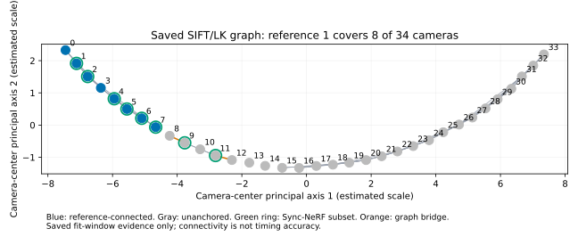
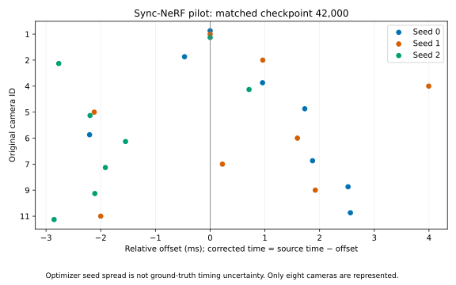
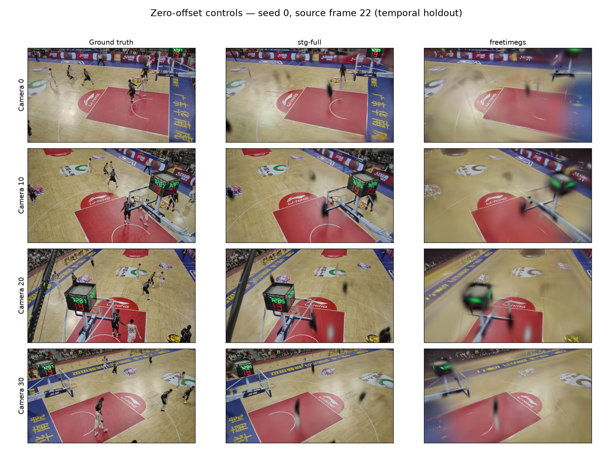

# Basketball synchronization pivot — Plan 024

**Plan 024 campaign complete. Synchronization benefit remains unverified.**
Literature cutoff: September 8, 2026. This campaign implements
[Plan 024](../../../plans/plan_024.md) under [execution specification 025](../../../plans/plan_025.md);
it does not resume the earlier continuous-improvement loop.

## Decision supported by the timing evidence

Keep zero offsets as the operational baseline. No supported correction covers
all 34 cameras, and no correction-versus-zero reconstruction benefit can be
measured in this campaign. Zero is not verified physical synchronization.
The [frozen timing decision](timing-decision.json) records why corrected runs and
final timing-window evaluation are unavailable. Independent timing truth does
not exist for these Basketball estimates, so neither 10-ms accuracy nor clock
rate mismatch is established.

The most promising next synchronization experiment remains calibrated learned
correspondence, conditional on an executable complete release and a labeled
benchmark. VisualSync's released global estimator executes, but the inspected
original archive lacks essential pair/preprocessing implementation. Rebuilding
that missing core would violate this campaign's scope. This is an availability
result, not evidence that VisualSync fails on Basketball.
[VisualSync paper](https://arxiv.org/html/2512.02017v1),
[code audit](benchmark-code-matrix.md).

## What the literature establishes

The [11-work evidence matrix](literature.md) records task assumptions, motion
priors, offset models, published metrics and protocol limitations. The
[citation map](citation-map.md) retains backward/forward searches, verified
relationships and discovery limitations. Detailed reading stayed within the
20-paper cap. The [source/license inventory](source-license-inventory.json)
and [benchmark/code matrix](benchmark-code-matrix.md) separate runnable code,
component checks, unavailable data and literature-only comparisons.

Three distinctions matter for this decision:

- VisualSync reports a 20.2-ms mean and 5.9-ms median on UDBD, illustrating why
  a favorable median does not establish uniform accuracy. Its reported
  Sync-NeRF comparison (0.4/0.2 ms mean/median) is not reconciled with the
  original Sync-NeRF hybrid mean of 15.6 ms. Released metadata does not resolve
  all sampling, phase, training and gauge differences; both numbers retain
  their original provenance. [VisualSync](https://arxiv.org/html/2512.02017v1),
  [Sync-NeRF](https://arxiv.org/html/2310.13356v2).
- SyncTrack4D reports Basketball refinement to 0.260 frames, while Humans as a
  Calibration Pattern reports a Panoptic mean of 0.028 frames. These are
  different methods and protocols. Their exact reproducible Basketball input
  release or complete runnable pipeline was not established here. HCP and
  Sync-NeRF also optimize test-view parameters in published evaluation; this
  campaign disables test-image optimization.
  [SyncTrack4D](https://arxiv.org/html/2512.04315v1),
  [HCP](https://arxiv.org/html/2412.19089v2).
- FreeTimeGS and MoRel change the scene representation; they are not camera
  synchronization estimators. Better rendering alone would not prove a timing
  correction accurate. Our FreeTimeGsVanilla backend is a separate
  reproduction and is not labeled the authors' implementation.
  [FreeTimeGS](https://arxiv.org/html/2506.05348v1),
  [MoRel](https://arxiv.org/html/2512.09270v1).

UDBD Box images and transforms resolve, but exact supplied offset labels and
source phase remain unresolved. The SyncTrack4D Panoptic basketball release,
frame start, camera identifiers and labels are also unresolved. Neither
benchmark received an accuracy run; both reserved benchmark attempts remain
unused. Independent analytic fixtures exercise fractional timing, ambiguity,
occlusion, wrong matches, dropped frames, disconnected graphs and rate mismatch.
They validate our interfaces and observability checks, not learned-baseline
accuracy on real data. [Analytic evidence](analytic-fixtures.json).

## Basketball timing findings

The frozen inputs retain original camera IDs 0–33, reference 1, the accepted
calibration and estimated scale. All inspected presentation timestamps for
source frames 0–249 follow 25 fps. No adjacent exact pixel duplicates occurred
in reconstruction frames 0–49. Regular file timestamps do not establish capture
clock agreement. Historical scoreboard zero integer lags do not establish
subframe accuracy. Historical spline/transform qualification failures remain
separate from new timing evidence. [Input freeze](basketball-freeze.json),
[prior diagnostic audit](prior-diagnostics.md).

All 561 camera pairs have explicit support/rejection records in the saved
SIFT/LK comparison. There are 67 accepted saved edges, but the component
containing reference 1 covers only cameras 0–7. Five components and unanchored
bridges prevent a full-rig inference. Cycle and leave-one-edge-out diagnostics
are retained; connectivity alone is not uncertainty or correctness. No learned
pair pass exists to compare against this graph.
[Common graph results](sift-common-graph.json).

Three Sync-NeRF pilots used deterministically selected training cameras
1, 2, 4, 5, 6, 7, 9 and 11 on frames 50–149, with calibrated rays, unchanged
native Box-hybrid optimizer/loss settings, and no test-view timing optimization.
They reached 43,049, 42,944 and 42,999 updates within their 2,400-second caps.
These are short feasibility runs relative to the native 90,001-update schedule;
the offset-freeze step at 50,000 was not reached.

At the largest shared saved checkpoint, update 42,000, non-reference offsets
have seed ranges of 3.28–5.42 ms. This spread describes optimizer repeatability;
it is not physical error or a confidence interval for camera timing. Only eight
cameras are represented, none of the reconstruction held-out cameras. Native
checkpoint weights/optimizer/scheduler are retained; a fresh CPU reload of seed
0 exactly reproduces its final export. Native Sync-NeRF checkpoints omit RNG
and AMP-scaler state, so exact training continuation remains unverified.
[Matched checkpoint](syncnerf-matched-checkpoint.json),
[all endpoint exports](syncnerf-results.json),
[reload evidence](syncnerf-seed0-reload.json).

The 150–199 development window had already influenced historical work and is
not a fresh test. Cross-window agreement is unverified. This campaign did not
open final-window images 200–249: no eligible full-rig candidate or runnable
learned evidence pipeline exists, and the fitted Sync-NeRF field should not be
extrapolated outside its four-second support. Historical calibration had already
used selected frames in that range, so it is not globally untouched data.

## Reconstruction protocol and limitations

Both native backends use frames 0–49 at 960×540, held-out cameras 0/10/20/30,
and temporal holdout [0.8,1.0) seconds (source frames 20–24). Each seed has the
same 1,350 training keys and 350 evaluation keys. Continuous timestamps preserve
source IDs and share normalization. Only the zero condition runs. Each run
has a 5,000-update target and a 1,200-second cap, while retaining the native
30,000-step STG Full and 70,000-step FreeTimeGsVanilla schedules. Reaching the campaign target
does not reproduce the full author schedule. The frozen training-protocol prose
incorrectly described both schedules as 30,000 steps; the
[schedule erratum](schedule-erratum.json) records the actual saved configuration.
The executed settings and frozen records are unchanged.

Initialization uses 5,093 accepted static-map points, colored from training
cameras at frame 25. FreeTimeGS applies its native normalization/filtering and
creates 45,828 local static copies with zero initial velocity. This provides
no reconstructed player motion. Geometry, initialization, short schedules,
representation capacity and image formation can all limit dynamic reconstruction
independently of synchronization. The scale is estimated, not independent
metric ground truth. [Training protocol](training-protocol.json).

The frozen [evaluation protocol v3](evaluation-protocol-v3.json) specifies the
largest common 1,000/2,000/5,000 checkpoint, fresh offline reload in distinct
processes, 350 renders per run and 13 repeated view/time probes. Raw float and
PNG hashes test repeat rendering. Throughput measures a warmed native renderer
at camera 0/frame 25, excluding loading, camera construction, image encoding and
metrics. A shared pinned container computes all image metrics.

Full-image and motion bounding-box PSNR/SSIM/LPIPS are separate from
foreground-pixel PSNR/MAE. The prediction-independent motion proxy has a median
3.37% foreground area but an 81.37% bounding-box area; crop scores include
substantial background. Masks are not semantic person/ball truth. Temporal
observations compare adjacent predicted and target frame differences.
Uncertainty uses 2,000 resamples of three seeds and aligned five-frame blocks,
not independent pixels. The temporal holdout has only one such block, so it
cannot measure between-block temporal variability.

## Reconstruction results, validation and accounting

All six zero controls completed 5,000 updates. All 2,100 evaluation images
were scored, and all 78 repeated probes matched raw float and PNG hashes after
fresh offline reloads. No run required a replacement attempt. The final
[evidence audit](final-validation.json) passed. [Per-run results](reconstruction-results.json)
and [complete metric/interval summaries](reconstruction-metrics.json) retain provenance.

The table shows three-seed means. PSNR brackets are 95% seed/five-frame-block
bootstrap intervals; SSIM/LPIPS intervals are retained in the linked JSON.
PSNR and SSIM are higher-is-better; LPIPS and MAE are lower-is-better.

| Split | Region | Method | PSNR dB [95% interval] | SSIM | LPIPS Alex |
| --- | --- | --- | ---: | ---: | ---: |
| Held-out cameras | Full image | STG Full | 23.52 [23.42, 23.64] | 0.782 | 0.270 |
| Held-out cameras | Full image | FreeTimeGsVanilla | 19.22 [19.08, 19.35] | 0.648 | 0.472 |
| Held-out cameras | Motion crop | STG Full | 23.46 [23.34, 23.60] | 0.784 | 0.272 |
| Held-out cameras | Motion crop | FreeTimeGsVanilla | 19.64 [19.45, 19.86] | 0.661 | 0.463 |
| Temporal interpolation | Full image | STG Full | 24.50 [24.39, 24.64] | 0.818 | 0.251 |
| Temporal interpolation | Full image | FreeTimeGsVanilla | 19.79 [19.64, 19.94] | 0.656 | 0.470 |
| Temporal interpolation | Motion crop | STG Full | 23.75 [23.65, 23.87] | 0.806 | 0.267 |
| Temporal interpolation | Motion crop | FreeTimeGsVanilla | 19.66 [19.50, 19.79] | 0.657 | 0.465 |

| Split | Method | Motion-pixel PSNR dB [95% interval] | Motion-pixel MAE |
| --- | --- | ---: | ---: |
| Held-out cameras | STG Full | 13.74 [13.35, 14.13] | 0.1558 |
| Held-out cameras | FreeTimeGsVanilla | 11.78 [11.45, 12.13] | 0.2087 |
| Temporal interpolation | STG Full | 12.98 [12.79, 13.09] | 0.1752 |
| Temporal interpolation | FreeTimeGsVanilla | 11.55 [11.22, 11.76] | 0.2157 |

STG Full is the stronger image-quality baseline in this bounded reproduction.
For held-out full images, the paired FreeTimeGS-minus-STG PSNR difference is
−4.30 dB [−4.54, −4.11]; LPIPS is +0.202 [0.191, 0.213]. Temporal full-image
PSNR differs by −4.72 dB [−4.99, −4.55]. These are cross-method differences
at zero offsets, **not synchronization-correction benefits**. Matching seed
labels pairs runs but does not make the two native random streams equivalent.
The narrow intervals condition on these cameras, this scene and the short
schedules; they do not establish general superiority over author implementations.

Full-image scores conceal poor moving-person detail. The fixed seed-0 contact
sheet shows blurred/missing players in both methods and sharper court/background
detail in STG Full. No settings changed after this inspection. Static
initialization and representation/training limits are plausible contributors,
but this campaign does not isolate the cause or show that correcting clocks
would resolve it.

Adjacent-frame difference MAE, averaged over seeds, is 0.00749 for STG Full
and 0.00938 for FreeTimeGS on held-out cameras; temporal-interpolation values
are 0.00708 and 0.00901. These use RGB/255, with 196 and 120 adjacent pairs
per seed respectively. They are descriptive temporal observations, not a
physical timing test or perceptual smoothness guarantee. Background dominates
full-image temporal error too. [Per-seed temporal observations](temporal-observations.json).

| Backend | Total training s, three seeds | Mean warmed FPS | Max training allocated MiB | Max rendering allocated MiB |
| --- | ---: | ---: | ---: | ---: |
| STG Full | 670.33 | 1090.5 | 444.5 | 162.7 |
| FreeTimeGsVanilla | 409.75 | 1656.2 | 270.5 | 74.3 |

FPS uses the same RTX 4090, one warmed view/time, five warmups and 30 timed
renders per seed. These small, short-trained models are not comparable to the
papers' full-quality FPS results. Memory is PyTorch allocation, excluding CUDA
context/driver and other allocations; reserved peaks and individual samples
are retained in the per-run artifact. FreeTimeGS is faster here but has lower
image quality; speed alone does not make it the preferred reconstruction.

| GPU allocation | Charged seconds | Ceiling seconds |
| --- | ---: | ---: |
| visualsync | 241.14 | 14400 |
| sync-nerf | 6935.97 | 10800 |
| stg-full | 670.33 | 7200 |
| freetimegs | 409.75 | 7200 |
| evaluation | 475.30 | 3600 |

Total campaign charge is **8732.49 seconds (2.43 GPU hours)**, including failed setup/check work, startup and evaluation. No allocation was transferred or reused.
Historical training plus this campaign's reconstruction and Sync-NeRF fitting totals **30539.45 seconds (8.48 hours)** of the 24-hour training ceiling. All 22 historical records remain unchanged.
Unused benchmark/corrected-condition slots remain unused. All scientific
workers exited successfully, with no forced kills or unresolved reservations.
[GPU ledger](gpu-budget.json), [setup accounting](setup-accounting.json),
[training admission proof](global-training-admission.json).

Validation covers timing signs/gauge/units, continuous support, analytic adverse
cases, calibration ray/undistortion conventions, temporal exclusions, masks,
checkpoint selection and block summaries. The targeted CPU results and native
reload evidence are retained in [implementation validation](implementation-validation.md).
Final audit additionally verifies all 2,100 finite metric rows, 1,896 temporal
pairs, frozen source/evidence hashes, complete three-seed cohorts and budgets.
Passing these checks establishes implementation and artifact consistency, not
physical timing accuracy or adequate player reconstruction.

Large checkpoints, PNGs and per-frame metric records remain under
`.local/sync-pivot/`; hashes and paths are retained in the report artifacts.
For CPU revalidation, run `python3 scripts/validate-sync-pivot-results.py`
from the repository root. `python3 scripts/summarize-basketball-controls.py`
regenerates compact result summaries from those retained local records.
Neither command launches new training or GPU evaluation.

## Interpreting the comparison with dance1

The later dance1 result favored FreeTimeGsVanilla, but its 5,000-update result
favored STG Full too. The observed ranking therefore does not establish a
Basketball-versus-dance1 method preference independent of training progress.

| Retained comparison | STG Full updates / PSNR | FreeTimeGsVanilla updates / PSNR |
| --- | ---: | ---: |
| Basketball pilot | 5,000 / 23.52 dB | 5,000 / 19.22 dB |
| dance1 pilot | 5,000 / 23.45 dB | 5,000 / 19.15 dB |
| dance1 later run | 30,000 / 24.50 dB | 42,061 / 25.50 dB |

[dance1 checkpoint comparisons](../../experiments/contender-summary.md) use a
different resolution, scene and evaluation split, so absolute scores are not
cross-scene quality equivalences. Within each pilot the ranking is clear.
The incomplete dance1 FreeTimeGS run nevertheless had 8.4 times as many updates
as the Basketball pilot; incomplete does not imply similarly early training.

The [dance1 FreeTimeGS setup](../../experiments/007-freetimegs.md) retained
4,101,912 dense temporal EDGS/RoMa-initialized Gaussians with estimated velocities.
Basketball starts with 45,828 static local copies and zero velocity. Both use
the native relocation preset with ordinary point-count growth disabled; a
sparse initialization does not automatically become a dense model through that
training schedule. STG has native densification. These differences make
initialization coverage and training progress concrete competing explanations
for the Basketball blur. Their individual contributions have not been isolated.

Blur of fixed court markings particularly argues against attributing all
FreeTimeGS softness to camera time offsets. Time shifts primarily affect changing
content; static appearance can instead expose geometry, calibration, sampling,
initialization or optimization limitations. The display's changing digits are
not a static control. Player blur remains compatible with several causes,
including motion representation, training, calibration, timing and exposure.

The supported conclusion is that STG Full learns a better baseline early in
both saved scenes, while the much longer, densely initialized dance1 FreeTimeGS
run eventually leads its image-quality comparison. Whether Basketball would
follow that trajectory is untested. A future experiment should test initialization
and convergence explicitly before attributing this result to scene preference
or synchronization; no additional training is authorized by this interpretation.

## Ranked follow-up

1. **Operate with zero offsets pending stronger evidence.** Preserve the accepted
   calibration and use STG Full as the stronger tested image-quality baseline
   under these 5,000-update settings. This is an operational choice, not a measured
   superiority result against a correction.
2. **Resolve a complete learned correspondence release and benchmark truth.**
   Obtain the missing VisualSync pair/preprocessing implementation or another
   complete calibrated release, plus exact source phase/offset labels for a
   reproducible benchmark. Require full-rig connected support, repeatability
   across windows, and held-out reconstruction benefit before deployment.
3. **Use the reduced Sync-NeRF fit as a cross-check, not a rig correction.**
   A future explicitly budgeted experiment could test initialization sensitivity
   and separate-window agreement before adding held-out-camera timing estimation.
   Current small estimates do not justify filling unobserved cameras with zeros
   and calling the result estimated.
4. **Investigate reconstruction limits using the zero controls.** Separate
   static initialization and short-schedule limitations from timing. Prefer a
   defensible dynamic track or human-motion prerequisite before a classical or
   human-prior calibration pipeline. No automatic return to spline-evaluator
   refinement and no additional scientific attempts are launched by this report.
